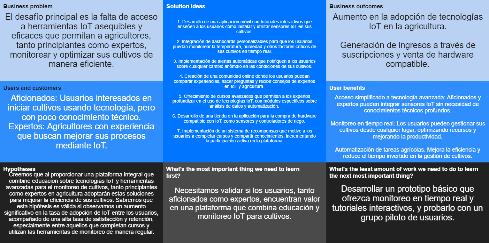

# Universidad Peruana de Ciencias Aplicadas

### Ingeniería de Software

### Ciclo 2024-02

# 
Desarrollo de Soluciones IOT

## TB1 REPORT

**Sección:** WX71

**Profesor**: Marco Antonio León Baca

**StartUp Name**: GrowGenius

**Producto**: GreenGrow

### Team Members:

| Member                            |    Code    |
| :-------------------------------- | :--------: |
| Checa Apolinario, Paolo Sebastián | u202112749 |
| Lazo Tapia, Jesús Antonio         | u202019038 |
| Hinostroza Mavila, Farid Rolando  | u202014468 |
| Taype Fernandez, Leonardo         | u20201e840 |
| Arana Ramos, Jack                 | u202121875 |

 

Septiembre del 2023

  

# Registro de Versiones del Informe

| Versión |   Fecha    |                                                                                       Autor                                                                                        | Descripción de modificación                                                                                                                                           |
| :-----: | :--------: | :--------------------------------------------------------------------------------------------------------------------------------------------------------------------------------: | :-------------------------------------------------------------------------------------------------------------------------------------------------------------------- |
|   TB1   | 28/08/2024 | Checa Apolinario, Paolo Sebastián    Lazo Tapia, Jesús Antonio    Hinostroza Mavila, Farid Rolando    Taype Fernandez, Leonardo    Arana Ramos, Jack | Se realizaron los capítulos: Capítulo I: Introducción, Capítulo II: Requirements Elicitation & Analysis, Capítulo III: Requirements Specification y Capítulo IV: Solution Software Design |

  

# Project Report Collaboration Insights

- **TB1:** Para esta entrega, realizamos como equipo las actividades correspondientes a los capítulos asignados en el siguiente repositorio dentro de nuestra organización de grupo: 

     

    Link del repositorio del Informe Final: [Github - Informe Final GreenGrow]()

     

    A continuación, se muestran las capturas de evidencia correspondientes al desarrollo de los siguientes capítulos:

     

    - **Capítulo I: Introducción** (Paolo Sebastián)
    - **Capítulo II: Requirements Elicitation & Analysis** (Farid Rolando)
    - **Capítulo III: Requirements Specification** (Jesús Antonio)
    - **Capítulo IV: Solution Software Design** (Leonardo y Jack)

    

              
    

    

        
    

  

# Contenido

## Tabla de Contenidos

### [Registro de versiones del informe](#registro-de-versiones-del-informe)

### [Project Report Collaboration Insights](#project-report-collaboration-insights)

### [Contenido](#contenido)

### [Student Outcome](#student-outcome-1)

### [Capítulo I: Introducción](#capítulo-i-introducción)

- [1.1. Startup Profile](#11-startup-profile)
  - [1.1.1. Descripción de la Startup](#111-description-de-la-startup)
  - [1.1.2. Perfiles de integrantes del equipo](#112-perfiles-de-integrantes-del-equipo)
- [1.2. Solution Profile](#12-solution-profile)
  - [1.2.1 Antecedentes y problemática](#121-antecedentes-y-problemática)
  - [1.2.2 Lean UX Process](#122-lean-ux-process)
    - [1.2.2.1. Lean UX Problem Statements](#1221-lean-ux-problem-statements)
    - [1.2.2.2. Lean UX Assumptions](#1222-lean-ux-assumptions)
    - [1.2.2.3. Lean UX Hypothesis Statements](#1223-lean-ux-hypothesis-statements)
    - [1.2.2.4. Lean UX Canvas](#1224-lean-ux-canvas)
- [1.3. Segmentos objetivo](#13-segmentos-objetivo)

### [Capítulo II: Requirements Elicitation & Analysis](#capítulo-ii-requirements-elicitation--analysis)

- [2.1. Competidores](#21-competidores)
  - [2.1.1. Análisis competitivo](#211-análisis-competitivo)
  - [2.1.2. Estrategias y tácticas frente a competidores](#212-estrategias-y-tácticas-frente-a-competidores)
- [2.2. Entrevistas](#22-entrevistas)
  - [2.2.1. Diseño de entrevistas](#221-diseño-de-entrevistas)
  - [2.2.2. Registro de entrevistas](#222-registro-de-entrevistas)
  - [2.2.3. Análisis de entrevistas](#223-análisis-de-entrevistas)
- [2.3. Needfinding](#23-needfinding)
  - [2.3.1. User Personas](#231-user-personas)
  - [2.3.2. User Task Matrix](#232-user-task-matrix)
  - [2.3.3. User Journey Mapping](#233-user-journey-mapping)
  - [2.3.4. Empathy Mapping](#234-empathy-mapping)
  - [2.3.5. As-is Scenario Mapping](#235-as-is-scenario-mapping)
- [2.4. Ubiquitous Language](#24-ubiquitous-language)

### [Capítulo III: Requirements Specification](#capítulo-iii-requirements-specification)

- [3.1. To-Be Scenario Mapping](#31-to-be-scenario-mapping)
- [3.2. User Stories](#32-user-stories)
- [3.3. Impact Mapping](#33-impact-mapping)
- [3.4. Product Backlog](#34-product-backlog)

### [Capítulo IV: Solution Software Design](#capítulo-iv-solution-software-design)

- [4.1. Strategic-Level Domain-Driven Design](#41-strategic-level-domain-driven-design)
  - [4.1.1. Event Storming](#411-event-storming)
    - [4.1.1.1. Candidate Context Discovery](#4111-candidate-context-discovery)
    - [4.1.1.2. Domain Message Flows Modeling](#4112-domain-message-flows-modeling)
    - [4.1.1.3. Bounded Context Canvases](#4113-bounded-context-canvases)
  - [4.1.2. Context Mapping](#412-context-mapping)
  - [4.1.3. Software Architecture](#413-software-architecture)
    - [4.1.3.1. Software Architecture System Landscape Diagram](#4131-software-architecture-system-landscape-diagram)
    - [4.1.3.2. Software Architecture Context Level Diagrams](#4132-software-architecture-context-level-diagrams)
    - [4.1.3.3. Software Architecture Container Level Diagrams](#4133-software-architecture-container-level-diagrams)
    - [4.1.3.4. Software Architecture Deployment Diagrams](#4134-software-architecture-deployment-diagrams)

- [4.2. Tactical-Level Domain-Driven Design](#42-tactical-level-domain-driven-design)

### [Conclusiones](#conclusiones)

### [Bibliografía](#bibliografía)

### [Anexos](#anexos)

  

# Student Outcome

| Criterio específico | Acciones realizadas | Conclusiones |
| :------------------: | :-----------------: | :----------: |
| 
 Comunica oralmente sus ideas y/o resultados con objetividad a público de diferentes especialidades y niveles jerárquicos, en el marco del desarrollo de un proyecto en ingeniería.
 | 
 **Jesus Lazo Tapia - TB1:** He estado en equipo participando en todas las reuniones, contribuyendo al impact mapping y To-Be Scenario Mapping, y colaborando en la toma de decisiones. 

 | |
| 
 Comunica en forma escrita ideas y/o resultados con objetividad a público de diferentes especialidades y niveles jerárquicos, en el marco del desarrollo de un proyecto en ingeniería.
 | 
 **Jesus Lazo Tapia - TB1**: He promovido un entorno colaborativo al ayudar con el markdown, participar en la planificación, y asegurar que todas las voces sean escuchadas, contribuyendo a cumplir nuestras metas.

 | |

  

# Capítulo I: Introducción

## 1.1. StartUp Profile

### 1.1.1. Description de la StartUp

Nuestra startup recibe el nombre de GrowEasy Innovators, la cual nace para ofrecer soluciones avanzadas en el monitoreo y gestión de cultivos mediante tecnología IoT. Nos dedicamos a fortalecer a los agricultores y aficionados de la hidroponía con herramientas tecnológicas que permiten un control preciso y automatizado de sus cultivos. A través de sensores inteligentes, los usuarios pueden monitorear en tiempo real parámetros críticos como la temperatura, humedad, intensidad del viento y la iluminación, optimizando el crecimiento de las plantas y garantizando cosechas de alta calidad. Además, ofrecemos una plataforma intuitiva que permite la gestión remota de estos factores, facilitando la toma de decisiones y reduciendo el margen de error.

 

- **Visión:** Nos proponemos ser líderes en la integración de tecnología IoT en la agricultura, facilitando el acceso a soluciones inteligentes que promuevan prácticas sostenibles y eficientes en el cultivo de alimentos, independientemente del entorno.

- **Misión:** Nuestra misión es proporcionar una solución integral que permita a los agricultores, tanto expertos como aficionados, monitorear y gestionar sus cultivos de manera eficiente y sostenible a través de tecnología IoT, mejorando así la productividad y reduciendo el impacto ambiental.

### 1.1.2. Perfiles de integrantes del equipo

<table align="center"  border="1" width="70%" style="text-align:center;">
    <tr align="center">
        <td rowspan="4">
            
        </td>
        <td align="left">
            <b>Nombres y Apellidos:</b>
                         
            Checa Apolinario, Paolo Sebastián 
        </td>
    </tr>    
    <tr>
        <td align="left">
        <b>Código:</b>
         
        U202112749
        </td>
    </tr>
    <tr>
        <td align="left">
        <b>Descripción de carrera</b>
         
        

        En la Ingeniería de Software uno consigue los instrumentos necesarios para poder desarrollar programas o aplicaciones. El camino para lograr aquello se basa en un proceso donde el ingeniero deberá analizar lo requerido, planificar el desarrollo del proceso y comprobar su funcionamiento correcto hasta que este se ejecute sin errores. Las estrategias usadas para simplificar y acelerar estos procesos serán clave en esta rama pues estas serán las soluciones innovadoras que el ingeniero deberá crear.
        
 
        </td>
    </tr>
    <tr>
        <td align="left">
        <b>Conocimiento y habilidades</b>
         
        

        Poseo conocimientos en programación en el entorno del lenguaje C++, Python y Java. Estoy dispuesto a aportar nuevas ideas al equipo, tengo fácil adaptación a los roles designados y buena organización. Soy responsable y dispongo de la capacidad para aportar ideas innovadoras en beneficio de nuestro proyecto. 
        </td>
    </tr>
    <tr align="center">
        <td rowspan="4">
            
        </td>
        <td align="left">
            <b>Nombres y Apellidos:</b>
                         
            Lazo Tapia, Jesús Antonio 
        </td>
    </tr>    
    <tr>
        <td align="left">
        <b>Código:</b>
         
        U202019038
        </td>
    </tr>
    <tr>
        <td align="left">
        <b>Descripción de carrera</b>
         
        

        La Ingeniería de Software proporciona las herramientas esenciales para crear programas y aplicaciones. Este proceso involucra que el ingeniero analice las necesidades, planifique el desarrollo y verifique que todo funcione correctamente hasta asegurar que el software opere sin fallas. Las tácticas implementadas para optimizar y acelerar estos procedimientos serán fundamentales en este campo, ya que representan las soluciones innovadoras que el ingeniero debe desarrollar. 
        

        </td>
    </tr>
    <tr>
        <td align="left">
        <b>Conocimiento y habilidades</b>
         
        

        Poseo conocimientos en programación que he estado llevando desde el inicio de mi carrera, me gusta el desarrollo con tecnología inteligente y redes y comunicaciones de datos. Soy responsable y estaré apoyando a mi grupo para obtener el éxito de nuestro trabajo.
        
 
        </td>
    </tr>
    <tr align="center">
        <td rowspan="4">
            
        </td>
        <td align="left">
            <b>Nombres y Apellidos:</b>
                         
            Hinostroza Mavila, Farid Rolando 
        </td>
    </tr>    
    <tr>
        <td align="left">
        <b>Código:</b>
         
        U202014468
        </td>
    </tr>
    <tr>
        <td align="left">
        <b>Descripción de carrera</b>
         
        

        La Ingeniería de Software es una disciplina que combina creatividad y lógica para desarrollar soluciones tecnológicas que impacten positivamente en la sociedad. Este campo abarca desde la concepción de la idea hasta la implementación y mantenimiento de software, garantizando que las soluciones sean efectivas y eficientes. El ingeniero de software debe estar preparado para enfrentar desafíos complejos, aplicar metodologías ágiles, adaptarse a las nuevas tendencias tecnológicas, asegurando que los productos finales cumplan con los estándares de calidad y funcionalidad.
        
 
        </td>
    </tr>
    <tr>
        <td align="left">
        <b>Conocimiento y habilidades</b>
         
        

        He adquirido una base sólida en desarrollo de software, con un interés particular en la inteligencia artificial y la gestión de bases de datos. Mi enfoque es la mejora continua y la implementación de soluciones innovadoras que resuelvan problemas reales. Además, soy proactivo y colaborativo, lo que me permite trabajar eficazmente en equipo para alcanzar los objetivos propuestos, siempre con la vista puesta en la excelencia y la eficiencia del proyecto.
        
 
        </td>
    </tr>
    <tr align="center">
        <td rowspan="4">
            
        </td>
        <td align="left">
            <b>Nombres y Apellidos:</b>
                         
            Taype Fernandez, Leonardo 
        </td>
    </tr>    
    <tr>
        <td align="left">
        <b>Código:</b>
         
        U20201E840
        </td>
    </tr>
    <tr>
        <td align="left">
        <b>Descripción de carrera</b>
         
        

        En la carrera de Ingeniería de Software adquirimos conocimiento para desarrollar soluciones a través de software. Analizamos requisitos, diseñamos arquitectura, creamos código y mantenemos en funcionamiento productos de software. 
        

        </td>
    </tr>
    <tr>
        <td align="left">
        <b>Conocimiento y habilidades</b>
         
        

        Me considero una persona comprometida y responsable. Me gusta aprender y plantearme retos. Estudio la carrera de ingeniería de software, siempre me ha gustado interactuar con la computadora y ahora puedo ser un profesional haciendo lo que me gusta. Tengo conocimientos en desarrollo web, móvil y desktop. 
        

        </td>
    </tr>
    <tr align="center">
        <td rowspan="4">
            
        </td>
        <td align="left">
            <b>Nombres y Apellidos:</b>
                         
            Arana Ramos, Jack 
        </td>
    </tr>    
    <tr>
        <td align="left">
        <b>Código:</b>
         
        U202121875
        </td>
    </tr>
    <tr>
        <td align="left">
        <b>Descripción de carrera</b>
         
        

        Estudiante de Ingeniería de Software en la Universidad Peruana de Ciencias Aplicadas. La carrera de Ingeniería de Software está diseñada para formar profesionales altamente capacitados en el diseño, desarrollo y mantenimiento de sistemas de software complejos. A lo largo del programa, se adquiere una sólida base en principios de ingeniería, metodologías de desarrollo, y buenas prácticas en la gestión de proyectos tecnológicos. 
        

        </td>
    </tr>
    <tr>
        <td align="left">
        <b>Conocimiento y habilidades</b>
         
        

        Tengo experiencia en desarrollo web full stack, manejando tanto front-end como back-end. También estoy capacitado en prácticas de DevOps, control de versiones con Git, y diseño de interfaces de usuario eficientes. Mis habilidades analíticas y de trabajo en equipo, junto con una gestión eficaz del tiempo, me permiten adaptarme rápidamente a nuevas tecnologías y resolver problemas complejos de manera eficiente. 
        

        </td>
    </tr>
</table>

## 1.2. Solution Profile

**Nombre del Producto:** Nuestro servicio tiene el nombre de “GrowEasy”, reflejando nuestro compromiso de facilitar el monitoreo y la gestión eficiente de cultivos para nuestros usuarios. Con la tecnología IoT, los usuarios podrán supervisar y optimizar el crecimiento de sus plantas de manera sencilla, creciendo junto con nosotros a medida que aprovechan al máximo nuestras herramientas tecnológicas.

**Descripción del Producto:** Proponemos un servicio innovador y tecnológico que permite a los usuarios monitorear y gestionar sus cultivos a través de sensores IoT que capturan datos en tiempo real sobre parámetros como temperatura, humedad, y luz. Con esta información, los usuarios pueden tomar decisiones informadas para mejorar la salud y productividad de sus plantas, ya sea en un entorno doméstico o a mayor escala. Nuestro enfoque es hacer que la tecnología sea accesible y fácil de usar, priorizando la simplicidad y la efectividad para todos los usuarios de nuestra plataforma.

**Monetización:** Nuestro servicio generará ingresos a través de la venta de hardware IoT (sensores y dispositivos de control) y suscripciones a la plataforma que ofrecen acceso a funcionalidades avanzadas, como análisis de datos y recomendaciones personalizadas. Además, consideramos alianzas con empresas de insumos y equipamiento agrícola para ofrecer publicidad dirigida y relevante dentro de nuestra aplicación, brindando a los usuarios acceso a productos y servicios que complementen su experiencia de cultivo.

### 1.2.1. Antecedentes y problemática

Para este segmento, utilizamos la técnica 5W y 2H, lo que nos permite identificar los aspectos clave relacionados con nuestro proyecto.

- **Who**

Nuestros usuarios son agricultores, tanto aficionados como expertos, interesados en utilizar tecnología avanzada para monitorear y optimizar sus cultivos. Están comprometidos con la adopción de soluciones innovadoras que les permitan mejorar la eficiencia y la sostenibilidad de sus procesos agrícolas.

- **What**

El desafío principal para nuestros usuarios radica en la falta de herramientas accesibles y fáciles de usar que les permitan monitorear en tiempo real y gestionar eficientemente los diferentes factores que afectan el crecimiento de sus cultivos, como la temperatura, humedad, viento e iluminación.

- **Where**

Este problema surge principalmente en áreas rurales y urbanas donde los agricultores y aficionados a la hidroponía no tienen acceso a soluciones tecnológicas integradas, lo que dificulta el control eficiente de las condiciones de cultivo.

- **When**

La dificultad se presenta constantemente, especialmente cuando los usuarios buscan maximizar la productividad y la calidad de sus cultivos, pero no cuentan con los medios para monitorear y ajustar las variables ambientales de manera precisa y en tiempo real.

- **Why**

Los usuarios suelen enfrentar obstáculos debido a la falta de soluciones IoT asequibles y comprensibles que les permitan realizar un monitoreo continuo y automatizado de sus cultivos. Esto los obliga a recurrir a métodos tradicionales o manuales que no siempre son eficaces para asegurar un crecimiento óptimo.

- **How**

Para abordar esta problemática, hemos desarrollado una plataforma IoT que integra sensores inteligentes con una aplicación móvil y web. Esta solución permite a los usuarios monitorear en tiempo real las condiciones de sus cultivos, recibir alertas y recomendaciones, y ajustar automáticamente los parámetros necesarios para asegurar un crecimiento saludable y sostenible.

- **How much**

De acuerdo con información del Instituto Nacional de Estadística e Informática (INEI), el sector agrícola en el Perú mostró un aumento significativo en la tasa de empleo durante el segundo y tercer trimestre de 2020. En el segundo trimestre, el empleo en este sector creció un 22.6%, y en el tercer trimestre, un 20.5%. Esto es especialmente destacable si se considera que, en esos mismos periodos, la población empleada a nivel nacional disminuyó en un 39.6% y un 17.1%, respectivamente, en comparación con 2019. Además, según El Comercio (2019), la hidroponía se considera el futuro de la agricultura sostenible, ya que requiere un 90% menos de agua que las técnicas agrícolas tradicionales. Esto representa una gran ventaja para quienes desean iniciar su propio proyecto, ya que la hidroponía permite el cultivo en espacios reducidos, optimizando tanto el espacio como los recursos.

 

### 1.2.2. Lean UX Process

#### 1.2.2.1. Lean UX Problem Statements

De acuerdo con El Comercio (2019), la hidroponía es el futuro de la agricultura sostenible, utilizando un 90% menos de agua que los métodos tradicionales y adaptándose eficientemente a espacios reducidos, lo que permite un crecimiento más rápido de los cultivos. Sin embargo, muchos agricultores, tanto aficionados como expertos, enfrentan barreras para acceder a soluciones tecnológicas integradas que faciliten el monitoreo y la optimización de sus cultivos. Como startup, nuestro objetivo es abordar la siguiente interrogante: ¿Cómo podemos emplear tecnologías IoT para ofrecer un servicio innovador que brinde herramientas accesibles y avanzadas, permitiendo a los aficionados y expertos en hidroponía gestionar sus cultivos de manera eficiente?

#### 1.2.2.2. Lean UX Assumptions

**Business outcomes:**

- Los usuarios están interesados en monitorear y optimizar sus cultivos utilizando tecnología IoT.
- Los usuarios buscan orientación y soporte para configurar y utilizar sensores IoT en sus proyectos agrícolas.
- Los usuarios desean una interfaz intuitiva y fácil de usar para configurar sensores, visualizar datos en tiempo real, y recibir alertas.
- Los usuarios deben poder interpretar los datos de manera clara y precisa para tomar decisiones informadas sobre sus cultivos.
- Las aplicaciones deben ser compatibles con los múltiples dispositivos y navegadores actuales.

**User assumptions:**

- **¿Quién es el usuario?**

Los usuarios son agricultores, tanto aficionados como expertos, que buscan mejorar la gestión de sus cultivos mediante la implementación de tecnología IoT. Incluye tanto a aficionados que están aprendiendo sobre agricultura tecnológica como a expertos que desean optimizar sus procesos.

- **¿Dónde encaja nuestro producto en su trabajo o vida?**

Nuestra aplicación puede ser una herramienta esencial para la gestión diaria de cultivos hidropónicos, permitiendo a los usuarios monitorear factores críticos como temperatura, humedad y luz, optimizando el uso de recursos y mejorando la productividad.

- **¿Qué problema tiene nuestro producto? ¿Cómo se resuelve?**

El problema es la falta de herramientas accesibles para monitorear cultivos en tiempo real, lo que puede llevar a ineficiencias en el uso de recursos. Se resuelve ofreciendo una plataforma que permite la configuración y monitoreo de sensores IoT, proporcionando alertas y recomendaciones basadas en datos.

- **¿Cuándo y cómo es usado nuestro producto?**

Nuestro producto es utilizado tanto en tiempo real como de forma periódica, permitiendo a los usuarios revisar el estado de sus cultivos, recibir notificaciones y ajustar configuraciones según las necesidades cambiantes de sus plantas. Los expertos pueden usar la plataforma para gestionar múltiples cultivos simultáneamente.

- **¿Qué características son importantes?**

Las características más importantes incluyen la capacidad de conectar y configurar múltiples sensores IoT, visualización de datos en tiempo real, alertas automáticas ante condiciones adversas, y un sistema de recomendaciones basado en análisis de datos históricos.

- **¿Cómo debe verse nuestro producto y comportarse?**

El producto debe ser visualmente atractivo y fácil de usar, con una interfaz que permita a los usuarios navegar y configurar sensores rápidamente. Debe ser robusto, eficiente, y garantizar un rendimiento estable incluso al manejar grandes volúmenes de datos.

#### 1.2.2.3. Lean UX Hypothesis Statements

En esta sección, presentaremos hipótesis que proponen soluciones a las problemáticas identificadas previamente en nuestro proyecto enfocado en el monitoreo de cultivos mediante tecnología IoT. Estas hipótesis serán específicas y contarán con métricas claras para garantizar que el éxito pueda ser evaluado de manera objetiva. Las métricas utilizadas se basan en promedios generales de aplicaciones y sistemas IoT existentes en el sector agrícola.

**Hipótesis 1:**

Creemos que nuestra aplicación y sistema IoT serán una herramienta invaluable para aficionados en el cultivo hidropónico, permitiéndoles monitorear y gestionar eficientemente sus cultivos. Sabremos que tuvimos éxito cuando más del 70% de los usuarios aficionados reporten mejoras significativas en la salud y rendimiento de sus cultivos.

Métricas:

1. Porcentaje de usuarios aficionados que reportan mejoras en sus cultivos

    - Métrica actual: 0%
    - Métrica deseada: 70%

 

2. Número de sesiones de monitoreo activas por usuario aficionado por semana

- Métrica actual: 1
- Métrica deseada: 5

 

**Hipótesis 2:**

Creemos que la contribución de expertos en agricultura será fundamental para optimizar las funcionalidades avanzadas de nuestra plataforma. Sabremos que tuvimos éxito cuando más del 75% de los expertos utilicen y recomienden nuestras herramientas analíticas y de personalización avanzada.

Métricas:

1. Porcentaje de expertos que utilizan funcionalidades avanzadas

    - Métrica actual: 0%
    - Métrica deseada: 75%

 

2. Número de configuraciones personalizadas creadas por expertos

    - Métrica actual: 0
    - Métrica deseada: 50 por mes

 

**Hipótesis 3:**

Creemos que nuestra aplicación será utilizada principalmente por personas mayores de 18 años, siendo este nuestro segmento objetivo principal. Sabremos que tuvimos éxito cuando el 85% de nuestros usuarios activos pertenezcan a este grupo de edad.

Métricas:

1. Porcentaje de usuarios mayores de 18 años

    - Métrica actual: 0%
    - Métrica deseada: 85%

 

2. Tasa de retención de usuarios mayores de 18 años

    - Métrica actual: 0%
    - Métrica deseada: 70% mensual

 

**Hipótesis 4:**

Creemos que nuestra aplicación será sencilla y fácil de usar para todos nuestros usuarios. Sabremos que tuvimos éxito cuando más del 85% de los usuarios reporten una alta satisfacción con la usabilidad de la aplicación en encuestas periódicas.

Métricas:

1. Porcentaje de usuarios satisfechos con la usabilidad

    - Métrica actual: 0%
    - Métrica deseada: 85%

 

2. Tiempo promedio para configurar el sistema IoT por parte de nuevos usuarios

    - Métrica actual: 60 minutos
    - Métrica deseada: 20 minutos

 

**Hipótesis 5:**

Creemos que la función de comunidad será una característica significativa donde los usuarios puedan compartir experiencias, consejos y soluciones relacionadas con sus proyectos de cultivo. Sabremos que tuvimos éxito cuando más del 65% de los usuarios activos participen regularmente en la comunidad.

Métricas:

1. Porcentaje de usuarios activos que participan en la comunidad

    - Métrica actual: 0%
    - Métrica deseada: 65%

 

2. Número de publicaciones y comentarios en la comunidad por mes

    - Métrica actual: 0
    - Métrica deseada: 100 publicaciones y 300 comentarios

 

#### 1.2.2.4. Lean UX Canvas

En esta sección, presentaremos nuestro Lean UX Canvas, que resume los aspectos clave de nuestro proyecto y las estrategias para abordarlos de manera efectiva. Este canvas se basa en los principios de Lean UX, que enfatizan la colaboración, la iteración y la validación continua para lograr resultados exitosos.

    

## 1.3. Segmentos objetivos

| Tipo de Usuario | Personas que deseen iniciar en la hidroponía                                                                                                                                                                                                                                 | Expertos que desean brindar sus conocimientos a los principiantes                                                                                                                                                                                                |
| :-------------- | :--------------------------------------------------------------------------------------------------------------------------------------------------------------------------------------------------------------------------------------------------------------------------- | :--------------------------------------------------------------------------------------------------------------------------------------------------------------------------------------------------------------------------------------------------------------- |
| Geográfico      | País: Perú    Zona residencial: No es relevante, ya que pueden ser de diferentes zonas del país.                                                                                                                                                                                      | País: Perú    Zona residencial: No es relevante, ya que pueden ser de diferentes zonas del país.                                                                                                                                                                          |
| Psicográfico    | Clase Social: Principalmente de clase media a clase media alta, interesados en aprovechar tecnologías accesibles para mejorar sus cultivos.    Estilo de vida: Personas interesadas en la agricultura y sostenibilidad, que buscan aprender a utilizar tecnologías IoT para mejorar sus cultivos, pero carecen del conocimiento técnico necesario para comenzar por su cuenta. | Clase Social: Desde clase media hasta clase alta, con recursos para invertir en tecnologías avanzadas.    Estilo de vida: Agricultores con experiencia que buscan optimizar sus procesos de cultivo mediante herramientas IoT. |
| Demográfico     | Edad: Personas mayores de 18 años.    Nivel de Ingreso: Varía según la capacidad de inversión en tecnologías IoT, desde ingresos medios a altos.    Nacionalidad: Principalmente peruanos; extranjeros pueden acceder al servicio con identificación válida, como pasaporte.                                                    | Edad: Preferiblemente mayores de 30 años.    Nivel de Ingreso: Ingresos medios a altos, con capacidad para invertir en tecnología avanzada.    Nacionalidad: Principalmente peruanos; extranjeros deben identificarse con pasaporte.    Estudios: Secundaria completa o estudios superiores, idealmente con formación en agricultura o tecnología.                          |

# Capítulo II: Requirements Elicitation & Analysis

## 2.1. Competidores

Después de realizar un análisis en el mercado peruano, hemos identificado tres proyectos similares a GrowEasy que consideramos como posibles competidores. Estos son:

### **AgroData Perú**
Empresa especializada en ofrecer herramientas tecnológicas para la gestión agrícola. Su principal producto es una plataforma IoT que permite a los agricultores monitorear condiciones ambientales y del suelo en tiempo real. También brindan análisis de datos para optimizar la producción y minimizar riesgos asociados con condiciones climáticas adversas.

    

### **Hydroponics Perú**

Se especializa en ofrecer soluciones completas para la práctica de la hidroponía, incluyendo sistemas automatizados de riego, control de nutrientes, y monitoreo ambiental a través de sensores IoT. Además de vender equipos, ofrecen asesoría técnica y soporte para la implementación de sistemas hidropónicos tanto a nivel doméstico como comercial.

    

### **Smart Agro Perú**

Smart Agro Perú es una empresa que se dedica a la integración de tecnología en el sector agrícola. Ofrecen soluciones que incluyen la implementación de sensores IoT para monitorear en tiempo real variables como temperatura, humedad del suelo, y niveles de agua en los cultivos. Además, proporcionan una plataforma digital que permite a los agricultores tomar decisiones informadas basadas en los datos recolectados por los sensores.

    

### 2.1.1. Análisis competitivo

### 2.1.2. Estrategias y tácticas frente a competidores

**Diferenciación y Educación:** Enfatizar la accesibilidad y facilidad de uso de GrowEasy Innovators para todos los niveles de agricultores, complementado con programas educativos y contenido de apoyo para aficionados y aficionados.
Segmentación y Personalización: Ofrecer soluciones escalables y modulares que permitan a pequeños agricultores acceder a tecnología avanzada, con opciones de personalización y precios flexibles que puedan crecer con sus necesidades.

**Expansión y Alianzas:** Desarrollar campañas de marketing geolocalizado para mercados rurales y urbanos, y establecer alianzas estratégicas con instituciones y organismos que promuevan la agricultura sostenible.

**Innovación y Posicionamiento:** Invertir en investigación y desarrollo para mantener la tecnología de GrowEasy Innovators a la vanguardia, y fortalecer la marca a través de casos de éxito y testimonios que resalten la sostenibilidad y eficacia de la plataforma.

## 2.2. Entrevistas

### 2.2.1. Diseño de entrevistas

En esta sección se han formulado las preguntas para nuestro segmento objetivo, con la finalidad de obtener información cualitativa como opiniones o descripciones. Esta información nos será de gran ayuda en el desarrollo de nuestra solución.

**Adquisición de información general**

1. ¿Cómo te llamas?
2. ¿Cuántos años tienes?
3. ¿Cuál es tu ocupación?
4. ¿En qué lugar resides actualmente?

**Segmento 1: Aficionados a la hidroponía**

1. ¿Por qué estás interesado en empezar un proyecto de hidroponía casero con tecnología IoT?
2. ¿Cómo imaginas que sería tu proyecto de hidroponía con monitoreo automatizado?
¿Cuáles son los principales desafíos que enfrentas al buscar información sobre hidroponía y tecnología IoT?
3. ¿Qué beneficios esperas obtener al integrar sensores IoT en tu proyecto de hidroponía?
4. ¿Te resultaría útil una aplicación que ofrezca monitoreo en tiempo real y guías de expertos en IoT para hidroponía?
5. ¿Qué características o herramientas crees que serían esenciales en una aplicación de este tipo?

**Segmento 2: Expertos en hidroponía**

1. ¿Cómo empezaste en la hidroponía y qué te llevó a integrar tecnología avanzada en tus proyectos?
2. ¿Qué herramientas y datos específicos utilizas actualmente para optimizar tus cultivos hidropónicos?
3. ¿Cuáles son los principales desafíos que enfrentas al analizar y utilizar los datos de sensores IoT en tu sistema hidropónico?
4. ¿Qué tipo de datos adicionales o específicos te gustaría tener para mejorar la eficiencia de tu sistema?
5. ¿Te resultaría útil una aplicación que ofrezca análisis avanzados de datos y opciones personalizadas para gestionar tu cultivo?
6. ¿Qué funcionalidades consideras esenciales en una plataforma que te permita acceder y analizar datos complejos de tus cultivos en tiempo real?

### 2.2.2. Registro de entrevistas

### 2.2.3. Análisis de entrevistas

## 2.3. Needfinding

Los User Personas son fundamentales para el éxito del proyecto, ya que brindan una comprensión profunda y concreta de las necesidades, deseos, frustraciones y comportamientos de los usuarios clave. Estos perfiles detallados permiten a la startup diseñar una plataforma y experiencia de aprendizaje altamente enfocada y personalizada, abordando de manera efectiva los desafíos específicos de cada segmento objetivo: desde brindar recursos claros y accesibles a aficionados, hasta ofrecer herramientas para que los expertos compartan su conocimiento.

### 2.3.1. User Personas

Para comprender mejor a los usuarios a los que está dirigida nuestra solución, hemos identificado y perfilado dos grupos clave de usuarios: el Aficionado a la Hidroponía y el Agricultor Experto. Estos perfiles de User Persona nos permiten visualizar sus necesidades, comportamientos, y desafíos específicos, ayudándonos a diseñar una solución que realmente responda a sus expectativas y resuelva sus problemas de manera efectiva.

- **Agricultor Experto:** es un profesional con experiencia en la gestión de cultivos a gran escala, que busca soluciones tecnológicas avanzadas para optimizar sus operaciones y maximizar la eficiencia de su producción.

    

 

- **Aficionado a la Hidroponía:** es alguien que se está iniciando en el mundo del cultivo sin suelo, buscando tecnologías sencillas que le faciliten el cuidado de sus plantas y le permitan mejorar su rendimiento sin necesidad de un conocimiento técnico profundo.

    

 

### 2.3.2. User Task Matrix

El User Task Matrix es una herramienta clave que recopila y analiza las tareas fundamentales que los usuarios de "GrowEasy Innovators" realizan en su actividad agrícola, ya sea en la agricultura tradicional o en la hidroponía. Este cuadro se enfoca en evaluar con qué frecuencia los usuarios llevan a cabo cada una de estas tareas y la severidad o impacto que estas tienen en su éxito. Al identificar estas áreas clave, GrowEasy podrá desarrollar soluciones tecnológicas que no solo faciliten la vida de los usuarios, sino que también maximicen la eficiencia y la efectividad en el manejo de sus cultivos. Esto permite priorizar las necesidades más críticas de los usuarios y ofrecerles herramientas que realmente les ayuden a alcanzar sus objetivos de manera óptima.

### 2.3.3. User Journey Mapping

El User Journey Mapping del aficionado a la hidroponía explora el recorrido completo que este usuario realiza desde el momento en que se da cuenta de la necesidad de una solución tecnológica para mejorar el cuidado de sus cultivos, hasta la evaluación final de la eficacia de dicha solución. Este mapa detalla las etapas clave, las emociones, y los desafíos que enfrenta un aficionados mientras navega por la amplia gama de opciones tecnológicas, se registra en una plataforma, comienza a utilizar la tecnología, y finalmente evalúa su impacto en el rendimiento de sus cultivos. A través de este análisis, identificamos oportunidades críticas para mejorar la experiencia del usuario y facilitar su camino hacia la adopción de tecnologías innovadoras en el cultivo hidropónico.

    

 

El User Journey Mapping del agricultor experto en grandes cultivos ofrece una visión detallada del proceso que sigue este usuario al integrar tecnologías avanzadas en sus operaciones agrícolas. Este recorrido abarca desde la búsqueda inicial de soluciones que puedan aumentar la eficiencia y productividad de sus cultivos a gran escala, hasta la implementación y personalización de estas tecnologías, y la evaluación de su retorno de inversión. El mapa pone en evidencia las expectativas elevadas de un usuario experimentado, así como los desafíos técnicos y estratégicos que enfrenta al adoptar nuevas herramientas. Este análisis proporciona una base para desarrollar soluciones que no solo satisfagan las necesidades complejas de los expertos, sino que también les ofrezcan un valor tangible y medible en sus operaciones agrícolas.

    

 

### 2.3.4. Empathy Mapping

El Empathy Mapping es una herramienta esencial que nos permite adentrarnos en la mente y el corazón de nuestros usuarios, capturando sus pensamientos, sentimientos, percepciones y comportamientos en relación con sus actividades cotidianas. A través de este proceso, podemos comprender mejor las motivaciones, frustraciones y deseos que impulsan a nuestros usuarios, lo que nos ayuda a diseñar soluciones que realmente resuenen con sus necesidades.

**Aficionado**

    

 

**Experto**

    

### 2.3.5. As-is Scenario Mapping

El As-Is Scenario Mapping es una herramienta clave que utilizamos para comprender el flujo actual de actividades, pensamientos y emociones que experimentan nuestros usuarios en su contexto cotidiano, antes de la implementación de nuestra solución. Este mapeo captura cómo los usuarios interactúan con las tecnologías y procesos existentes, identificando los puntos de dolor, las oportunidades de mejora y las áreas donde nuestra solución podría tener el mayor impacto.

**Aficionados**

    

 

**Expertos**

    

## 2.4. Ubiquitous Language

Este glosario de Ubiquitous Language está orientado al uso de IoT en la agricultura y la hidroponía, ayudando a asegurar que todos los miembros del equipo y stakeholders compartan una comprensión clara y común de los términos clave en este dominio.

### 1. **Internet of Things (IoT)**
- **Definición:** Conjunto de dispositivos físicos que están conectados a Internet y que pueden recopilar, transmitir, y recibir datos para monitorizar y controlar diversos procesos de forma remota.

### 2. **Sensor Network (Red de Sensores)**
- **Definición:** Conjunto de sensores conectados que recopilan datos en tiempo real sobre diferentes parámetros ambientales como temperatura, humedad, luz, y nutrientes, utilizados para optimizar el crecimiento de los cultivos.

### 3. **Real-Time Monitoring (Monitoreo en Tiempo Real)**
- **Definición:** Proceso de recopilación y análisis de datos en tiempo real desde sensores IoT, permitiendo a los usuarios tomar decisiones inmediatas basadas en las condiciones actuales de los cultivos.

### 4. **Data Analytics (Análisis de Datos)**
- **Definición:** Proceso de examinar y procesar los datos recopilados por los dispositivos IoT para identificar patrones y obtener insights que puedan mejorar la eficiencia y productividad agrícola.

### 5. **Actuator (Actuador)**
- **Definición:** Dispositivo mecánico o electrónico que recibe señales de los sistemas IoT y realiza una acción física, como activar un sistema de riego o ajustar la iluminación en función de los datos recogidos.

### 6. **Cloud Computing (Computación en la Nube)**
- **Definición:** Uso de servidores en la nube para almacenar, procesar y analizar grandes volúmenes de datos recolectados por dispositivos IoT, facilitando la gestión y acceso remoto a la información.

### 7. **Remote Control (Control Remoto)**
- **Definición:** Capacidad de operar y gestionar sistemas de cultivo y dispositivos agrícolas a distancia mediante aplicaciones móviles o plataformas web conectadas a dispositivos IoT.

### 8. **Predictive Maintenance (Mantenimiento Predictivo)**
- **Definición:** Uso de datos históricos y en tiempo real recopilados por IoT para predecir fallos en el equipo agrícola y realizar el mantenimiento antes de que ocurra un problema, evitando tiempos de inactividad.

### 9. **Automation (Automatización)**
- **Definición:** Proceso de utilizar dispositivos IoT para realizar tareas agrícolas de forma automática sin la intervención directa del usuario, como la gestión del riego o el control de temperatura en un invernadero.

### 10. **Edge Computing (Computación en el Borde)**
- **Definición:** Procesamiento de datos cerca del lugar donde se generan, en lugar de enviarlos a un servidor central o a la nube, lo que permite respuestas más rápidas y reduce la latencia en aplicaciones críticas como el monitoreo de cultivos.

### 11. **Smart Irrigation (Riego Inteligente)**
- **Definición:** Sistema de riego que utiliza sensores IoT para determinar las necesidades de agua de los cultivos y ajustar el suministro de manera automática para optimizar el uso del agua.

### 12. **Environmental Sensing (Sensores Ambientales)**
- **Definición:** Uso de sensores IoT para medir y monitorizar las condiciones ambientales, tales como humedad, temperatura, y luz solar, cruciales para la toma de decisiones en la gestión de cultivos.

### 13. **Connectivity (Conectividad)**
- **Definición:** Capacidad de los dispositivos IoT de comunicarse entre sí y con servidores centrales a través de redes inalámbricas, como Wi-Fi, LoRa, o redes móviles, para el intercambio de datos y la ejecución de comandos.

### 14. **Smart Greenhouse (Invernadero Inteligente)**
- **Definición:** Invernadero equipado con sensores y actuadores IoT que permiten un control automatizado de las condiciones internas, como temperatura, humedad, y luz, para crear un entorno óptimo para el cultivo de plantas.

 

# Capítulo III: Requirements Specification

## 3.1. To-Be Scenario Mapping

Es importante visualizar las operaciones y experiencias de los usuarios con nuestro producto. En este contexto, presentamos el segmento de To-Be Scenario Map, que representa la visión y mejora de nuestro proceso actual. Esta herramienta nos guiará hacia un futuro donde nuestras operaciones sean más eficientes, nuestras experiencias de usuario sean más satisfactorias y nuestro impacto en el mercado sea aún más significativo. A través de esta visualización del estado futuro deseado, delineamos los pasos clave, las interacciones y los resultados esperados que nos llevarán a alcanzar nuestras metas y superar las expectativas de nuestros usuarios y partes interesadas.

### Segmento 1: Aficinados

    

### Segmento 2: Expertos 

    

## 3.2. User Stories

En este segmento presentamos los User Stories, una herramienta poderosa que nos ayudará a comprender y documentar los requisitos desde la perspectiva del usuario en forma de historias simples y centradas en el usuario. Cada User Story representa un objetivo específico que un usuario desea alcanzar al interactuar con nuestro producto o servicio, lo que nos permite enfocarnos en las funcionalidades y características que realmente importan para nuestros usuarios.

| Epic ID | Título de Épica | Descripción de Épica |
| :------ | :-------------- | :------------------- |
| EP01 | Implementación de monitoreo en tiempo real | Como experto en hidroponía, quiero poder acceder a datos y estadísticas en tiempo real sobre mis cultivos para optimizar mi producción. |
| EP002 | Configuración de alertas personalizadas | Como experto en hidroponía, quiero configurar alertas personalizadas basadas en datos específicos para recibir notificaciones sobre condiciones críticas en mis cultivos. |
| EP003 | Gestión de dispositivos IoT | Como aficionado y experto, quiero poder vincular y gestionar dispositivos IoT para supervisar y controlar mis cultivos de manera eficiente.|
| EP004 | Definición de estructura del landing page | Como aficionado y experto Quiero disponer de un landing page con información pertinente Para conocer todo acerca del producto inteligente.| 
| EP005 | Definición de estructura del Front-End | Como aficionado y experto Quiero disponer de una página y aplicación móvil funcional Para poder registrarse y utilizar los distintos servicios que esta ofrece.|

 

| Epic / Story ID | Título | Descripción | Criterios de Aceptación | Relacionado con (Epic ID) |
| :-------------- | :----- | :---------- | :---------------------- | :----------------------- |
| US01 | Registro de Usuario  | Como aficionado y/o experto Quiero registrarme en la página Para observar todo lo que ofrece el servicio. | Escenario 1: Crear una cuenta Dado que el aficionado y/o experto ingresa a la página web Cuando el usuario no se encuentra registrado en la página Entonces podrá registrarse ingresando sus datos. Escenario 2: Rellenado de datos correctamente Dado que el aficionado y/o experto desea registrarse en la página, Cuando rellene toda la información requerida con sus datos, Entonces el sistema registra sus datos ingresados a la base de datos. Escenario 3: Rellenado de datos incorrectamente. Dado que el aficionado y/o experto desea registrarse en la página, Cuando no ingresa los datos correctamente, Entonces el sistema le indicará que “Está incorrecto” o “Falta rellenar este dato”. | EP005 |
| US02 | Visualización del Landing Page | Como aficionado y/o experto Quiero visualizar toda la información de las funcionalidades del producto inteligente Para conocer a fondo los beneficios para mis cultivos | Escenario 1: El invitado visualiza la sección landing page Dado que el aficionado y/o experto desea información del producto inteligente, Cuando ingrese a nuestra landing page Entonces verá toda la información que ofrece nuestro producto inteligente. Escenario 2: El invitado no puede visualizar la sección landing page Dado que el aficionado y/o experto desea información del producto inteligente, Cuando ingrese a nuestra landing page y no pueda visualizarlo por algún error interno Entonces será redirigido a una página predeterminada que indique que la página no está disponible temporalmente. | EP004 |
| US03 | Visualización de las funcionalidades que ofrecen en el landing page | Como aficionado y/o experto Quiero visualizar los beneficios del producto inteligente, Para entender las funcionalidades que esta ofrece | Escenario 1: El invitado visualiza la sección de funcionalidades Dado que el aficionado y/o experto desea conocer las funcionalidades del producto inteligente Cuando lea la información proporcionada en la landing page, Entonces podrá entender todas las funcionalidades y beneficios del producto inteligente. Escenario 2: El invitado visualiza las las instrucciones del producto inteligente Dado que el aficionado y/o experto desea saber cómo funciona el producto inteligente Cuando lea las instrucciones en la landing page, Entonces comprenderá cómo utilizar y poner en funcionamiento el producto inteligente. Escenario 3: El invitado no puede visualizar la sección de servicios Dado que el aficionado y/o experto desea conocer las funcionalidades del producto inteligente Cuando acceda a la landing page y no pueda ver el contenido debido a un error interno Entonces se mostrará un mensaje indicando que los servicios no están disponibles temporalmente. | EP004 |
| US04 | Visualización de los testimonios de personas sobre la landing page | Como aficionado y/o experto Quiero visualizar los testimonios de distintas personas acerca del producto inteligente para saber si cumple con su objetivo. | Escenario 1: El invitado visualiza la sección Testimonios Dado que el aficionado y/o experto desea saber el testimonio de las personas que han usado el producto inteligente Cuando ingrese al landing page Entonces podrá informarse acerca de todos los testimonios de personas acerca de nuestro producto. Escenario 2: El invitado no puede visualizar la sección de testimonios. Dado que un aficionado y/o experto desea conocer los testimonios de personas que han usado el producto inteligente, Cuando intente acceder a la sección de testimonios en la landing page y no pueda verla debido a un error de carga, Entonces se mostrará un mensaje indicando que la sección de testimonios no está disponible temporalmente y que intente nuevamente más tarde. Escenario 3: El invitado visualiza testimonios destacados. Dado que un aficionado y/o experto desea saber si el producto inteligente cumple con su objetivo, Cuando acceda a la landing page y llegue a la sección de testimonios, Entonces podrá ver testimonios destacados seleccionados por su relevancia o popularidad, los cuales resaltan experiencias sobresalientes o casos de éxito con el producto. | EP004 |
| US05 | Monitoreo en tiempo real de los parámetros del cultivo | Como aficionado, quiero monitorear en tiempo real los parámetros de mi cultivo (como temperatura, humedad y luz), para poder ajustar las condiciones y asegurarme de que mis plantas crezcan saludables. | Escenario 1: Visualización de datos en tiempo real Dado que soy un aficionado que necesita mantener condiciones óptimas para el crecimiento de mis cultivos, Cuando acceda a la aplicación de monitoreo del producto inteligente, Entonces podré ver datos en tiempo real sobre la temperatura, humedad y niveles de luz de mis cultivos, permitiéndome tomar decisiones inmediatas para ajustar las condiciones según sea necesario. Escenario 2: Recepción de alertas para condiciones adversas Dado que soy un aficionado preocupado por los cambios repentinos que puedan afectar mis cultivos, Cuando los sensores del producto inteligente detecten condiciones adversas (como un aumento repentino de la temperatura o baja humedad), Entonces recibiré una alerta automática en mi dispositivo móvil, para que pueda actuar rápidamente y corregir las condiciones antes de que se dañen mis plantas. | EP001 |
| US06 | Configuración avanzada de alertas personalizadas para parámetros del cultivo | Como experto en el cuidado de cultivos, quiero configurar alertas personalizadas basadas en rangos específicos de temperatura, humedad y luz, para optimizar el rendimiento de mis plantas y prevenir problemas antes de que ocurran. | Escenario 1: Configuración de alertas personalizadas Dado que soy un experto que desea un mayor control sobre las condiciones de mis cultivos, Cuando acceda a la sección de configuración avanzada en la aplicación del producto inteligente, Entonces podré establecer rangos personalizados para los parámetros de temperatura, humedad, y luz, y recibir alertas específicas cuando estos valores estén fuera de los rangos definidos Escenario 2: Ajuste de los parámetros de alerta basados en datos históricos Dado que soy un experto que quiere mejorar continuamente el rendimiento de mis cultivos,Cuando revise los datos históricos proporcionados por los sensores del producto inteligente,Entonces podré ajustar los parámetros de alerta basados en patrones identificados (como tendencias estacionales o cambios ambientales), optimizando así las condiciones de mis cultivos para obtener los mejores resultados posibles. | EP002 |
| US07 | Gestión de dispositivos IoT | Como aficionado y/o experto, quiero poder gestionar los dispositivos IoT vinculados para optimizar la supervisión de mis cultivos. | Escenario 1: Listado de dispositivos Dado que el aficionado y/o experto tiene dispositivos vinculados, cuando accede a la sección de gestión, entonces debe ver un listado con todos sus dispositivos. Escenario 2: Eliminación de dispositivo Dado que el aficionado y/o experto desea eliminar un dispositivo, cuando selecciona la opción de eliminar, entonces el dispositivo debe ser desvinculado. | EP003 |
| US08 | Personalización de dashboard | Como aficionado y/o experto, quiero personalizar mi panel de control para visualizar solo la información más relevante. | Escenario 1: Personalización exitosa Dado que el aficionado y/o experto desea personalizar su dashboard, cuando selecciona qué datos mostrar, entonces debe poder reorganizar los elementos a su gusto. Escenario 2: Guardado de preferencias Dado que el aficionado y/o experto personaliza su dashboard, cuando guarda sus cambios, entonces el sistema debe aplicar los cambios de inmediato. | EP001 |
| US09 | Análisis de datos históricos | Como aficionado y/o experto, quiero acceder a datos históricos de mis cultivos para analizar tendencias y tomar mejores decisiones. | Escenario 1: Acceso a datos históricos Dado que el aficionado y/o experto tiene dispositivos IoT, cuando accede a la sección de historial, entonces debe ver gráficos con datos antiguos. Escenario 2: Selección de rango de fechas Dado que el aficionado y/o experto necesita ver datos de un periodo específico, cuando selecciona las fechas, entonces el sistema debe mostrar los datos correspondientes.| EP001 |
| US10 | Seguridad de datos | Como aficionado y/o experto, quiero asegurarme de que mis datos personales y de cultivos están protegidos contra accesos no autorizados. | Escenario 1: Seguridad de datos personales Dado que el aficionado y/o experto ingresa datos personales, cuando completa su perfil, entonces el sistema debe garantizar la protección de esos datos. Escenario 2: Seguridad de datos de cultivos Dado que el aficionado y/o experto monitorea cultivos, cuando el sistema almacena datos, entonces deben ser accesibles solo por el usuario autenticado. | EP005 |
| US11 | Desvinculación de dispositivos | Como aficionado y/o experto, quiero poder desvincular dispositivos IoT que ya no utilizo para mantener mi panel de control limpio y organizado. | Escenario 1: Listado de dispositivos vinculados Dado que el aficionado y/o experto desea desvincular un dispositivo, cuando accede a la lista de dispositivos en su perfil, entonces debe poder seleccionar y desvincular cualquiera de ellos fácilmente. Escenario 2: Confirmación de desvinculación Dado que el aficionado y/o experto selecciona un dispositivo para desvincular, cuando confirma, entonces el sistema debe eliminarlo de la lista. | EP003 |
| US12 | Comparación de datos históricos | Como aficionado y/o experto, quiero comparar los datos actuales de mis cultivos con datos históricos para identificar tendencias. | Escenario 1: Acceso a datos históricos Dado que el aficionado y/o experto desea comparar datos, cuando selecciona la opción de comparación, entonces debe poder ver los datos actuales y seleccionar un rango histórico para comparar. Escenario 2: Visualización de tendencias Dado que el aficionado y/o experto compara datos, cuando se generan gráficos, entonces el sistema debe mostrar claramente las tendencias observadas. | EP001 |
| US13 | Gestión de energía de sensores | Como aficionado y/o experto, quiero monitorear el consumo de energía de mis sensores IoT para optimizar su uso y prolongar la vida útil. | Escenario 1: Acceso al monitoreo de energía Dado que el aficionado y/o experto desea monitorear el consumo de energía, cuando accede a la sección de sensores, entonces debe poder ver el estado de la batería y el consumo de energía de cada sensor. Escenario 2: Notificación de batería baja Dado que un sensor tiene batería baja, cuando se detecta, entonces el sistema debe enviar una notificación para alertar al aficionado y/o experto. | EP003 |
| US14 | Visualización de datos en gráficos | Como aficionado y/o experto, quiero visualizar los datos de mis cultivos en gráficos intuitivos para comprender mejor la información. | Escenario 1: Acceso a gráficos Dado que el aficionado y/o experto accede a la sección de visualización de datos, cuando selecciona un tipo de gráfico, entonces los datos deben mostrarse en el formato elegido (líneas, barras, etc.). Escenario 2: Comparación visual Dado que el aficionado y/o experto selecciona varios conjuntos de datos, cuando se visualizan juntos, entonces el gráfico debe mostrar claramente las diferencias o similitudes. | EP001 |
| US15 | Integración de nuevos sensores IoT | Como aficionado y/o experto, quiero poder integrar nuevos sensores IoT en mi sistema para ampliar la supervisión de diferentes parámetros en mis cultivos. | Escenario 1: Integración exitosa de sensores Dado que el aficionado y/o experto desea expandir la supervisión de su cultivo, Cuando conecta un nuevo sensor IoT al sistema, Entonces el sensor debe ser reconocido automáticamente y aparecer en la lista de dispositivos vinculados. Escenario 2: Configuración de sensores nuevos Dado que el aficionado y/o experto ha vinculado un nuevo sensor, Cuando accede a la configuración del sensor, Entonces debe poder ajustar los parámetros de monitoreo específicos para ese sensor, como rango de medición y alertas personalizadas. | EP003 |
| US16 | Exportación de datos históricos | Como aficionado y/o experto, quiero exportar los datos históricos de mis cultivos para analizarlos fuera del sistema o compartirlos con otros. | Escenario 1: Selección de rango de exportación Dado que el aficionado y/o experto necesita exportar datos, Cuando accede a la sección de historial y selecciona un rango de fechas, Entonces el sistema debe permitir la exportación de los datos en formatos como CSV o Excel. Escenario 2: Confirmación de exportación Dado que el aficionado y/o experto ha seleccionado un rango de fechas para exportar, Cuando confirma la exportación, Entonces el sistema debe generar el archivo y proporcionar un enlace para descargarlo. | EP001 |
| US17 | Personalización de notificaciones | Como aficionado y/o experto, quiero personalizar el tipo y la frecuencia de las notificaciones para recibir solo las alertas más relevantes. | Escenario 1: Configuración de tipo de notificación Dado que el aficionado y/o experto desea recibir notificaciones relevantes, Cuando accede a la sección de configuración de notificaciones, Entonces debe poder seleccionar qué tipo de alertas desea recibir (por ejemplo, solo alertas críticas, todas las alertas, o resúmenes diarios). Escenario 2: Configuración de frecuencia de notificación Dado que el aficionado y/o experto desea controlar la frecuencia de las notificaciones, Cuando ajusta las opciones de frecuencia, Entonces el sistema debe permitir configuraciones como "inmediato", "cada hora", "diariamente", o "semanalmente". | EP002 |
| US18 | Exportación de datos | Como aficionado y/o experto, quiero poder exportar los datos de mis cultivos en diferentes formatos para análisis externo. | Escenario 1: Selección de formato  Dado que el aficionado y/o experto desea exportar datos, cuando selecciona un formato (CSV, Excel, PDF), entonces el sistema debe generar un archivo en el formato elegido. Escenario 2: Confirmación de exportación Dado que el aficionado y/o experto realiza la exportación, cuando el archivo se genera, entonces el sistema debe notificar que la operación fue exitosa. | EP003 |
| US019 | Validación de datos ingresados | Como aficionado y/o experto, quiero que los datos ingresados en la aplicación sean validados automáticamente para evitar errores. | Escenario 1: Validación en tiempo real Dado que el aficionado y/o experto ingresa datos, cuando introduce información en un campo, entonces el sistema debe validar los datos inmediatamente y notificar cualquier error. Escenario 2: Notificación de errores Dado que se detectan errores en los datos, cuando se muestra un mensaje de error, entonces el aficionado y/o experto debe recibir sugerencias para corregir los datos. | EP005 |
| US20 | Gestión de múltiples cultivos | Como aficionado y/o experto, quiero gestionar múltiples cultivos dentro de la misma aplicación para centralizar toda la información. | Escenario 1: Adición de cultivos Dado que el aficionado y/o experto tiene varios cultivos, cuando accede a la opción de añadir, entonces debe poder registrar cada uno con sus respectivos parámetros. Escenario 2: Cambio entre cultivos Dado que el aficionado y/o experto desea ver un cultivo específico, cuando selecciona uno de la lista, entonces el sistema debe mostrar la información relacionada únicamente con ese cultivo. | EP004 |

## 3.3. Impact Mapping

Presentamos el concepto de Impact Map, una herramienta estratégica que nos facilita la visualización y comunicación del impacto esperado de nuestras iniciativas y proyectos. Esta herramienta nos guía en la creación de un camino claro desde nuestras actividades y entregables hasta los resultados finales deseados, identificando los principales factores de valor y las métricas clave que medirán nuestro avance hacia el éxito. A través de esta representación estructurada y enfocada en los resultados, podemos alinear de manera efectiva nuestros esfuerzos con nuestra visión estratégica, involucrar a las partes interesadas relevantes y tomar decisiones informadas que impulsen el crecimiento y la innovación dentro de nuestra organización.

 

    

## 3.4. Product Backlog

| # Orden | User Story Id | Título                                                                           | Descripción                                                                                                                                                      | Story Points (1 / 2 / 3 / 5 / 8) |
| :------ | :------------ | :------------------------------------------------------------------------------- | :--------------------------------------------------------------------------------------------------------------------------------------------------------------- | :------------------------------- |
| 1       | US01          | Registro de Usuario                                                             | Como aficionado y/o experto Quiero registrarme en la página Para observar todo lo que ofrece el producto inteligente.                                                                   | 3                                |
| 2 | US02 | Visualización del Landing Page | Como aficionado y/o experto Quiero visualizar toda la información de las funcionalidades del producto inteligente Para conocer a fondo los beneficios para mis cultivos. | 2 |
| 3 | US19 | Validación de datos ingresados | Como aficionado y/o experto, quiero que los datos ingresados en la aplicación sean validados automáticamente para evitar errores | 2 |
| 4 | US03 | Visualización de las funcionalidades que ofrecen en el landing page | Como aficionado y/o experto Quiero visualizar los beneficios del producto inteligente, Para entender las funcionalidades que esta ofrece | 2 |
| 5 | US10 | Seguridad de datos | Como aficionado y/o experto, quiero asegurarme de que mis datos personales y de cultivos están protegidos contra accesos no autorizados. | 8 |
| 6 | US05 | Monitoreo en tiempo real de los parámetros del cultivo | Como aficionado, quiero monitorear en tiempo real los parámetros de mi cultivo (como temperatura, humedad y luz), para poder ajustar las condiciones y asegurarme de que mis plantas crezcan saludables. | 8 |
| 7 | US07 | Gestión de dispositivos IoT | Como aficionado y/o experto, quiero poder gestionar los dispositivos IoT vinculados para optimizar la supervisión de mis cultivos. | 5 |
| 8 | US06 | Configuración avanzada de alertas personalizadas para parámetros del cultivo | Como experto en el cuidado de cultivos, quiero configurar alertas personalizadas basadas en rangos específicos de temperatura, humedad y luz, para optimizar el rendimiento de mis plantas y prevenir problemas antes de que ocurran. | 5 |
| 9 | US20 | Gestión de múltiples cultivos | Como aficionado y/o experto, quiero gestionar múltiples cultivos dentro de la misma aplicación para centralizar toda la información. | 5 |
| 10 | US09 | Análisis de datos históricos | Como aficionado y/o experto, quiero acceder a datos históricos de mis cultivos para analizar tendencias y tomar mejores decisiones. | 5 |
| 11 | US15 | Integración de nuevos sensores IoT | Como aficionado y/o experto, quiero poder integrar nuevos sensores IoT en mi sistema para ampliar la supervisión de diferentes parámetros en mis cultivos. | 5 |
| 12 | US12 | Comparación de datos históricos | Como aficionado y/o experto, quiero comparar los datos actuales de mis cultivos con datos históricos para identificar tendencias. | 5 |
| 13 | US08 | Personalización de dashboard | Como aficionado y/o experto, quiero personalizar mi panel de control para visualizar solo la información más relevante. | 3 |
| 14 | US14 | Visualización de datos en gráficos | Como aficionado y/o experto, quiero visualizar los datos de mis cultivos en gráficos intuitivos para comprender mejor la información. | 3 |
| 15 | US16 | Exportación de datos históricos | Como aficionado y/o experto, quiero exportar los datos históricos de mis cultivos para analizarlos fuera del sistema o compartirlos con otros. | 3 |
| 16 | US18 | Exportación de datos | Como aficionado y/o experto, quiero poder exportar los datos de mis cultivos en diferentes formatos para análisis externo. | 3 | 
| 17 | US11 | Desvinculación de dispositivos | Como aficionado y/o experto, quiero poder desvincular dispositivos IoT que ya no utilizo para mantener mi panel de control limpio y organizado. | 3 |
| 19 | US04 | Visualización de los testimonios de personas sobre la landing page | Como aficionado y/o experto Quiero visualizar los testimonios de distintas personas acerca del producto inteligente para saber si cumple con su objetivo. | 1
| 20 | US13 | Gestión de energía de sensores | Como aficionado y/o experto, quiero monitorear el consumo de energía de mis sensores IoT para optimizar su uso y prolongar la vida útil. | 8 |

# Capítulo IV: Solution Software Design

## 4.1. Strategic-Level Domain-Driven Design

### 4.1.1. Event Storming

#### 4.1.1.1. Candidate Context Discovery

En esta sección, abordaremos el proceso de **Descubrimiento del Contexto del Candidato**, un componente crucial para la identificación y análisis de contextos relevantes en el desarrollo de aplicaciones y sistemas. Este proceso implica la exploración y recopilación de información clave que permite comprender los escenarios y necesidades de los usuarios o stakeholders involucrados. Utilizando la herramienta Miro, hemos mapeado visualmente los diversos contextos candidatos, integrando imágenes de referencia para proporcionar una visión clara y estructurada. A través de este enfoque, buscamos establecer una base sólida para la toma de decisiones informadas y el diseño eficaz de soluciones tecnológicas que se ajusten a los requerimientos identificados.

A continuación, se presenta la imagen de referencia del mapeo realizado en [Miro](https://miro.com/app/board/uXjVKnyuUYc=/):

    

#### 4.1.1.2. Domain Message Flows Modeling

En esta sección, abordaremos el **Modelado de Flujos de Mensajes de Dominio**, una técnica crucial para la representación de cómo los mensajes y datos se transmiten dentro de un sistema o entre diferentes dominios. Este modelado es fundamental para entender las interacciones entre componentes, servicios y entidades del dominio, lo que permite identificar dependencias, optimizar procesos y mejorar la arquitectura del sistema.

Para la creación de los diagramas de flujos de mensajes, hemos utilizado la herramienta Figma, que facilita el diseño colaborativo y la representación visual detallada de los flujos de mensajes. Figma nos ha permitido desarrollar diagramas precisos y fácilmente editables, proporcionando una visión clara de cómo los mensajes se intercambian y procesan en el sistema.

A continuación, se presenta las imágenes de referencia del modelado realizado en [Figma](https://www.figma.com/board/Hqho4dHjN1knvm4cqb4FLY/Domain-Message-Flows-Modeling?node-id=0-1\&t=UJPsVYgekUVI6V6A-1):

**Login and Register Context**

    
    

**Monitoring Context**  

    

**Notification Context**  

    

**Report Context**  

    

**Recommendation Context**  

    

#### 4.1.1.3. Bounded Context Canvases

En esta sección, examinaremos los **Bounded Context Canvases**, una herramienta fundamental en el diseño y análisis de arquitecturas de sistemas complejos. Los Bounded Context Canvases son utilizados para definir y visualizar los límites contextuales dentro de un sistema, permitiendo una comprensión clara de cómo se dividen y organizan los distintos dominios o contextos dentro de la solución.

El objetivo de los Bounded Context Canvases es identificar y documentar los límites entre diferentes contextos, así como las interacciones y relaciones entre ellos. Esto ayuda a asegurar que cada contexto tenga una definición clara y que las interacciones entre contextos sean gestionadas de manera efectiva, facilitando la integración y la coherencia en el sistema global.

A continuación, se presenta las imágenes de referencia del canvas de contextos realizado en [Miro](https://miro.com/welcomeonboard/V1h4alVMNXVwb1FpWHhlYnJXRnhYT0RuY3dUUlpPVDFIbllPR1prZFZrSGVGZ2RpSDc2ZWdaSzMydGJ0Um5ka3wzNDU4NzY0NTkzNDI3ODE3NjA2fDI=?share\_link\_id=388280836822):

    
    
    
    
    

### 4.1.2. Context Mapping

En esta sección, exploraremos el **Context Mapping**, una técnica esencial para el diseño y análisis de arquitecturas de sistemas complejos. El Context Mapping se centra en la representación visual y la documentación de las interacciones y relaciones entre diferentes contextos o dominios dentro de un sistema. Esta técnica es crucial para identificar las dependencias, flujos de información y puntos de integración entre los contextos, ayudando a clarificar la estructura y facilitando una integración eficiente.

Utilizando la herramienta Lucidchart, hemos desarrollado un diagrama detallado que ilustra estos contextos y sus interacciones de manera clara y estructurada. Lucidchart permite crear diagramas precisos y colaborativos que facilitan la comprensión y comunicación de las relaciones entre los distintos dominios.

A continuación, se presenta la imagen de referencia del mapeo realizado en [Lucidchart](https://lucid.app/lucidchart/bd13a4a3-1ff1-461e-bd38-8dd32358d38d/edit?viewport\_loc=-221%2C69%2C2155%2C1115%2C0\_0\&invitationId=inv\_f25e463d-9272-4a27-93f5-a9dc1d179113):

    

### 4.1.3. Software Architecture

En esta sección mostraremos los diagramas C4 donde se visualiza la arquitectura de nuestra solución.

#### 4.1.3.1. Software Architecture System Landscape Diagram

    

#### 4.1.3.2. Software Architecture Context Level Diagrams

    

#### 4.1.3.3. Software Architecture Container Level Diagrams

    

#### 4.1.3.4. Software Architecture Deployment Diagrams

    

## 4.2. Tactical-Level Domain-Driven Design

# Conclusiones

# Bibliografía

# Anexos
