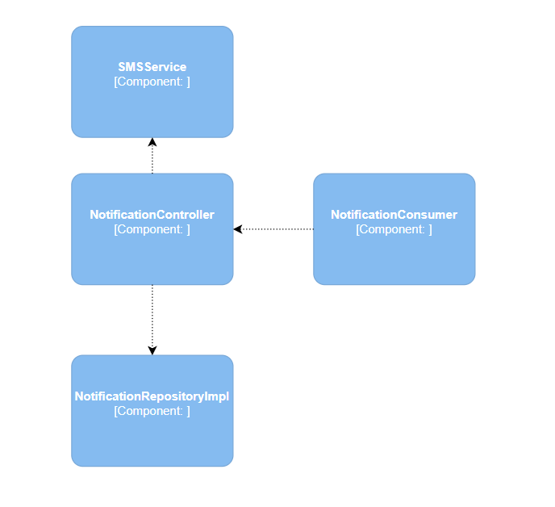
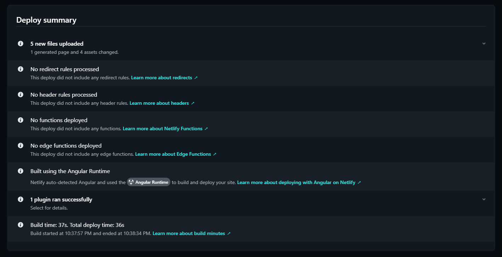

# Universidad Peruana de Ciencias Aplicadas

### Ingeniería de Software

### Ciclo 2024-02

# 
Desarrollo de Soluciones IOT

## TF REPORT

**Sección:** WX71

**Profesor**: Marco Antonio León Baca

**StartUp Name**: GrowGenius

**Producto**: GreenGrow

### Team Members:

| Member                            |    Code    |
| :-------------------------------- | :--------: |
| Checa Apolinario, Paolo Sebastián | u202112749 |
| Lazo Tapia, Jesús Antonio         | u202019038 |
| Hinostroza Mavila, Farid Rolando  | u202014468 |
| Taype Fernandez, Leonardo         | u20201e840 |
| Arana Ramos, Jack                 | u202121875 |

 

Noviembre del 2024

 

Enlace al video de exposición: [Video de Exposición TF]()

  

# Registro de Versiones del Informe

| Versión |   Fecha    |                                                                                       Autor                                                                                        | Descripción de modificación                                                                                                                                           |
| :-----: | :--------: | :--------------------------------------------------------------------------------------------------------------------------------------------------------------------------------: | :-------------------------------------------------------------------------------------------------------------------------------------------------------------------- |
|   TB1   | 28/08/2024 | Checa Apolinario, Paolo Sebastián    Lazo Tapia, Jesús Antonio    Hinostroza Mavila, Farid Rolando    Taype Fernandez, Leonardo    Arana Ramos, Jack | Se realizaron los capítulos: Capítulo I: Introducción, Capítulo II: Requirements Elicitation & Analysis, Capítulo III: Requirements Specification y Capítulo IV: Solution Software Design |
| TP1 | 25/09/2024 | Checa Apolinario, Paolo Sebastián    Lazo Tapia, Jesús Antonio    Hinostroza Mavila, Farid Rolando    Taype Fernandez, Leonardo    Arana Ramos, Jack | Se realizaron los capítulos: Capítulo V: Solution UI/UX Design y Capítulo VI: Product Implementation, Validation & Deployment |
| TB2 | 31/10/2024 | Checa Apolinario, Paolo Sebastián    Lazo Tapia, Jesús Antonio    Hinostroza Mavila, Farid Rolando    Taype Fernandez, Leonardo    Arana Ramos, Jack | Se realizaron los puntos de Sprint 2, Sprint Backlog 2, Execution Evidence for Sprint Review, Services Documentation Evidence for Sprint Review, Software Deployment Evidence for Sprint Review y Evaluaciones según heurísticas |
| TF | 17/11/2024 | Checa Apolinario, Paolo Sebastián    Lazo Tapia, Jesús Antonio    Hinostroza Mavila, Farid Rolando    Taype Fernandez, Leonardo    Arana Ramos, Jack | Se realizó la revisión final del informe, se corrigieron errores y se añadieron detalles finales para la entrega final del proyecto |

  

# Project Report Collaboration Insights

- **TB1:** Para esta entrega, realizamos como equipo las actividades correspondientes a los capítulos asignados en el siguiente repositorio dentro de nuestra organización de grupo: 

     

    Link del repositorio del Informe Final: [Github - Informe Final GreenGrow](https://github.com/GrowEasy-IOT-WX71/Informe-Final)

     

    A continuación, se muestran las capturas de evidencia correspondientes al desarrollo de los siguientes capítulos:

     

    - **Capítulo I: Introducción** (Paolo Sebastián)
    - **Capítulo II: Requirements Elicitation & Analysis** (Farid Rolando)
    - **Capítulo III: Requirements Specification** (Jesús Antonio)
    - **Capítulo IV: Solution Software Design** (Leonardo y Jack)

    

     

    

 

- **TP1:** Para esta entrega, realizamos como equipo las actividades correspondientes a los capítulos asignados en el siguiente repositorio dentro de nuestra organización de grupo: 

     

    Link del repositorio del Informe Final: [Github - Informe Final GreenGrow](https://github.com/GrowEasy-IOT-WX71/Informe-Final)

     

    A continuación, se muestran las capturas de evidencia correspondientes al desarrollo de los siguientes capítulos:

     

    - **Capítulo V: Solution UI/UX Design**
    - **Capítulo VI: Product Implementation, Validation & Deployment**

    

              
    

     

    

        
    

 

- **TB2:** Para esta entrega, realizamos como equipo las actividades correspondientes a los capítulos asignados en el siguiente repositorio dentro de nuestra organización de grupo:

     

    Link del repositorio del Informe Final: [Github - Informe Final GreenGrow](https://github.com/GrowEasy-IOT-WX71/Informe-Final)

     

    

              
    

     

    

        
    

 

- **TF:** Para esta entrega, realizamos como equipo las actividades correspondientes a los capítulos asignados en el siguiente repositorio dentro de nuestra organización de grupo:

     

    Link del repositorio del Informe Final: [Github - Informe Final GreenGrow](https://github.com/GrowEasy-IOT-WX71/Informe-Final)

     

    

        
    

     

    

        
    

  

# Contenido

## Tabla de Contenidos

### [Registro de versiones del informe](#registro-de-versiones-del-informe)

### [Project Report Collaboration Insights](#project-report-collaboration-insights)

### [Contenido](#contenido)

### [Student Outcome](#student-outcome)

### [Capítulo I: Introducción](#capítulo-i-introducción)

- [1.1. Startup Profile](#11-startup-profile)
  - [1.1.1. Descripción de la Startup](#111-description-de-la-startup)
  - [1.1.2. Perfiles de integrantes del equipo](#112-perfiles-de-integrantes-del-equipo)
- [1.2. Solution Profile](#12-solution-profile)
  - [1.2.1 Antecedentes y problemática](#121-antecedentes-y-problemática)
  - [1.2.2 Lean UX Process](#122-lean-ux-process)
    - [1.2.2.1. Lean UX Problem Statements](#1221-lean-ux-problem-statements)
    - [1.2.2.2. Lean UX Assumptions](#1222-lean-ux-assumptions)
    - [1.2.2.3. Lean UX Hypothesis Statements](#1223-lean-ux-hypothesis-statements)
    - [1.2.2.4. Lean UX Canvas](#1224-lean-ux-canvas)
- [1.3. Segmentos objetivo](#13-segmentos-objetivo)

### [Capítulo II: Requirements Elicitation & Analysis](#capítulo-ii-requirements-elicitation--analysis)

- [2.1. Competidores](#21-competidores)
  - [2.1.1. Análisis competitivo](#211-análisis-competitivo)
  - [2.1.2. Estrategias y tácticas frente a competidores](#212-estrategias-y-tácticas-frente-a-competidores)
- [2.2. Entrevistas](#22-entrevistas)
  - [2.2.1. Diseño de entrevistas](#221-diseño-de-entrevistas)
  - [2.2.2. Registro de entrevistas](#222-registro-de-entrevistas)
  - [2.2.3. Análisis de entrevistas](#223-análisis-de-entrevistas)
- [2.3. Needfinding](#23-needfinding)
  - [2.3.1. User Personas](#231-user-personas)
  - [2.3.2. User Task Matrix](#232-user-task-matrix)
  - [2.3.3. User Journey Mapping](#233-user-journey-mapping)
  - [2.3.4. Empathy Mapping](#234-empathy-mapping)
  - [2.3.5. As-is Scenario Mapping](#235-as-is-scenario-mapping)
- [2.4. Ubiquitous Language](#24-ubiquitous-language)

### [Capítulo III: Requirements Specification](#capítulo-iii-requirements-specification)

- [3.1. To-Be Scenario Mapping](#31-to-be-scenario-mapping)
- [3.2. User Stories](#32-user-stories)
- [3.3. Impact Mapping](#33-impact-mapping)
- [3.4. Product Backlog](#34-product-backlog)

### [Capítulo IV: Solution Software Design](#capítulo-iv-solution-software-design)

- [4.1. Strategic-Level Domain-Driven Design](#41-strategic-level-domain-driven-design)
  - [4.1.1. Event Storming](#411-event-storming)
    - [4.1.1.1. Candidate Context Discovery](#4111-candidate-context-discovery)
    - [4.1.1.2. Domain Message Flows Modeling](#4112-domain-message-flows-modeling)
    - [4.1.1.3. Bounded Context Canvases](#4113-bounded-context-canvases)
  - [4.1.2. Context Mapping](#412-context-mapping)
  - [4.1.3. Software Architecture](#413-software-architecture)
    - [4.1.3.1. Software Architecture System Landscape Diagram](#4131-software-architecture-system-landscape-diagram)
    - [4.1.3.2. Software Architecture Context Level Diagrams](#4132-software-architecture-context-level-diagrams)
    - [4.1.3.3. Software Architecture Container Level Diagrams](#4133-software-architecture-container-level-diagrams)
    - [4.1.3.4. Software Architecture Deployment Diagrams](#4134-software-architecture-deployment-diagrams)

- [4.2. Tactical-Level Domain-Driven Design](#42-tactical-level-domain-driven-design)
  - [4.2.1. Bounded Context: Login and Register Context](#421-bounded-context-login-and-register-context)
    - [4.2.1.1. Domain Layer](#4211-domain-layer)
    - [4.2.1.2. Interface Layer](#4212-interface-layer)
    - [4.2.1.3. Application Layer](#4213-application-layer)
    - [4.2.1.4. Infrastructure Layer](#4214-infrastructure-layer)
    - [4.2.1.5. Bounded Context Software Architecture Component Level Diagrams](#4216-bounded-context-software-architecture-component-level-diagrams)
    - [4.2.1.6. Bounded Context Software Architecture Code Level Diagrams](#4216-bounded-context-software-architecture-code-level-diagrams)
      - [4.2.1.6.1. Bounded Context Domain Layer Class Diagrams](#42161-bounded-context-domain-layer-class-diagrams)
      - [4.2.1.6.2. Bounded Context Database Design Diagrams](#42162-bounded-context-database-design-diagrams)

  - [4.2.2. Bounded Context: Notification Context](#422-bounded-context-notification-context)
    - [4.2.2.1. Domain Layer](#4221-domain-layer)
    - [4.2.2.2. Interface Layer](#4222-interface-layer)
    - [4.2.2.3. Application Layer](#4223-application-layer)
    - [4.2.2.4. Infrastructure Layer](#4224-infrastructure-layer)
    - [4.2.2.5. Bounded Context Software Architecture Component Level Diagrams](#4225-bounded-context-software-architecture-component-level-diagrams)
    - [4.2.2.6. Bounded Context Software Architecture Code Level Diagrams](#4226-bounded-context-software-architecture-code-level-diagrams)
      - [4.2.2.6.1. Bounded Context Domain Layer Class Diagrams](#42261-bounded-context-domain-layer-class-diagrams)
      - [4.2.2.6.2. Bounded Context Database Design Diagram](#42262-bounded-context-database-design-diagram)

  - [4.2.3. Bounded Context: Monitoring Context](#423-bounded-context-monitoring-context)
    - [4.2.3.1. Domain Layer](#4231-domain-layer)
    - [4.2.3.2. Interface Layer](#4232-interface-layer)
    - [4.2.3.3. Application Layer](#4233-application-layer)
    - [4.2.3.4. Infrastructure Layer](#4234-infrastructure-layer)
    - [4.2.3.5. Bounded Context Software Architecture Component Level Diagrams](#4235-bounded-context-software-architecture-component-level-diagrams)
    - [4.2.3.6. Bounded Context Software Architecture Code Level Diagrams](#4236-bounded-context-software-architecture-code-level-diagrams)
      - [4.2.3.6.1. Bounded Context Domain Layer Class Diagrams](#42361-bounded-context-domain-layer-class-diagrams)
      - [4.2.3.6.2. Bounded Context Database Design Diagram](#42362-bounded-context-database-design-diagram)

  - [4.2.4. Bounded Context: Report Context](#424-bounded-context-report-context)
    - [4.2.4.1. Domain Layer](#4241-domain-layer)
    - [4.2.4.2. Interface Layer](#4242-interface-layer)
    - [4.2.4.3. Application Layer](#4243-application-layer)
    - [4.2.4.4. Infrastructure Layer](#4244-infrastructure-layer)
    - [4.2.4.5. Bounded Context Software Architecture Component Level Diagrams](#4245-bounded-context-software-architecture-component-level-diagrams)
    - [4.2.4.6. Bounded Context Software Architecture Code Level Diagrams](#4246-bounded-context-software-architecture-code-level-diagrams)
      - [4.2.4.6.1. Bounded Context Domain Layer Class Diagrams](#42461-bounded-context-domain-layer-class-diagrams)
      - [4.2.4.6.2. Bounded Context Database Design Diagram](#42462-bounded-context-database-design-diagram)

  - [4.2.5. Bounded Context: Recommendation Context](#425-bounded-context-recommendation-context)
    - [4.2.5.1. Domain Layer](#4251-domain-layer)
    - [4.2.5.2. Interface Layer](#4252-interface-layer)
    - [4.2.5.3. Application Layer](#4253-application-layer)
    - [4.2.5.4. Infrastructure Layer](#4254-infrastructure-layer)
    - [4.2.5.5. Bounded Context Software Architecture Component Level Diagrams](#4255-bounded-context-software-architecture-component-level-diagrams)
    - [4.2.5.6. Bounded Context Software Architecture Code Level Diagrams](#4256-bounded-context-software-architecture-code-level-diagrams)
      - [4.2.5.6.1. Bounded Context Domain Layer Class Diagrams](#42561-bounded-context-domain-layer-class-diagrams)
      - [4.2.5.6.2. Bounded Context Database Design Diagram](#42562-bounded-context-database-design-diagram)

### [Capítulo V: Solution UI/UX Design](#capítulo-v-solution-uiux-design)

- [5.1. Style Guidelines](#51-style-guidelines)
  - [5.1.1. General Style Guidelines](#511-general-style-guidelines)
  - [5.1.2. Web, Mobile and IoT Style Guidelines](#512-web-mobile-and-iot-style-guidelines)
- [5.2. Information Architecture](#52-information-architecture)
  - [5.2.1. Organization Systems](#521-organization-systems)
  - [5.2.2. Labeling Systems](#522-labeling-systems)
  - [5.2.3. SEO Tags and Meta Tags](#523-seo-tags-and-meta-tags)
  - [5.2.4. Searching Systems](#524-searching-systems)
  - [5.2.5. Navigation Systems](#525-navigation-systems)
- [5.3. Landing Page UI Design](#53-landing-page-ui-design)
  - [5.3.1. Landing Page Wireframe](#531-landing-page-wireframe)
  - [5.3.2. Landing Page Mock-up](#532-landing-page-mock-up)
- [5.4. Applications UX/UI Design](#54-applications-uxui-design)
  - [5.4.1. Applications Wireframes](#541-applications-wireframes)
  - [5.4.2. Applications Wireflow Diagrams](#542-applications-wireflow-diagrams)
  - [5.4.3. Applications Mock-ups](#543-applications-mock-ups)
  - [5.4.4. Applications User Flow Diagrams](#544-applications-user-flow-diagrams)
- [5.5. Applications Prototyping](#55-applications-prototyping)

### [Capítulo VI: Product Implementation, Validation & Deployment](#capítulo-vi-product-implementation-validation--deployment)

- [6.1. Software Configuration Management](#61-software-configuration-management)
  - [6.1.1. Software Development Environment Configuration](#611-software-development-environment-configuration)
  - [6.1.2. Source Code Management](#612-source-code-management)
  - [6.1.3. Source Code Style Guide & Conventions](#613-source-code-style-guide--conventions)
  - [6.1.4. Software Deployment Configuration](#614-software-deployment-configuration)

- [6.2. Landing Page, Services & Applications Implementation](#62-landing-page-services--applications-implementation)
  - [6.2.1. Sprint](#621-sprint)
    - [6.2.1.1. Sprint Planning 1](#6211-sprint-planning-1)
    - [6.2.1.2. Sprint Backlog 1](#6212-sprint-backlog-1)
    - [6.2.1.3. Development Evidence for Sprint Review](#6213-development-evidence-for-sprint-review)
    - [6.2.1.4. Testing Suite Evidence for Sprint Review](#6214-testing-suite-evidence-for-sprint-review)
    - [6.2.1.5. Execution Evidence for Sprint Review](#6215-execution-evidence-for-sprint-review)
    - [6.2.1.6. Services Documentation Evidence for Sprint Review](#6216-services-documentation-evidence-for-sprint-review)
    - [6.2.1.7. Software Deployment Evidence for Sprint Review](#6217-software-deployment-evidence-for-sprint-review)
    - [6.2.1.8. Team Collaboration Insights during Sprint](#6218-team-collaboration-insights-during-sprint)
  - [6.2.2. Sprint 2](#622-sprint-2)
    - [6.2.2.1. Sprint Planning 2](#6221-sprint-planning-2)
    - [6.2.2.2. Sprint Backlog 2](#6222-sprint-backlog-2)
    - [6.2.2.3. Development Evidence for Sprint Review](#6223-development-evidence-for-sprint-review)
    - [6.2.2.4. Testing Suite Evidence for Sprint Review](#6224-testing-suite-evidence-for-sprint-review)
    - [6.2.2.5. Execution Evidence for Sprint Review](#6225-execution-evidence-for-sprint-review)
    - [6.2.2.6. Services Documentation Evidence for Sprint Review](#6226-services-documentation-evidence-for-sprint-review)
    - [6.2.2.7. Software Deployment Evidence for Sprint Review](#6227-software-deployment-evidence-for-sprint-review)
    - [6.2.2.8. Team Collaboration Insights during Sprint](#6228-team-collaboration-insights-during-sprint)

  - [6.2.3. Sprint 3](#623-sprint-3)
    - [6.2.3.1. Sprint Planning 3](#6231-sprint-planning-3)
    - [6.2.3.2. Sprint Backlog 3](#6232-sprint-backlog-3)
    - [6.2.3.3. Development Evidence for Sprint Review](#6233-development-evidence-for-sprint-review)
    - [6.2.3.4. Testing Suite Evidence for Sprint Review](#6234-testing-suite-evidence-for-sprint-review)
    - [6.2.3.5. Execution Evidence for Sprint Review](#6235-execution-evidence-for-sprint-review)
    - [6.2.3.6. Services Documentation Evidence for Sprint Review](#6236-services-documentation-evidence-for-sprint-review)
    - [6.2.3.7. Software Deployment Evidence for Sprint Review](#6237-software-deployment-evidence-for-sprint-review)
    - [6.2.3.8. Team Collaboration Insights during Sprint](#6238-team-collaboration-insights-during-sprint)

- [6.3. Validation Interviews](#63-validation-interviews)
    - [6.3.1. Diseño de Entrevistas](#631-diseño-de-entrevistas)
    - [6.3.2. Registro de Entrevistas](#632-registro-de-entrevistas)

- [6.4. Video About-the-Product](#64-video-about-the-product)

  

    

### [Conclusiones](#conclusiones)

### [Bibliografía](#bibliografía)

### [Anexos](#anexos)
- [Anexo D: Formato para Evaluación de User Experience según Heurísticas](#anexo-d-formato-para-evaluación-de-user-experience-según-heurísticas)

# Student Outcome

| Criterio específico |                                                                                                                                                                                                                                                                                                                                                                                                                                                                                                                                                                                                                                                                                                                                                                                                                                                                                                                                                                                                                                                                                                                                                                                                                                                                                                                                                                                                                                                                                                                                                                                                                                                                                                                                                                                                                                                                                                                                                                                                                                                                                                                                                                                                                                                            Acciones realizadas                                                                                                                                                                                                                                                                                                                                                                                                                                                                                                                                                                                                                                                                                                                                                                                                                                                                                                                                                                                                                                                                                                                                                                                                                                                                                                                                                                                                                                                                                                                                                                                                                                                                                                                                                                                                                                                                                                                                                                                                                                                                                                                                                                                                                                                            | Conclusiones |
| :------------------: |:-----------------------------------------------------------------------------------------------------------------------------------------------------------------------------------------------------------------------------------------------------------------------------------------------------------------------------------------------------------------------------------------------------------------------------------------------------------------------------------------------------------------------------------------------------------------------------------------------------------------------------------------------------------------------------------------------------------------------------------------------------------------------------------------------------------------------------------------------------------------------------------------------------------------------------------------------------------------------------------------------------------------------------------------------------------------------------------------------------------------------------------------------------------------------------------------------------------------------------------------------------------------------------------------------------------------------------------------------------------------------------------------------------------------------------------------------------------------------------------------------------------------------------------------------------------------------------------------------------------------------------------------------------------------------------------------------------------------------------------------------------------------------------------------------------------------------------------------------------------------------------------------------------------------------------------------------------------------------------------------------------------------------------------------------------------------------------------------------------------------------------------------------------------------------------------------------------------------------------------------------------------------------------------------------------------------------------------------------------------------------------------------------------------------------------------------------------------------------------------------------------------------------------------------------------------------------------------------------------------------------------------------------------------------------------------------------------------------------------------------------------------------------------------------------------------------------------------------------------------------------------------------------------------------------------------------------------------------------------------------------------------------------------------------------------------------------------------------------------------------------------------------------------------------------------------------------------------------------------------------------------------------------------------------------------------------------------------------------------------------------------------------------------------------------------------------------------------------------------------------------------------------------------------------------------------------------------------------------------------------------------------------------------------------------------------------------------------------------------------------------------------------------------------------------------------------------------------------------------------------------------------------------------------------------------------------------------------------------------------------------------------------------------------------------------------------------------------------------------------------------------------------------------------------------------------------------------------------------------------------------------------------------------------------------------------------------------------------------------------------------------------------------------------------------------------------------------------------------------------------------------------------------------------------:| :----------: |
| 
 Comunica oralmente sus ideas y/o resultados con objetividad a público de diferentes especialidades y niveles jerárquicos, en el marco del desarrollo de un proyecto en ingeniería.
 |                                                                                                                                                                                                                                                                                                                         
 **Paolo Sebastián Checa Apolinario**   **TB1**   Definimos en equipo el tema a desarrollar a lo largo del proyecto, definiendo tareas a cada uno. En mi caso, participé realizando el Startup Profile y la arquitectura del software.    **TP**   Realizamos el primer sprint de nuestro proyecto, enfocado a desplegar nuestra Landing Page y la primera versión de la Aplicación Web.    **TB2**   Expliqué los aspectos técnicos del proyecto agrícola, como la integración de dispositivos IoT y el monitoreo en tiempo real de cultivos, adaptando el lenguaje para diferentes audiencias.    **TF**   Se realizó el video de ejecución de la solucion, mostrando las principales funcionalidades de la aplicación.    **Jesus Lazo Tapia**   **TB1**   He estado en equipo participando en todas las reuniones, contribuyendo al impact mapping y To-Be Scenario Mapping, y colaborando en la toma de decisiones.    **TP**   He estado en equipo participando en todas las reuniones, contribuyendo al desarrollo y diseño de los wireframe y mock up de la landing page.    **TB2**   Durante el desarrollo del sprint 2, mantuve una constante comunicación con mi equipo para realizar la página web y si todos estábamos conformes con el diseño de nuestra página.   **TF**   Se realizo la actualización a la pagina web para recibir los datos del wokwi y grabe mi video para este entregable sprint 3.    **Farid Hinostroza Mavila**   **TB1**   He presentado los resultados del análisis de usuarios mediante la creación de user personas y el empathy map, asegurándome de que la información fuera clara para todos los miembros del equipo. Además, participé en las discusiones sobre la matriz de tareas del usuario.    **TP**   Trabajé en equipo para liderar de forma colaborativa el diseño y desarrollo de la arquitectura UI/UX de la solución "GrowEasy", asegurando la consistencia visual y la accesibilidad en todas las plataformas (web, móvil e IoT). Coordinamos la creación de directrices de estilo, optimización de interfaces, y la implementación de sistemas de navegación claros y simples, facilitando la experiencia del usuario en la gestión y monitoreo de cultivos inteligentes.    **TB2**   Durante el desarrollo del sprint 2, mantuve una comunicación y entorno dinámico con todos los miembros del equipo, logrando ejemplificar lo previsto en el planning y solventar posibles desacuerdos.    **TF**   Durante el desarrollo del último sprint, logré fomentar una comunicación efectiva con los miembros del equipo. Además, colaboré en la elaboración del video final de demostración, adaptando el contenido técnico para audiencias con diferentes niveles de especialización.    **Leonardo Taype Fernandez**   **TB1**   Participé activamente en las discusiones del equipo sobre la arquitectura del software, ofreciendo ideas para la integración de los distintos contextos del dominio. También colaboré en la elaboración de la documentación técnica y en la revisión de los componentes del proyecto.    **TP1**   He colaborado activamente con la elaboración de los prototipos y mockups de la aplicación móvil y web.    **TB2**   Al presentar los flujos de usuario y prototipos de la aplicación, respondí de manera objetiva a preguntas sobre la usabilidad de la aplicación y la adaptación de la interfaz para usuarios de distintas especialidades agrícolas.    **Jack Arana Ramos**   **TB1**   He tomado un rol proactivo en la coordinación de tareas y en la organización de reuniones. Mi contribución se ha centrado en la gestión de la planificación del proyecto y en asegurar que todos los miembros del equipo estén alineados con los objetivos y plazos establecidos.    **TP**   He presentado con éxito el diseño UX/UI de las Aplicaciones, contribuyendo en el desarrollo de los wireframes y wireflow diagrams.    **TB2**   Se realizó con éxito el desarrollo e integración del backend con las aplicaciones web y móvil, asi como con los dispositivos IOT.     **TF**   Durante el desarrollo del sprint 3, participe en la actualizacion de la evidencia de documentacion de los servicios y en la entrevista de validacion.  
                                                                                                                                                                                                                                                                                                                          | **TB1**   La colaboración y el liderazgo compartido han sido esenciales para el avance del proyecto, permitiendo una distribución equilibrada de tareas y una integración eficiente de contribuciones individuales. Esto ha resultado en un desarrollo cohesivo y bien fundamentado del Startup Profile y la arquitectura del software.    **TP**   El desarrollo de los prototipos y diseños de la solución contribuyen activamente al equipo para implementar el producto de manera satisfactoria.    **TB2**   A lo largo del desarrollo, demostramos competencia para transmitir conceptos técnicos complejos de forma accesible, y presentar los resultados de pruebas y ajustes con claridad, fortaleciendo la cohesión del grupo, alineando los objetivos del proyecto con el potencial de la solución para impactar positivamente en el sector agrícola.    **TF1**   Realizamos las últimas funcionalidades de la aplicación, para cumplir con los requisitos solicitados y presentar una solución de calidad. |
| 
 Comunica en forma escrita ideas y/o resultados con objetividad a público de diferentes especialidades y niveles jerárquicos, en el marco del desarrollo de un proyecto en ingeniería.
 | 
 **Paolo Sebastián Checa Apolinario**   **TB1**   Colaboramos activamente en equipo con el desarrollo de nuestro informe, completando nuestras tareas en conjunto dentro de nuestro repositorio en Github.    **TP**   Implementamos los diseños que tendrá nuestra solución, lanzando la primera versión tanto de la Landing Page como de la Aplicación Web.    **TB2**   Reconocí la importancia de aprender sobre nuevas tecnologías y herramientas en IoT y monitoreo de cultivos, lo cual me permitió integrar innovaciones que mejoran la efectividad de la solución agrícola, promoviendo el uso de herramientas de software actualizadas para el beneficio del proyecto y el sector.    **TF**   Implementamos las funcionalidades finales a nuestra solución, aplicando mejoras continuas para cumplir con lo solicitado por nuestros usuarios.    **Jesus Lazo Tapia**   **TB1**   He promovido un entorno colaborativo al ayudar con el markdown, participar en la planificación, y asegurar que todas las voces sean escuchadas, contribuyendo a cumplir nuestras metas.    **TP**   He promovido un entorno colaborativo al ayudar con el desarrollo de los puntos para esta entrega, participar en la planificación, y me he asegurado en seguir las indicaciones de mis compañeros para realizar el trabajo.    **TB2**   Colaboré con el desarrollo de la aplicación usando Angular Material y mis conocimientos sobre Html, css y typescript. Para que la aplicación tenga una buena funcionalidad entre las páginas y ayudando al usuario a que tenga un diseño interactivo, entendible y atractivo.   **TF**   Implemente la sección de análisis en la pagina web donde el usuario podrá visualizar de manera grafica y sencilla los resultado que le mande el worki a la pagina web. Cumpli con los objetivos del equipo.    **Farid Hinostroza Mavila**   **TB1**   He colaborado en la redacción de informes que incluyen el análisis de competidores, user personas, y la matriz de tareas de usuario. Además, documenté estos resultados en el repositorio de GitHub para facilitar su acceso por parte de todo el equipo.    **TP**   Manejé un entorno colaborativo e inclusivo durante el desarrollo del proyecto "GrowEasy", donde establecimos metas claras, planificamos las tareas en equipo y cumplimos los objetivos a tiempo. Fomentamos la participación activa de todos los miembros, asegurándonos de que cada persona contribuyera de manera equitativa en la definición de las directrices de diseño y la implementación de la interfaz, logrando así un producto final accesible y funcional para los usuarios.    **TB2**   Colaboré con el desarrollo del backend respecto al bounded context notification y management, también en la revisión de las heurísticas, siguiendo las bases de nuestro proyecto.    **TF**   Desarrollé el informe final del proyecto, destacando las métricas técnicas clave y el impacto positivo de las funcionalidades implementadas en el usuario final. Además, gestioné la integración de este informe en el repositorio compartido para facilitar su distribución y revisión.    **Leonardo Taype Fernandez**   **TB1**   He trabajado en la coordinación de tareas y en la planificación del proyecto, asegurando que todos los miembros del equipo tuvieran tareas claras y metas definidas. También he facilitado un ambiente de trabajo inclusivo al estar disponible para ayudar a mis compañeros y al fomentar la colaboración.    **TP**   Colaboré  con mis compañeros para seguir una misma línea de diseño para nuestros productos de software.    **TB2**   Reconocí la necesidad de formarme en el uso de herramientas de monitoreo de rendimiento en tiempo real para mejorar la supervisión de la aplicación. Esta capacitación me permitió identificar áreas de optimización en el rendimiento del software y proponer mejoras que benefician tanto al desarrollo como a la experiencia del usuario final.    **Jack Arana Ramos**   **TB1**   He establecido metas claras y realistas para el equipo, facilitando la planificación de tareas y asegurando que el progreso se monitoree adecuadamente. He promovido un ambiente inclusivo al involucrar a todos los miembros en la toma de decisiones y al valorar sus aportes.    **TP**   He facilitado el índice de contenido del markdown para esta entrega, promoviendo una mayor facilidad para mis compañeros en la redacción del informe en Markdown.    **TB2**   Identifiqué la necesidad de profundizar en los estándares de seguridad de datos, lo que me llevó a investigar y aplicar prácticas avanzadas en protección de la información de los usuarios y del sistema. Este aprendizaje me permitió garantizar la seguridad de los datos en el proyecto, alineándome con las mejores prácticas de la industria.     **TF**   Durante el desarrollo del sprint 3, colabore en la actualización del backend, logrando integrar una mejor integracion con el frontend. 
 | **TB1**   La creación de un entorno colaborativo y la planificación estructurada han facilitado el cumplimiento de metas y objetivos del equipo. La participación activa de cada miembro en la planificación, redacción de informes y documentación ha optimizado el proceso de trabajo y garantizado que todos los aportes sean considerados y valorados.    **TP**   Al desarrollar la primera versión de nuestra solución, podemos notar los puntos a mejorar e implementar en futuras entregas, para cumplir con las expectativas de los usuarios.    **TB2**   Al profundizar en los estándares de seguridad de datos, se han implementado prácticas avanzadas que garantizan la protección de la información, alineándose con las mejores prácticas de la industria. Además, la adaptación a metodologías ágiles ha fortalecido la colaboración y eficiencia del equipo, promoviendo una cultura de mejora continua.    **TF**   Como equipo logramos realizar una solución funcional y de calidad, la cual cumple con las necesidades de nuestros usuarios de manera correcta, y que aún tiene margen de mejora para futuras actualizaciones. |

# Capítulo I: Introducción

## 1.1. StartUp Profile

### 1.1.1. Description de la StartUp

Nuestra startup recibe el nombre de GrowEasy Innovators, la cual nace para ofrecer soluciones avanzadas en el monitoreo y gestión de cultivos mediante tecnología IoT. Nos dedicamos a fortalecer a los agricultores y aficionados de la hidroponía con herramientas tecnológicas que permiten un control preciso y automatizado de sus cultivos. A través de sensores inteligentes, los usuarios pueden monitorear en tiempo real parámetros críticos como la temperatura, humedad, intensidad del viento y la iluminación, optimizando el crecimiento de las plantas y garantizando cosechas de alta calidad. Además, ofrecemos una plataforma intuitiva que permite la gestión remota de estos factores, facilitando la toma de decisiones y reduciendo el margen de error.

 

          

- **Visión:** Nos proponemos ser líderes en la integración de tecnología IoT en la agricultura, facilitando el acceso a soluciones inteligentes que promuevan prácticas sostenibles y eficientes en el cultivo de alimentos, independientemente del entorno.

- **Misión:** Nuestra misión es proporcionar una solución integral que permita a los agricultores, tanto expertos como aficionados, monitorear y gestionar sus cultivos de manera eficiente y sostenible a través de tecnología IoT, mejorando así la productividad y reduciendo el impacto ambiental.

### 1.1.2. Perfiles de integrantes del equipo

<table align="center"  border="1" width="70%" style="text-align:center;">
    <tr align="center">
        <td rowspan="4">
            
        </td>
        <td align="left">
            <b>Nombres y Apellidos:</b>
                         
            Checa Apolinario, Paolo Sebastián 
        </td>
    </tr>    
    <tr>
        <td align="left">
        <b>Código:</b>
         
        U202112749
        </td>
    </tr>
    <tr>
        <td align="left">
        <b>Descripción de carrera</b>
         
        

        En la Ingeniería de Software uno consigue los instrumentos necesarios para poder desarrollar programas o aplicaciones. El camino para lograr aquello se basa en un proceso donde el ingeniero deberá analizar lo requerido, planificar el desarrollo del proceso y comprobar su funcionamiento correcto hasta que este se ejecute sin errores. Las estrategias usadas para simplificar y acelerar estos procesos serán clave en esta rama pues estas serán las soluciones innovadoras que el ingeniero deberá crear.
        
 
        </td>
    </tr>
    <tr>
        <td align="left">
        <b>Conocimiento y habilidades</b>
         
        

        Poseo conocimientos en programación en el entorno del lenguaje C++, Python y Java. Estoy dispuesto a aportar nuevas ideas al equipo, tengo fácil adaptación a los roles designados y buena organización. Soy responsable y dispongo de la capacidad para aportar ideas innovadoras en beneficio de nuestro proyecto. 
        </td>
    </tr>
    <tr align="center">
        <td rowspan="4">
            
        </td>
        <td align="left">
            <b>Nombres y Apellidos:</b>
                         
            Lazo Tapia, Jesús Antonio 
        </td>
    </tr>    
    <tr>
        <td align="left">
        <b>Código:</b>
         
        U202019038
        </td>
    </tr>
    <tr>
        <td align="left">
        <b>Descripción de carrera</b>
         
        

        La Ingeniería de Software proporciona las herramientas esenciales para crear programas y aplicaciones. Este proceso involucra que el ingeniero analice las necesidades, planifique el desarrollo y verifique que todo funcione correctamente hasta asegurar que el software opere sin fallas. Las tácticas implementadas para optimizar y acelerar estos procedimientos serán fundamentales en este campo, ya que representan las soluciones innovadoras que el ingeniero debe desarrollar. 
        

        </td>
    </tr>
    <tr>
        <td align="left">
        <b>Conocimiento y habilidades</b>
         
        

        Poseo conocimientos en programación que he estado llevando desde el inicio de mi carrera, me gusta el desarrollo con tecnología inteligente y redes y comunicaciones de datos. Soy responsable y estaré apoyando a mi grupo para obtener el éxito de nuestro trabajo.
        
 
        </td>
    </tr>
    <tr align="center">
        <td rowspan="4">
            
        </td>
        <td align="left">
            <b>Nombres y Apellidos:</b>
                         
            Hinostroza Mavila, Farid Rolando 
        </td>
    </tr>    
    <tr>
        <td align="left">
        <b>Código:</b>
         
        U202014468
        </td>
    </tr>
    <tr>
        <td align="left">
        <b>Descripción de carrera</b>
         
        

        La Ingeniería de Software es una disciplina que combina creatividad y lógica para desarrollar soluciones tecnológicas que impacten positivamente en la sociedad. Este campo abarca desde la concepción de la idea hasta la implementación y mantenimiento de software, garantizando que las soluciones sean efectivas y eficientes. El ingeniero de software debe estar preparado para enfrentar desafíos complejos, aplicar metodologías ágiles, adaptarse a las nuevas tendencias tecnológicas, asegurando que los productos finales cumplan con los estándares de calidad y funcionalidad.
        
 
        </td>
    </tr>
    <tr>
        <td align="left">
        <b>Conocimiento y habilidades</b>
         
        

        He adquirido una base sólida en desarrollo de software, con un interés particular en la inteligencia artificial y la gestión de bases de datos. Mi enfoque es la mejora continua y la implementación de soluciones innovadoras que resuelvan problemas reales. Además, soy proactivo y colaborativo, lo que me permite trabajar eficazmente en equipo para alcanzar los objetivos propuestos, siempre con la vista puesta en la excelencia y la eficiencia del proyecto.
        
 
        </td>
    </tr>
    <tr align="center">
        <td rowspan="4">
            
        </td>
        <td align="left">
            <b>Nombres y Apellidos:</b>
                         
            Taype Fernandez, Leonardo 
        </td>
    </tr>    
    <tr>
        <td align="left">
        <b>Código:</b>
         
        U20201E840
        </td>
    </tr>
    <tr>
        <td align="left">
        <b>Descripción de carrera</b>
         
        

        En la carrera de Ingeniería de Software adquirimos conocimiento para desarrollar soluciones a través de software. Analizamos requisitos, diseñamos arquitectura, creamos código y mantenemos en funcionamiento productos de software. 
        

        </td>
    </tr>
    <tr>
        <td align="left">
        <b>Conocimiento y habilidades</b>
         
        

        Me considero una persona comprometida y responsable. Me gusta aprender y plantearme retos. Estudio la carrera de ingeniería de software, siempre me ha gustado interactuar con la computadora y ahora puedo ser un profesional haciendo lo que me gusta. Tengo conocimientos en desarrollo web, móvil y desktop. 
        

        </td>
    </tr>
    <tr align="center">
        <td rowspan="4">
            
        </td>
        <td align="left">
            <b>Nombres y Apellidos:</b>
                         
            Arana Ramos, Jack 
        </td>
    </tr>    
    <tr>
        <td align="left">
        <b>Código:</b>
         
        U202121875
        </td>
    </tr>
    <tr>
        <td align="left">
        <b>Descripción de carrera</b>
         
        

        Estudiante de Ingeniería de Software en la Universidad Peruana de Ciencias Aplicadas. La carrera de Ingeniería de Software está diseñada para formar profesionales altamente capacitados en el diseño, desarrollo y mantenimiento de sistemas de software complejos. A lo largo del programa, se adquiere una sólida base en principios de ingeniería, metodologías de desarrollo, y buenas prácticas en la gestión de proyectos tecnológicos. 
        

        </td>
    </tr>
    <tr>
        <td align="left">
        <b>Conocimiento y habilidades</b>
         
        

        Tengo experiencia en desarrollo web full stack, manejando tanto front-end como back-end. También estoy capacitado en prácticas de DevOps, control de versiones con Git, y diseño de interfaces de usuario eficientes. Mis habilidades analíticas y de trabajo en equipo, junto con una gestión eficaz del tiempo, me permiten adaptarme rápidamente a nuevas tecnologías y resolver problemas complejos de manera eficiente. 
        

        </td>
    </tr>
</table>

## 1.2. Solution Profile

**Nombre del Producto:** Nuestro servicio tiene el nombre de “GrowEasy”, reflejando nuestro compromiso de facilitar el monitoreo y la gestión eficiente de cultivos para nuestros usuarios. Con la tecnología IoT, los usuarios podrán supervisar y optimizar el crecimiento de sus plantas de manera sencilla, creciendo junto con nosotros a medida que aprovechan al máximo nuestras herramientas tecnológicas.

**Descripción del Producto:** Proponemos un servicio innovador y tecnológico que permite a los usuarios monitorear y gestionar sus cultivos a través de sensores IoT que capturan datos en tiempo real sobre parámetros como temperatura, humedad, y luz. Con esta información, los usuarios pueden tomar decisiones informadas para mejorar la salud y productividad de sus plantas, ya sea en un entorno doméstico o a mayor escala. Nuestro enfoque es hacer que la tecnología sea accesible y fácil de usar, priorizando la simplicidad y la efectividad para todos los usuarios de nuestra plataforma.

**Monetización:** Nuestro servicio generará ingresos a través de la venta de hardware IoT (sensores y dispositivos de control) y suscripciones a la plataforma que ofrecen acceso a funcionalidades avanzadas, como análisis de datos y recomendaciones personalizadas. Además, consideramos alianzas con empresas de insumos y equipamiento agrícola para ofrecer publicidad dirigida y relevante dentro de nuestra aplicación, brindando a los usuarios acceso a productos y servicios que complementen su experiencia de cultivo.

### 1.2.1. Antecedentes y problemática

Para este segmento, utilizamos la técnica 5W y 2H, lo que nos permite identificar los aspectos clave relacionados con nuestro proyecto.

- **Who**

Nuestros usuarios son agricultores, tanto aficionados como expertos, interesados en utilizar tecnología avanzada para monitorear y optimizar sus cultivos. Están comprometidos con la adopción de soluciones innovadoras que les permitan mejorar la eficiencia y la sostenibilidad de sus procesos agrícolas.

- **What**

El desafío principal para nuestros usuarios radica en la falta de herramientas accesibles y fáciles de usar que les permitan monitorear en tiempo real y gestionar eficientemente los diferentes factores que afectan el crecimiento de sus cultivos, como la temperatura, humedad, viento e iluminación.

- **Where**

Este problema surge principalmente en áreas rurales y urbanas donde los agricultores y aficionados a la hidroponía no tienen acceso a soluciones tecnológicas integradas, lo que dificulta el control eficiente de las condiciones de cultivo.

- **When**

La dificultad se presenta constantemente, especialmente cuando los usuarios buscan maximizar la productividad y la calidad de sus cultivos, pero no cuentan con los medios para monitorear y ajustar las variables ambientales de manera precisa y en tiempo real.

- **Why**

Los usuarios suelen enfrentar obstáculos debido a la falta de soluciones IoT asequibles y comprensibles que les permitan realizar un monitoreo continuo y automatizado de sus cultivos. Esto los obliga a recurrir a métodos tradicionales o manuales que no siempre son eficaces para asegurar un crecimiento óptimo.

- **How**

Para abordar esta problemática, hemos desarrollado una plataforma IoT que integra sensores inteligentes con una aplicación móvil y web. Esta solución permite a los usuarios monitorear en tiempo real las condiciones de sus cultivos, recibir alertas y recomendaciones, y ajustar automáticamente los parámetros necesarios para asegurar un crecimiento saludable y sostenible.

- **How much**

De acuerdo con información del Instituto Nacional de Estadística e Informática (INEI), el sector agrícola en el Perú mostró un aumento significativo en la tasa de empleo durante el segundo y tercer trimestre de 2020. En el segundo trimestre, el empleo en este sector creció un 22.6%, y en el tercer trimestre, un 20.5%. Esto es especialmente destacable si se considera que, en esos mismos periodos, la población empleada a nivel nacional disminuyó en un 39.6% y un 17.1%, respectivamente, en comparación con 2019. Además, según El Comercio (2019), la hidroponía se considera el futuro de la agricultura sostenible, ya que requiere un 90% menos de agua que las técnicas agrícolas tradicionales. Esto representa una gran ventaja para quienes desean iniciar su propio proyecto, ya que la hidroponía permite el cultivo en espacios reducidos, optimizando tanto el espacio como los recursos.

 

### 1.2.2. Lean UX Process

#### 1.2.2.1. Lean UX Problem Statements

De acuerdo con El Comercio (2019), la hidroponía es el futuro de la agricultura sostenible, utilizando un 90% menos de agua que los métodos tradicionales y adaptándose eficientemente a espacios reducidos, lo que permite un crecimiento más rápido de los cultivos. Sin embargo, muchos agricultores, tanto aficionados como expertos, enfrentan barreras para acceder a soluciones tecnológicas integradas que faciliten el monitoreo y la optimización de sus cultivos. Como startup, nuestro objetivo es abordar la siguiente interrogante: ¿Cómo podemos emplear tecnologías IoT para ofrecer un servicio innovador que brinde herramientas accesibles y avanzadas, permitiendo a los aficionados y expertos en hidroponía gestionar sus cultivos de manera eficiente?

#### 1.2.2.2. Lean UX Assumptions

**Business outcomes:**

- Los usuarios están interesados en monitorear y optimizar sus cultivos utilizando tecnología IoT.
- Los usuarios buscan orientación y soporte para configurar y utilizar sensores IoT en sus proyectos agrícolas.
- Los usuarios desean una interfaz intuitiva y fácil de usar para configurar sensores, visualizar datos en tiempo real, y recibir alertas.
- Los usuarios deben poder interpretar los datos de manera clara y precisa para tomar decisiones informadas sobre sus cultivos.
- Las aplicaciones deben ser compatibles con los múltiples dispositivos y navegadores actuales.

**User assumptions:**

- **¿Quién es el usuario?**

Los usuarios son agricultores, tanto aficionados como expertos, que buscan mejorar la gestión de sus cultivos mediante la implementación de tecnología IoT. Incluye tanto a aficionados que están aprendiendo sobre agricultura tecnológica como a expertos que desean optimizar sus procesos.

- **¿Dónde encaja nuestro producto en su trabajo o vida?**

Nuestra aplicación puede ser una herramienta esencial para la gestión diaria de cultivos hidropónicos, permitiendo a los usuarios monitorear factores críticos como temperatura, humedad y luz, optimizando el uso de recursos y mejorando la productividad.

- **¿Qué problema tiene nuestro producto? ¿Cómo se resuelve?**

El problema es la falta de herramientas accesibles para monitorear cultivos en tiempo real, lo que puede llevar a ineficiencias en el uso de recursos. Se resuelve ofreciendo una plataforma que permite la configuración y monitoreo de sensores IoT, proporcionando alertas y recomendaciones basadas en datos.

- **¿Cuándo y cómo es usado nuestro producto?**

Nuestro producto es utilizado tanto en tiempo real como de forma periódica, permitiendo a los usuarios revisar el estado de sus cultivos, recibir notificaciones y ajustar configuraciones según las necesidades cambiantes de sus plantas. Los expertos pueden usar la plataforma para gestionar múltiples cultivos simultáneamente.

- **¿Qué características son importantes?**

Las características más importantes incluyen la capacidad de conectar y configurar múltiples sensores IoT, visualización de datos en tiempo real, alertas automáticas ante condiciones adversas, y un sistema de recomendaciones basado en análisis de datos históricos.

- **¿Cómo debe verse nuestro producto y comportarse?**

El producto debe ser visualmente atractivo y fácil de usar, con una interfaz que permita a los usuarios navegar y configurar sensores rápidamente. Debe ser robusto, eficiente, y garantizar un rendimiento estable incluso al manejar grandes volúmenes de datos.

#### 1.2.2.3. Lean UX Hypothesis Statements

En esta sección, presentaremos hipótesis que proponen soluciones a las problemáticas identificadas previamente en nuestro proyecto enfocado en el monitoreo de cultivos mediante tecnología IoT. Estas hipótesis serán específicas y contarán con métricas claras para garantizar que el éxito pueda ser evaluado de manera objetiva. Las métricas utilizadas se basan en promedios generales de aplicaciones y sistemas IoT existentes en el sector agrícola.

**Hipótesis 1:**

Creemos que nuestra aplicación y sistema IoT serán una herramienta invaluable para aficionados en el cultivo hidropónico, permitiéndoles monitorear y gestionar eficientemente sus cultivos. Sabremos que tuvimos éxito cuando más del 70% de los usuarios aficionados reporten mejoras significativas en la salud y rendimiento de sus cultivos.

Métricas:

1. Porcentaje de usuarios aficionados que reportan mejoras en sus cultivos

    - Métrica actual: 0%
    - Métrica deseada: 70%

 

2. Número de sesiones de monitoreo activas por usuario aficionado por semana

- Métrica actual: 1
- Métrica deseada: 5

 

**Hipótesis 2:**

Creemos que la contribución de expertos en agricultura será fundamental para optimizar las funcionalidades avanzadas de nuestra plataforma. Sabremos que tuvimos éxito cuando más del 75% de los expertos utilicen y recomienden nuestras herramientas analíticas y de personalización avanzada.

Métricas:

1. Porcentaje de expertos que utilizan funcionalidades avanzadas

    - Métrica actual: 0%
    - Métrica deseada: 75%

 

2. Número de configuraciones personalizadas creadas por expertos

    - Métrica actual: 0
    - Métrica deseada: 50 por mes

 

**Hipótesis 3:**

Creemos que nuestra aplicación será utilizada principalmente por personas mayores de 18 años, siendo este nuestro segmento objetivo principal. Sabremos que tuvimos éxito cuando el 85% de nuestros usuarios activos pertenezcan a este grupo de edad.

Métricas:

1. Porcentaje de usuarios mayores de 18 años

    - Métrica actual: 0%
    - Métrica deseada: 85%

 

2. Tasa de retención de usuarios mayores de 18 años

    - Métrica actual: 0%
    - Métrica deseada: 70% mensual

 

**Hipótesis 4:**

Creemos que nuestra aplicación será sencilla y fácil de usar para todos nuestros usuarios. Sabremos que tuvimos éxito cuando más del 85% de los usuarios reporten una alta satisfacción con la usabilidad de la aplicación en encuestas periódicas.

Métricas:

1. Porcentaje de usuarios satisfechos con la usabilidad

    - Métrica actual: 0%
    - Métrica deseada: 85%

 

2. Tiempo promedio para configurar el sistema IoT por parte de nuevos usuarios

    - Métrica actual: 60 minutos
    - Métrica deseada: 20 minutos

 

**Hipótesis 5:**

Creemos que la función de comunidad será una característica significativa donde los usuarios puedan compartir experiencias, consejos y soluciones relacionadas con sus proyectos de cultivo. Sabremos que tuvimos éxito cuando más del 65% de los usuarios activos participen regularmente en la comunidad.

Métricas:

1. Porcentaje de usuarios activos que participan en la comunidad

    - Métrica actual: 0%
    - Métrica deseada: 65%

 

2. Número de publicaciones y comentarios en la comunidad por mes

    - Métrica actual: 0
    - Métrica deseada: 100 publicaciones y 300 comentarios

 

#### 1.2.2.4. Lean UX Canvas

En esta sección, presentaremos nuestro Lean UX Canvas, que resume los aspectos clave de nuestro proyecto y las estrategias para abordarlos de manera efectiva. Este canvas se basa en los principios de Lean UX, que enfatizan la colaboración, la iteración y la validación continua para lograr resultados exitosos.

    

## 1.3. Segmentos objetivos

| Tipo de Usuario | Personas que deseen iniciar en la hidroponía                                                                                                                                                                                                                                 | Expertos que desean brindar sus conocimientos a los principiantes                                                                                                                                                                                                |
| :-------------- | :--------------------------------------------------------------------------------------------------------------------------------------------------------------------------------------------------------------------------------------------------------------------------- | :--------------------------------------------------------------------------------------------------------------------------------------------------------------------------------------------------------------------------------------------------------------- |
| Geográfico      | País: Perú    Zona residencial: No es relevante, ya que pueden ser de diferentes zonas del país.                                                                                                                                                                                      | País: Perú    Zona residencial: No es relevante, ya que pueden ser de diferentes zonas del país.                                                                                                                                                                          |
| Psicográfico    | Clase Social: Principalmente de clase media a clase media alta, interesados en aprovechar tecnologías accesibles para mejorar sus cultivos.    Estilo de vida: Personas interesadas en la agricultura y sostenibilidad, que buscan aprender a utilizar tecnologías IoT para mejorar sus cultivos, pero carecen del conocimiento técnico necesario para comenzar por su cuenta. | Clase Social: Desde clase media hasta clase alta, con recursos para invertir en tecnologías avanzadas.    Estilo de vida: Agricultores con experiencia que buscan optimizar sus procesos de cultivo mediante herramientas IoT. |
| Demográfico     | Edad: Personas mayores de 18 años.    Nivel de Ingreso: Varía según la capacidad de inversión en tecnologías IoT, desde ingresos medios a altos.    Nacionalidad: Principalmente peruanos; extranjeros pueden acceder al servicio con identificación válida, como pasaporte.                                                    | Edad: Preferiblemente mayores de 30 años.    Nivel de Ingreso: Ingresos medios a altos, con capacidad para invertir en tecnología avanzada.    Nacionalidad: Principalmente peruanos; extranjeros deben identificarse con pasaporte.    Estudios: Secundaria completa o estudios superiores, idealmente con formación en agricultura o tecnología.                          |

# Capítulo II: Requirements Elicitation & Analysis

## 2.1. Competidores

Después de realizar un análisis en el mercado peruano, hemos identificado tres proyectos similares a GrowEasy que consideramos como posibles competidores. Estos son:

### **AgroData Perú**
Empresa especializada en ofrecer herramientas tecnológicas para la gestión agrícola. Su principal producto es una plataforma IoT que permite a los agricultores monitorear condiciones ambientales y del suelo en tiempo real. También brindan análisis de datos para optimizar la producción y minimizar riesgos asociados con condiciones climáticas adversas.

    

### **Hydroponics Perú**

Se especializa en ofrecer soluciones completas para la práctica de la hidroponía, incluyendo sistemas automatizados de riego, control de nutrientes, y monitoreo ambiental a través de sensores IoT. Además de vender equipos, ofrecen asesoría técnica y soporte para la implementación de sistemas hidropónicos tanto a nivel doméstico como comercial.

    

### **Smart Agro Perú**

Smart Agro Perú es una empresa que se dedica a la integración de tecnología en el sector agrícola. Ofrecen soluciones que incluyen la implementación de sensores IoT para monitorear en tiempo real variables como temperatura, humedad del suelo, y niveles de agua en los cultivos. Además, proporcionan una plataforma digital que permite a los agricultores tomar decisiones informadas basadas en los datos recolectados por los sensores.

    

### 2.1.1. Análisis competitivo

### 2.1.2. Estrategias y tácticas frente a competidores

**Diferenciación y Educación:** Enfatizar la accesibilidad y facilidad de uso de GrowEasy Innovators para todos los niveles de agricultores, complementado con programas educativos y contenido de apoyo para aficionados y aficionados.
Segmentación y Personalización: Ofrecer soluciones escalables y modulares que permitan a pequeños agricultores acceder a tecnología avanzada, con opciones de personalización y precios flexibles que puedan crecer con sus necesidades.

**Expansión y Alianzas:** Desarrollar campañas de marketing geolocalizado para mercados rurales y urbanos, y establecer alianzas estratégicas con instituciones y organismos que promuevan la agricultura sostenible.

**Innovación y Posicionamiento:** Invertir en investigación y desarrollo para mantener la tecnología de GrowEasy Innovators a la vanguardia, y fortalecer la marca a través de casos de éxito y testimonios que resalten la sostenibilidad y eficacia de la plataforma.

## 2.2. Entrevistas

### 2.2.1. Diseño de entrevistas

En esta sección se han formulado las preguntas para nuestro segmento objetivo, con la finalidad de obtener información cualitativa como opiniones o descripciones. Esta información nos será de gran ayuda en el desarrollo de nuestra solución.

**Adquisición de información general**

1. ¿Cómo te llamas?
2. ¿Cuántos años tienes?
3. ¿Cuál es tu ocupación?
4. ¿En qué lugar resides actualmente?

**Segmento 1: Aficionados a la hidroponía**

1. ¿Por qué estás interesado en empezar un proyecto de hidroponía casero con tecnología IoT?
2. ¿Cómo imaginas que sería tu proyecto de hidroponía con monitoreo automatizado?
¿Cuáles son los principales desafíos que enfrentas al buscar información sobre hidroponía y tecnología IoT?
3. ¿Qué beneficios esperas obtener al integrar sensores IoT en tu proyecto de hidroponía?
4. ¿Te resultaría útil una aplicación que ofrezca monitoreo en tiempo real y guías de expertos en IoT para hidroponía?
5. ¿Qué características o herramientas crees que serían esenciales en una aplicación de este tipo?

**Segmento 2: Expertos en hidroponía**

1. ¿Cómo empezaste en la hidroponía y qué te llevó a integrar tecnología avanzada en tus proyectos?
2. ¿Qué herramientas y datos específicos utilizas actualmente para optimizar tus cultivos hidropónicos?
3. ¿Cuáles son los principales desafíos que enfrentas al analizar y utilizar los datos de sensores IoT en tu sistema hidropónico?
4. ¿Qué tipo de datos adicionales o específicos te gustaría tener para mejorar la eficiencia de tu sistema?
5. ¿Te resultaría útil una aplicación que ofrezca análisis avanzados de datos y opciones personalizadas para gestionar tu cultivo?
6. ¿Qué funcionalidades consideras esenciales en una plataforma que te permita acceder y analizar datos complejos de tus cultivos en tiempo real?

### 2.2.2. Registro de entrevistas

**Segmento 1: Aficionados a la hidroponía**
 

**Entrevista 1:**
- Nombre y apellidos: Juan Reyes
- Edad: 23 años
- Ubicación: San Isidro, Lima
- Evidencia de la reunión:

    

- Inicio: 00:07
- Fin: 03:17
- Enlace de entrevista: [Needfinding Interviews](https://upcedupe-my.sharepoint.com/:v:/g/personal/u202112749_upc_edu_pe/ERP0sf0OcAhMryt-BGJusicB6tFAdMA6lxjY8QTW3XVs7w?e=RCdZ3L&nav=eyJyZWZlcnJhbEluZm8iOnsicmVmZXJyYWxBcHAiOiJTdHJlYW1XZWJBcHAiLCJyZWZlcnJhbFZpZXciOiJTaGFyZURpYWxvZy1MaW5rIiwicmVmZXJyYWxBcHBQbGF0Zm9ybSI6IldlYiIsInJlZmVycmFsTW9kZSI6InZpZXcifX0%3D) 
- Resumen de la entrevista: Nuestro entrevistado, Juan Reyes, es desarrollador de software con un interés creciente en la hidroponía casera combinada con tecnología IoT. Mencionó que su interés en la hidroponía surge del deseo de experimentar con métodos de cultivo más eficientes y sostenibles, y de controlar las condiciones de crecimiento de manera remota. Juan imagina su proyecto con sensores que monitorean parámetros clave como pH, temperatura y humedad, y una plataforma que permita ajustar estos parámetros en tiempo real desde un dispositivo móvil. Entre los desafíos que enfrenta, destaca la dificultad de encontrar información consolidada sobre la integración de hidroponía e IoT, así como la complejidad técnica de la tecnología. Juan espera que la integración de sensores IoT le proporcione una mayor precisión en el monitoreo, ajustes automáticos y datos históricos para mejorar la producción. Además, considera que una aplicación que ofrezca monitoreo en tiempo real y guías de expertos sería muy útil, y que las características esenciales en dicha aplicación serían el monitoreo y ajuste en tiempo real, la integración con sensores y una interfaz intuitiva con guías.
 

**Entrevista 2:**
- Nombre y Apellidos: Eddy Rojas
- Edad: 25 años
- Ubicación: San Martin, Lima
- Evidencia de la reunión:

    

- Inicio: 03:18
- Fin: 05:25
- Enlace de entrevista: [Needfinding Interviews](https://upcedupe-my.sharepoint.com/:v:/g/personal/u202112749_upc_edu_pe/ERP0sf0OcAhMryt-BGJusicB6tFAdMA6lxjY8QTW3XVs7w?e=RCdZ3L&nav=eyJyZWZlcnJhbEluZm8iOnsicmVmZXJyYWxBcHAiOiJTdHJlYW1XZWJBcHAiLCJyZWZlcnJhbFZpZXciOiJTaGFyZURpYWxvZy1MaW5rIiwicmVmZXJyYWxBcHBQbGF0Zm9ybSI6IldlYiIsInJlZmVycmFsTW9kZSI6InZpZXcifX0%3D)
- Resumen de la entrevista: Eddy Rojas, aficionado a la hidroponía, compartió que le interesa este tipo de cultivo porque quiere aprender a cultivar plantas de manera más eficiente y, al mismo tiempo, explorar el uso de tecnología IoT. Imagina que su proyecto ideal incluiría un sistema automatizado donde pudiera controlar el riego y recibir alertas sobre el estado de sus plantas desde su teléfono. Sin embargo, Eddy mencionó que uno de los principales desafíos es encontrar información clara y sencilla para alguien que está empezando. Espera que, al integrar sensores IoT, pueda ahorrar tiempo y mejorar el crecimiento de sus plantas. También considera que una aplicación que le permita monitorear su sistema en tiempo real y que incluya guías prácticas sería muy útil.
 

**Entrevista 3:**
- Nombre y Apellidos: Andrea Lovatón
- Edad: 21 años
- Ubicación: Santa Anita, Lima
- Evidencia de la reunión:

    

- Inicio: 05:24
- Fin: 09:46
- Enlace de entrevista: [Needfinding Interviews](https://upcedupe-my.sharepoint.com/:v:/g/personal/u202112749_upc_edu_pe/ERP0sf0OcAhMryt-BGJusicB6tFAdMA6lxjY8QTW3XVs7w?e=RCdZ3L&nav=eyJyZWZlcnJhbEluZm8iOnsicmVmZXJyYWxBcHAiOiJTdHJlYW1XZWJBcHAiLCJyZWZlcnJhbFZpZXciOiJTaGFyZURpYWxvZy1MaW5rIiwicmVmZXJyYWxBcHBQbGF0Zm9ybSI6IldlYiIsInJlZmVycmFsTW9kZSI6InZpZXcifX0%3D)
- Resumen de la entrevista: Andrea Lovaton, aficionada a la hidroponía, expresó su interés en este tipo de cultivo porque busca cultivar sus propios vegetales de manera eficiente, mientras explora la integración de la tecnología IoT. Su proyecto ideal incluiría un sistema automatizado que monitoree los niveles de agua, nutrientes, luz y humedad, y que envíe alertas en caso de problemas, permitiéndole controlar el sistema desde su teléfono.Señaló que uno de los mayores desafíos es encontrar información integrada sobre hidroponía e IoT para principiantes. Espera que la integración de sensores IoT le permita ahorrar tiempo, mejorar la eficiencia y rendimiento de sus cultivos. Además, considera que una aplicación con monitoreo en tiempo real y guías prácticas sería de gran ayuda para optimizar su proyecto.
 

**Segmento 2: Expertos en la hidroponía**
 

**Entrevista 1:**
- Nombre y apellidos: Paolo Laguerre
- Edad: 26 años
- Ubicación: Distrito de Santiago de Surco, Lima
- Evidencia de la reunión:

    

- Inicio: 09:50
- Fin: 15:04
- Enlace de entrevista: [Needfinding Interviews](https://upcedupe-my.sharepoint.com/:v:/g/personal/u202112749_upc_edu_pe/ERP0sf0OcAhMryt-BGJusicB6tFAdMA6lxjY8QTW3XVs7w?e=RCdZ3L&nav=eyJyZWZlcnJhbEluZm8iOnsicmVmZXJyYWxBcHAiOiJTdHJlYW1XZWJBcHAiLCJyZWZlcnJhbFZpZXciOiJTaGFyZURpYWxvZy1MaW5rIiwicmVmZXJyYWxBcHBQbGF0Zm9ybSI6IldlYiIsInJlZmVycmFsTW9kZSI6InZpZXcifX0%3D)
- Resumen de la entrevista: Nuestro entrevistado fue Paolo Laguerre, agricultor experto con cierto recorrido en el sector. Comentó que empezó con la hidroponía debido a que últimamente empezaron a subir de precio o a escasear los recursos tradicionales con respecto a la agricultura. Mencionó que utiliza la herramienta OneNote para tener la lista de recursos que necesita utilizar en sus cultivos, y que con respecto a los sensores, un desafío es que estén al contacto con el agua, por lo que siempre existe la preocupación en caso se dañen. Por último, dijo que le sería de mucha utilidad una aplicación que le pueda mostrar los datos específicos de los cultivos, para que pueda visualizar si estos necesitan algún componente para una buena producción.
 

**Entrevista 2:**
- Nombre y Apellidos: Diego Jesus
- Edad: 28 años
- Ubicación: San Martin, Lima
- Evidencia de la reunión:

    

- Inicio: 15:05
- Fin: 17:07
- Enlace de la entrevista: [Needfinding Interviews](https://upcedupe-my.sharepoint.com/:v:/g/personal/u202112749_upc_edu_pe/ERP0sf0OcAhMryt-BGJusicB6tFAdMA6lxjY8QTW3XVs7w?e=RCdZ3L&nav=eyJyZWZlcnJhbEluZm8iOnsicmVmZXJyYWxBcHAiOiJTdHJlYW1XZWJBcHAiLCJyZWZlcnJhbFZpZXciOiJTaGFyZURpYWxvZy1MaW5rIiwicmVmZXJyYWxBcHBQbGF0Zm9ybSI6IldlYiIsInJlZmVycmFsTW9kZSI6InZpZXcifX0%3D)
- Resumen de la entrevista: Diego Jesus, experto en hidroponía, comentó que empezó en este tipo de cultivos porque busca métodos más eficientes para cultivar y está interesado en integrar tecnología moderna en su trabajo. Actualmente, utiliza sensores básicos para medir el agua, la temperatura, y la luz, lo que le permite monitorear las condiciones de sus plantas. Uno de los mayores desafíos que enfrenta es entender los datos generados por los sensores y cómo utilizarlos correctamente para mejorar sus cultivos. Además, mencionó que le gustaría tener más información sobre cómo las plantas absorben los nutrientes para ajustar mejor los niveles de estos. Por último, Diego mencionó que una aplicación que le ofrezca recomendaciones simples basadas en los datos de sus sensores sería muy útil para mejorar su sistema de hidroponía.

**Entrevista 3:**
- Nombre y Apellidos: Angello Olortegui
- Edad: 24 años
- Ubicación: San Miguel, Lima
- Evidencia de la reunión:

    

- Inicio: 17:08
- Fin: 20:09
- Enlace de la entrevista: [Needfinding Interviews](https://upcedupe-my.sharepoint.com/:v:/g/personal/u202112749_upc_edu_pe/ERP0sf0OcAhMryt-BGJusicB6tFAdMA6lxjY8QTW3XVs7w?e=gZG8wr&nav=eyJyZWZlcnJhbEluZm8iOnsicmVmZXJyYWxBcHAiOiJTdHJlYW1XZWJBcHAiLCJyZWZlcnJhbFZpZXciOiJTaGFyZURpYWxvZy1MaW5rIiwicmVmZXJyYWxBcHBQbGF0Zm9ybSI6IldlYiIsInJlZmVycmFsTW9kZSI6InZpZXcifSwicGxheWJhY2tPcHRpb25zIjp7InN0YXJ0VGltZUluU2Vjb25kcyI6MTAzMS40Mn19)
- Resumen de la entrevista: Angello es un joven ingeniero agrónomo que maneja un campo hidropónico en una zona rural. Su enfoque es más tradicional y no ha integrado tecnologías avanzadas como sensores IoT en su operación. Confía en métodos manuales para el monitoreo y control de su sistema, lo que presenta desafíos en términos de eficiencia y consistencia. Aunque no utiliza tecnología avanzada, Angello está abierto a mejorar su sistema con herramientas que puedan automatizar ciertos procesos, siempre que estas se adapten a su entorno y método de trabajo. Valora la simplicidad y la efectividad en las soluciones, prefiriendo herramientas que puedan darle acceso a datos relevantes como el pH, los nutrientes y las condiciones climáticas sin requerir una infraestructura tecnológica compleja..

### 2.2.3. Análisis de entrevistas

El análisis de las entrevistas revela que tanto los aficionados como los expertos en hidroponía buscan integrar tecnología IoT para mejorar la eficiencia de sus cultivos, aunque con diferencias en sus necesidades. Los aficionados, como Juan Reyes y Eddy Rojas, están motivados por la experimentación y aprendizaje, y enfrentan desafíos relacionados con la complejidad técnica y la falta de información clara sobre IoT e hidroponía. Valoran la automatización y una interfaz sencilla con guías prácticas que faciliten el proceso. Por otro lado, los expertos, como Paolo Laguerre y Diego Jesús, buscan optimizar sus procesos mediante datos precisos y enfrentan retos en la interpretación de estos datos, así como en la durabilidad de los sensores en contacto con el agua. Ambos segmentos coinciden en que una solución tecnológica ideal incluiría monitoreo en tiempo real y ajustes automáticos, pero los expertos demandan mayor precisión y control en comparación con los aficionados, que priorizan la simplicidad y el acceso a información accesible.

## 2.3. Needfinding

Los User Personas son fundamentales para el éxito del proyecto, ya que brindan una comprensión profunda y concreta de las necesidades, deseos, frustraciones y comportamientos de los usuarios clave. Estos perfiles detallados permiten a la startup diseñar una plataforma y experiencia de aprendizaje altamente enfocada y personalizada, abordando de manera efectiva los desafíos específicos de cada segmento objetivo: desde brindar recursos claros y accesibles a aficionados, hasta ofrecer herramientas para que los expertos compartan su conocimiento.

### 2.3.1. User Personas

Para comprender mejor a los usuarios a los que está dirigida nuestra solución, hemos identificado y perfilado dos grupos clave de usuarios: el Aficionado a la Hidroponía y el Agricultor Experto. Estos perfiles de User Persona nos permiten visualizar sus necesidades, comportamientos, y desafíos específicos, ayudándonos a diseñar una solución que realmente responda a sus expectativas y resuelva sus problemas de manera efectiva.

- **Agricultor Experto:** es un profesional con experiencia en la gestión de cultivos a gran escala, que busca soluciones tecnológicas avanzadas para optimizar sus operaciones y maximizar la eficiencia de su producción.

    

 

- **Aficionado a la Hidroponía:** es alguien que se está iniciando en el mundo del cultivo sin suelo, buscando tecnologías sencillas que le faciliten el cuidado de sus plantas y le permitan mejorar su rendimiento sin necesidad de un conocimiento técnico profundo.

    

 

### 2.3.2. User Task Matrix

El User Task Matrix es una herramienta clave que recopila y analiza las tareas fundamentales que los usuarios de "GrowEasy Innovators" realizan en su actividad agrícola, ya sea en la agricultura tradicional o en la hidroponía. Este cuadro se enfoca en evaluar con qué frecuencia los usuarios llevan a cabo cada una de estas tareas y la severidad o impacto que estas tienen en su éxito. Al identificar estas áreas clave, GrowEasy podrá desarrollar soluciones tecnológicas que no solo faciliten la vida de los usuarios, sino que también maximicen la eficiencia y la efectividad en el manejo de sus cultivos. Esto permite priorizar las necesidades más críticas de los usuarios y ofrecerles herramientas que realmente les ayuden a alcanzar sus objetivos de manera óptima.

<table border="1">
    <tr>
        <td>User Persona</td>
        <td>Tareas (Tasks)</td>
        <td>Descripción de la Tarea</td>
        <td>Objetivo Relacionado</td>
    </tr>
    <tr>
        <td rowspan="5">Agricultor Experto</td>
        <td>Monitorear las condiciones climáticas</td>
        <td>Revisa regularmente las condiciones climáticas locales para anticipar posibles impactos en los cultivos.</td>
        <td>Mantener los cultivos bajo condiciones óptimas.</td>
    </tr>
    <tr>
        <td>Supervisar el riego y la humedad del suelo</td>
        <td>Inspecciona visualmente y ajusta manualmente los sistemas de riego según las necesidades de las plantas.</td>
        <td>Optimizar el uso del agua y garantizar la salud del cultivo.</td>
    </tr>
    <tr>
        <td>Evaluar el estado de las plantas</td>
        <td>Recorre los terrenos para observar visualmente la salud de los cultivos, buscando señales de enfermedades o deficiencias.</td>
        <td>Asegurar la calidad y productividad de los cultivos.</td>
    </tr>
    <tr>
        <td>Planificar la siembra y la cosecha</td>
        <td>Basado en la experiencia y las condiciones actuales, decide cuándo sembrar y cuándo cosechar.</td>
        <td>Maximizar la producción y la rentabilidad.</td>
    </tr>
    <tr>
        <td>Comprar insumos agrícolas</td>
        <td>Realiza la compra de fertilizantes, semillas, y otros insumos necesarios para la operación agrícola.</td>
        <td>Asegurar que tiene todo lo necesario para mantener la producción en marcha.</td>
    </tr>
    <tr>
        <td rowspan="5">Aficionado a la Hidroponía</td>
        <td>Controlar los niveles de agua y nutrientes</td>
        <td>Revisa manualmente los niveles de agua y nutrientes en el sistema hidropónico.</td>
        <td>Mantener un ambiente de crecimiento saludable para las plantas.</td>
    </tr>
    <tr>
        <td>Regular la iluminación artificial</td>
        <td>Ajusta la cantidad de luz artificial según la fase de crecimiento de las plantas.</td>
        <td>Optimizar las condiciones de crecimiento en un espacio limitado.</td>
    </tr>
    <tr>
        <td>Documentar el crecimiento de las plantas</td>
        <td>Toma notas y fotos del progreso de los cultivos para registrar su crecimiento y ajustar el método si es necesario.</td>
        <td>Aprender y mejorar continuamente las técnicas hidropónicas.</td>
    </tr>
    <tr>
        <td>Investigar mejores prácticas en hidroponía</td>
        <td>Busca información en línea sobre técnicas avanzadas y mejores prácticas para mejorar el sistema.</td>
        <td>Mejorar el rendimiento y la eficiencia en la hidroponía.</td>
    </tr>
    <tr>
        <td>Compartir la experiencia en redes sociales</td>
        <td>Publica fotos y actualizaciones sobre los cultivos en cuentas de redes sociales.</td>
        <td>Inspirar a otros y compartir la pasión por la hidroponía.</td>
    </tr>
</table>

### 2.3.3. User Journey Mapping

El User Journey Mapping del aficionado a la hidroponía explora el recorrido completo que este usuario realiza desde el momento en que se da cuenta de la necesidad de una solución tecnológica para mejorar el cuidado de sus cultivos, hasta la evaluación final de la eficacia de dicha solución. Este mapa detalla las etapas clave, las emociones, y los desafíos que enfrenta un aficionados mientras navega por la amplia gama de opciones tecnológicas, se registra en una plataforma, comienza a utilizar la tecnología, y finalmente evalúa su impacto en el rendimiento de sus cultivos. A través de este análisis, identificamos oportunidades críticas para mejorar la experiencia del usuario y facilitar su camino hacia la adopción de tecnologías innovadoras en el cultivo hidropónico.

    

 

El User Journey Mapping del agricultor experto en grandes cultivos ofrece una visión detallada del proceso que sigue este usuario al integrar tecnologías avanzadas en sus operaciones agrícolas. Este recorrido abarca desde la búsqueda inicial de soluciones que puedan aumentar la eficiencia y productividad de sus cultivos a gran escala, hasta la implementación y personalización de estas tecnologías, y la evaluación de su retorno de inversión. El mapa pone en evidencia las expectativas elevadas de un usuario experimentado, así como los desafíos técnicos y estratégicos que enfrenta al adoptar nuevas herramientas. Este análisis proporciona una base para desarrollar soluciones que no solo satisfagan las necesidades complejas de los expertos, sino que también les ofrezcan un valor tangible y medible en sus operaciones agrícolas.

    

 

### 2.3.4. Empathy Mapping

El Empathy Mapping es una herramienta esencial que nos permite adentrarnos en la mente y el corazón de nuestros usuarios, capturando sus pensamientos, sentimientos, percepciones y comportamientos en relación con sus actividades cotidianas. A través de este proceso, podemos comprender mejor las motivaciones, frustraciones y deseos que impulsan a nuestros usuarios, lo que nos ayuda a diseñar soluciones que realmente resuenen con sus necesidades.

**Aficionado**

    

 

**Experto**

    

### 2.3.5. As-is Scenario Mapping

El As-Is Scenario Mapping es una herramienta clave que utilizamos para comprender el flujo actual de actividades, pensamientos y emociones que experimentan nuestros usuarios en su contexto cotidiano, antes de la implementación de nuestra solución. Este mapeo captura cómo los usuarios interactúan con las tecnologías y procesos existentes, identificando los puntos de dolor, las oportunidades de mejora y las áreas donde nuestra solución podría tener el mayor impacto.

**Aficionados**

    

 

**Expertos**

    

## 2.4. Ubiquitous Language

Este glosario de Ubiquitous Language está orientado al uso de IoT en la agricultura y la hidroponía, ayudando a asegurar que todos los miembros del equipo y stakeholders compartan una comprensión clara y común de los términos clave en este dominio.

### 1. **Internet of Things (IoT)**
- **Definición:** Conjunto de dispositivos físicos que están conectados a Internet y que pueden recopilar, transmitir, y recibir datos para monitorizar y controlar diversos procesos de forma remota.

### 2. **Sensor Network (Red de Sensores)**
- **Definición:** Conjunto de sensores conectados que recopilan datos en tiempo real sobre diferentes parámetros ambientales como temperatura, humedad, luz, y nutrientes, utilizados para optimizar el crecimiento de los cultivos.

### 3. **Real-Time Monitoring (Monitoreo en Tiempo Real)**
- **Definición:** Proceso de recopilación y análisis de datos en tiempo real desde sensores IoT, permitiendo a los usuarios tomar decisiones inmediatas basadas en las condiciones actuales de los cultivos.

### 4. **Data Analytics (Análisis de Datos)**
- **Definición:** Proceso de examinar y procesar los datos recopilados por los dispositivos IoT para identificar patrones y obtener insights que puedan mejorar la eficiencia y productividad agrícola.

### 5. **Actuator (Actuador)**
- **Definición:** Dispositivo mecánico o electrónico que recibe señales de los sistemas IoT y realiza una acción física, como activar un sistema de riego o ajustar la iluminación en función de los datos recogidos.

### 6. **Cloud Computing (Computación en la Nube)**
- **Definición:** Uso de servidores en la nube para almacenar, procesar y analizar grandes volúmenes de datos recolectados por dispositivos IoT, facilitando la gestión y acceso remoto a la información.

### 7. **Remote Control (Control Remoto)**
- **Definición:** Capacidad de operar y gestionar sistemas de cultivo y dispositivos agrícolas a distancia mediante aplicaciones móviles o plataformas web conectadas a dispositivos IoT.

### 8. **Predictive Maintenance (Mantenimiento Predictivo)**
- **Definición:** Uso de datos históricos y en tiempo real recopilados por IoT para predecir fallos en el equipo agrícola y realizar el mantenimiento antes de que ocurra un problema, evitando tiempos de inactividad.

### 9. **Automation (Automatización)**
- **Definición:** Proceso de utilizar dispositivos IoT para realizar tareas agrícolas de forma automática sin la intervención directa del usuario, como la gestión del riego o el control de temperatura en un invernadero.

### 10. **Edge Computing (Computación en el Borde)**
- **Definición:** Procesamiento de datos cerca del lugar donde se generan, en lugar de enviarlos a un servidor central o a la nube, lo que permite respuestas más rápidas y reduce la latencia en aplicaciones críticas como el monitoreo de cultivos.

### 11. **Smart Irrigation (Riego Inteligente)**
- **Definición:** Sistema de riego que utiliza sensores IoT para determinar las necesidades de agua de los cultivos y ajustar el suministro de manera automática para optimizar el uso del agua.

### 12. **Environmental Sensing (Sensores Ambientales)**
- **Definición:** Uso de sensores IoT para medir y monitorizar las condiciones ambientales, tales como humedad, temperatura, y luz solar, cruciales para la toma de decisiones en la gestión de cultivos.

### 13. **Connectivity (Conectividad)**
- **Definición:** Capacidad de los dispositivos IoT de comunicarse entre sí y con servidores centrales a través de redes inalámbricas, como Wi-Fi, LoRa, o redes móviles, para el intercambio de datos y la ejecución de comandos.

### 14. **Smart Greenhouse (Invernadero Inteligente)**
- **Definición:** Invernadero equipado con sensores y actuadores IoT que permiten un control automatizado de las condiciones internas, como temperatura, humedad, y luz, para crear un entorno óptimo para el cultivo de plantas.

 

# Capítulo III: Requirements Specification

## 3.1. To-Be Scenario Mapping

Es importante visualizar las operaciones y experiencias de los usuarios con nuestro producto. En este contexto, presentamos el segmento de To-Be Scenario Map, que representa la visión y mejora de nuestro proceso actual. Esta herramienta nos guiará hacia un futuro donde nuestras operaciones sean más eficientes, nuestras experiencias de usuario sean más satisfactorias y nuestro impacto en el mercado sea aún más significativo. A través de esta visualización del estado futuro deseado, delineamos los pasos clave, las interacciones y los resultados esperados que nos llevarán a alcanzar nuestras metas y superar las expectativas de nuestros usuarios y partes interesadas.

### Segmento 1: Aficinados

    

### Segmento 2: Expertos 

    

## 3.2. User Stories

En este segmento presentamos los User Stories, una herramienta poderosa que nos ayudará a comprender y documentar los requisitos desde la perspectiva del usuario en forma de historias simples y centradas en el usuario. Cada User Story representa un objetivo específico que un usuario desea alcanzar al interactuar con nuestro producto o servicio, lo que nos permite enfocarnos en las funcionalidades y características que realmente importan para nuestros usuarios.

| Epic ID | Título de Épica | Descripción de Épica |
| :------ | :-------------- | :------------------- |
| EP01 | Implementación de monitoreo en tiempo real | Como experto en hidroponía, quiero poder acceder a datos y estadísticas en tiempo real sobre mis cultivos para optimizar mi producción. |
| EP002 | Configuración de alertas personalizadas | Como experto en hidroponía, quiero configurar alertas personalizadas basadas en datos específicos para recibir notificaciones sobre condiciones críticas en mis cultivos. |
| EP003 | Gestión de dispositivos IoT | Como aficionado y experto, quiero poder vincular y gestionar dispositivos IoT para supervisar y controlar mis cultivos de manera eficiente.|
| EP004 | Definición de estructura del landing page | Como aficionado y experto Quiero disponer de un landing page con información pertinente Para conocer todo acerca del producto inteligente.| 
| EP005 | Definición de estructura del Front-End | Como aficionado y experto Quiero disponer de una página y aplicación móvil funcional Para poder registrarse y utilizar los distintos servicios que esta ofrece.|

 

| Epic / Story ID | Título | Descripción | Criterios de Aceptación | Relacionado con (Epic ID) |
| :-------------- | :----- | :---------- | :---------------------- | :----------------------- |
| US01 | Registro de Usuario  | Como aficionado y/o experto Quiero registrarme en la página Para observar todo lo que ofrece el servicio. | Escenario 1: Crear una cuenta Dado que el aficionado y/o experto ingresa a la página web Cuando el usuario no se encuentra registrado en la página Entonces podrá registrarse ingresando sus datos. Escenario 2: Rellenado de datos correctamente Dado que el aficionado y/o experto desea registrarse en la página, Cuando rellene toda la información requerida con sus datos, Entonces el sistema registra sus datos ingresados a la base de datos. Escenario 3: Rellenado de datos incorrectamente. Dado que el aficionado y/o experto desea registrarse en la página, Cuando no ingresa los datos correctamente, Entonces el sistema le indicará que “Está incorrecto” o “Falta rellenar este dato”. | EP005 |
| US02 | Visualización del Landing Page | Como aficionado y/o experto Quiero visualizar toda la información de las funcionalidades del producto inteligente Para conocer a fondo los beneficios para mis cultivos | Escenario 1: El invitado visualiza la sección landing page Dado que el aficionado y/o experto desea información del producto inteligente, Cuando ingrese a nuestra landing page Entonces verá toda la información que ofrece nuestro producto inteligente. Escenario 2: El invitado no puede visualizar la sección landing page Dado que el aficionado y/o experto desea información del producto inteligente, Cuando ingrese a nuestra landing page y no pueda visualizarlo por algún error interno Entonces será redirigido a una página predeterminada que indique que la página no está disponible temporalmente. | EP004 |
| US03 | Visualización de las funcionalidades que ofrecen en el landing page | Como aficionado y/o experto Quiero visualizar los beneficios del producto inteligente, Para entender las funcionalidades que esta ofrece | Escenario 1: El invitado visualiza la sección de funcionalidades Dado que el aficionado y/o experto desea conocer las funcionalidades del producto inteligente Cuando lea la información proporcionada en la landing page, Entonces podrá entender todas las funcionalidades y beneficios del producto inteligente. Escenario 2: El invitado visualiza las las instrucciones del producto inteligente Dado que el aficionado y/o experto desea saber cómo funciona el producto inteligente Cuando lea las instrucciones en la landing page, Entonces comprenderá cómo utilizar y poner en funcionamiento el producto inteligente. Escenario 3: El invitado no puede visualizar la sección de servicios Dado que el aficionado y/o experto desea conocer las funcionalidades del producto inteligente Cuando acceda a la landing page y no pueda ver el contenido debido a un error interno Entonces se mostrará un mensaje indicando que los servicios no están disponibles temporalmente. | EP004 |
| US04 | Visualización de los testimonios de personas sobre la landing page | Como aficionado y/o experto Quiero visualizar los testimonios de distintas personas acerca del producto inteligente para saber si cumple con su objetivo. | Escenario 1: El invitado visualiza la sección Testimonios Dado que el aficionado y/o experto desea saber el testimonio de las personas que han usado el producto inteligente Cuando ingrese al landing page Entonces podrá informarse acerca de todos los testimonios de personas acerca de nuestro producto. Escenario 2: El invitado no puede visualizar la sección de testimonios. Dado que un aficionado y/o experto desea conocer los testimonios de personas que han usado el producto inteligente, Cuando intente acceder a la sección de testimonios en la landing page y no pueda verla debido a un error de carga, Entonces se mostrará un mensaje indicando que la sección de testimonios no está disponible temporalmente y que intente nuevamente más tarde. Escenario 3: El invitado visualiza testimonios destacados. Dado que un aficionado y/o experto desea saber si el producto inteligente cumple con su objetivo, Cuando acceda a la landing page y llegue a la sección de testimonios, Entonces podrá ver testimonios destacados seleccionados por su relevancia o popularidad, los cuales resaltan experiencias sobresalientes o casos de éxito con el producto. | EP004 |
| US05 | Monitoreo en tiempo real de los parámetros del cultivo | Como aficionado, quiero monitorear en tiempo real los parámetros de mi cultivo (como temperatura, humedad y luz), para poder ajustar las condiciones y asegurarme de que mis plantas crezcan saludables. | Escenario 1: Visualización de datos en tiempo real Dado que soy un aficionado que necesita mantener condiciones óptimas para el crecimiento de mis cultivos, Cuando acceda a la aplicación de monitoreo del producto inteligente, Entonces podré ver datos en tiempo real sobre la temperatura, humedad y niveles de luz de mis cultivos, permitiéndome tomar decisiones inmediatas para ajustar las condiciones según sea necesario. Escenario 2: Recepción de alertas para condiciones adversas Dado que soy un aficionado preocupado por los cambios repentinos que puedan afectar mis cultivos, Cuando los sensores del producto inteligente detecten condiciones adversas (como un aumento repentino de la temperatura o baja humedad), Entonces recibiré una alerta automática en mi dispositivo móvil, para que pueda actuar rápidamente y corregir las condiciones antes de que se dañen mis plantas. | EP001 |
| US06 | Configuración avanzada de alertas personalizadas para parámetros del cultivo | Como experto en el cuidado de cultivos, quiero configurar alertas personalizadas basadas en rangos específicos de temperatura, humedad y luz, para optimizar el rendimiento de mis plantas y prevenir problemas antes de que ocurran. | Escenario 1: Configuración de alertas personalizadas Dado que soy un experto que desea un mayor control sobre las condiciones de mis cultivos, Cuando acceda a la sección de configuración avanzada en la aplicación del producto inteligente, Entonces podré establecer rangos personalizados para los parámetros de temperatura, humedad, y luz, y recibir alertas específicas cuando estos valores estén fuera de los rangos definidos Escenario 2: Ajuste de los parámetros de alerta basados en datos históricos Dado que soy un experto que quiere mejorar continuamente el rendimiento de mis cultivos,Cuando revise los datos históricos proporcionados por los sensores del producto inteligente,Entonces podré ajustar los parámetros de alerta basados en patrones identificados (como tendencias estacionales o cambios ambientales), optimizando así las condiciones de mis cultivos para obtener los mejores resultados posibles. | EP002 |
| US07 | Gestión de dispositivos IoT | Como aficionado y/o experto, quiero poder gestionar los dispositivos IoT vinculados para optimizar la supervisión de mis cultivos. | Escenario 1: Listado de dispositivos Dado que el aficionado y/o experto tiene dispositivos vinculados, cuando accede a la sección de gestión, entonces debe ver un listado con todos sus dispositivos. Escenario 2: Eliminación de dispositivo Dado que el aficionado y/o experto desea eliminar un dispositivo, cuando selecciona la opción de eliminar, entonces el dispositivo debe ser desvinculado. | EP003 |
| US08 | Personalización de dashboard | Como aficionado y/o experto, quiero personalizar mi panel de control para visualizar solo la información más relevante. | Escenario 1: Personalización exitosa Dado que el aficionado y/o experto desea personalizar su dashboard, cuando selecciona qué datos mostrar, entonces debe poder reorganizar los elementos a su gusto. Escenario 2: Guardado de preferencias Dado que el aficionado y/o experto personaliza su dashboard, cuando guarda sus cambios, entonces el sistema debe aplicar los cambios de inmediato. | EP001 |
| US09 | Análisis de datos históricos | Como aficionado y/o experto, quiero acceder a datos históricos de mis cultivos para analizar tendencias y tomar mejores decisiones. | Escenario 1: Acceso a datos históricos Dado que el aficionado y/o experto tiene dispositivos IoT, cuando accede a la sección de historial, entonces debe ver gráficos con datos antiguos. Escenario 2: Selección de rango de fechas Dado que el aficionado y/o experto necesita ver datos de un periodo específico, cuando selecciona las fechas, entonces el sistema debe mostrar los datos correspondientes.| EP001 |
| US10 | Seguridad de datos | Como aficionado y/o experto, quiero asegurarme de que mis datos personales y de cultivos están protegidos contra accesos no autorizados. | Escenario 1: Seguridad de datos personales Dado que el aficionado y/o experto ingresa datos personales, cuando completa su perfil, entonces el sistema debe garantizar la protección de esos datos. Escenario 2: Seguridad de datos de cultivos Dado que el aficionado y/o experto monitorea cultivos, cuando el sistema almacena datos, entonces deben ser accesibles solo por el usuario autenticado. | EP005 |
| US11 | Desvinculación de dispositivos | Como aficionado y/o experto, quiero poder desvincular dispositivos IoT que ya no utilizo para mantener mi panel de control limpio y organizado. | Escenario 1: Listado de dispositivos vinculados Dado que el aficionado y/o experto desea desvincular un dispositivo, cuando accede a la lista de dispositivos en su perfil, entonces debe poder seleccionar y desvincular cualquiera de ellos fácilmente. Escenario 2: Confirmación de desvinculación Dado que el aficionado y/o experto selecciona un dispositivo para desvincular, cuando confirma, entonces el sistema debe eliminarlo de la lista. | EP003 |
| US12 | Comparación de datos históricos | Como aficionado y/o experto, quiero comparar los datos actuales de mis cultivos con datos históricos para identificar tendencias. | Escenario 1: Acceso a datos históricos Dado que el aficionado y/o experto desea comparar datos, cuando selecciona la opción de comparación, entonces debe poder ver los datos actuales y seleccionar un rango histórico para comparar. Escenario 2: Visualización de tendencias Dado que el aficionado y/o experto compara datos, cuando se generan gráficos, entonces el sistema debe mostrar claramente las tendencias observadas. | EP001 |
| US13 | Gestión de energía de sensores | Como aficionado y/o experto, quiero monitorear el consumo de energía de mis sensores IoT para optimizar su uso y prolongar la vida útil. | Escenario 1: Acceso al monitoreo de energía Dado que el aficionado y/o experto desea monitorear el consumo de energía, cuando accede a la sección de sensores, entonces debe poder ver el estado de la batería y el consumo de energía de cada sensor. Escenario 2: Notificación de batería baja Dado que un sensor tiene batería baja, cuando se detecta, entonces el sistema debe enviar una notificación para alertar al aficionado y/o experto. | EP003 |
| US14 | Visualización de datos en gráficos | Como aficionado y/o experto, quiero visualizar los datos de mis cultivos en gráficos intuitivos para comprender mejor la información. | Escenario 1: Acceso a gráficos Dado que el aficionado y/o experto accede a la sección de visualización de datos, cuando selecciona un tipo de gráfico, entonces los datos deben mostrarse en el formato elegido (líneas, barras, etc.). Escenario 2: Comparación visual Dado que el aficionado y/o experto selecciona varios conjuntos de datos, cuando se visualizan juntos, entonces el gráfico debe mostrar claramente las diferencias o similitudes. | EP001 |
| US15 | Integración de nuevos sensores IoT | Como aficionado y/o experto, quiero poder integrar nuevos sensores IoT en mi sistema para ampliar la supervisión de diferentes parámetros en mis cultivos. | Escenario 1: Integración exitosa de sensores Dado que el aficionado y/o experto desea expandir la supervisión de su cultivo, Cuando conecta un nuevo sensor IoT al sistema, Entonces el sensor debe ser reconocido automáticamente y aparecer en la lista de dispositivos vinculados. Escenario 2: Configuración de sensores nuevos Dado que el aficionado y/o experto ha vinculado un nuevo sensor, Cuando accede a la configuración del sensor, Entonces debe poder ajustar los parámetros de monitoreo específicos para ese sensor, como rango de medición y alertas personalizadas. | EP003 |
| US16 | Exportación de datos históricos | Como aficionado y/o experto, quiero exportar los datos históricos de mis cultivos para analizarlos fuera del sistema o compartirlos con otros. | Escenario 1: Selección de rango de exportación Dado que el aficionado y/o experto necesita exportar datos, Cuando accede a la sección de historial y selecciona un rango de fechas, Entonces el sistema debe permitir la exportación de los datos en formatos como CSV o Excel. Escenario 2: Confirmación de exportación Dado que el aficionado y/o experto ha seleccionado un rango de fechas para exportar, Cuando confirma la exportación, Entonces el sistema debe generar el archivo y proporcionar un enlace para descargarlo. | EP001 |
| US17 | Personalización de notificaciones | Como aficionado y/o experto, quiero personalizar el tipo y la frecuencia de las notificaciones para recibir solo las alertas más relevantes. | Escenario 1: Configuración de tipo de notificación Dado que el aficionado y/o experto desea recibir notificaciones relevantes, Cuando accede a la sección de configuración de notificaciones, Entonces debe poder seleccionar qué tipo de alertas desea recibir (por ejemplo, solo alertas críticas, todas las alertas, o resúmenes diarios). Escenario 2: Configuración de frecuencia de notificación Dado que el aficionado y/o experto desea controlar la frecuencia de las notificaciones, Cuando ajusta las opciones de frecuencia, Entonces el sistema debe permitir configuraciones como "inmediato", "cada hora", "diariamente", o "semanalmente". | EP002 |
| US18 | Exportación de datos | Como aficionado y/o experto, quiero poder exportar los datos de mis cultivos en diferentes formatos para análisis externo. | Escenario 1: Selección de formato  Dado que el aficionado y/o experto desea exportar datos, cuando selecciona un formato (CSV, Excel, PDF), entonces el sistema debe generar un archivo en el formato elegido. Escenario 2: Confirmación de exportación Dado que el aficionado y/o experto realiza la exportación, cuando el archivo se genera, entonces el sistema debe notificar que la operación fue exitosa. | EP003 |
| US019 | Validación de datos ingresados | Como aficionado y/o experto, quiero que los datos ingresados en la aplicación sean validados automáticamente para evitar errores. | Escenario 1: Validación en tiempo real Dado que el aficionado y/o experto ingresa datos, cuando introduce información en un campo, entonces el sistema debe validar los datos inmediatamente y notificar cualquier error. Escenario 2: Notificación de errores Dado que se detectan errores en los datos, cuando se muestra un mensaje de error, entonces el aficionado y/o experto debe recibir sugerencias para corregir los datos. | EP005 |
| US20 | Gestión de múltiples cultivos | Como aficionado y/o experto, quiero gestionar múltiples cultivos dentro de la misma aplicación para centralizar toda la información. | Escenario 1: Adición de cultivos Dado que el aficionado y/o experto tiene varios cultivos, cuando accede a la opción de añadir, entonces debe poder registrar cada uno con sus respectivos parámetros. Escenario 2: Cambio entre cultivos Dado que el aficionado y/o experto desea ver un cultivo específico, cuando selecciona uno de la lista, entonces el sistema debe mostrar la información relacionada únicamente con ese cultivo. | EP004 |

## 3.3. Impact Mapping

Presentamos el concepto de Impact Map, una herramienta estratégica que nos facilita la visualización y comunicación del impacto esperado de nuestras iniciativas y proyectos. Esta herramienta nos guía en la creación de un camino claro desde nuestras actividades y entregables hasta los resultados finales deseados, identificando los principales factores de valor y las métricas clave que medirán nuestro avance hacia el éxito. A través de esta representación estructurada y enfocada en los resultados, podemos alinear de manera efectiva nuestros esfuerzos con nuestra visión estratégica, involucrar a las partes interesadas relevantes y tomar decisiones informadas que impulsen el crecimiento y la innovación dentro de nuestra organización.

 

    

## 3.4. Product Backlog

| # Orden | User Story Id | Título                                                                           | Descripción                                                                                                                                                      | Story Points (1 / 2 / 3 / 5 / 8) |
| :------ | :------------ | :------------------------------------------------------------------------------- | :--------------------------------------------------------------------------------------------------------------------------------------------------------------- | :------------------------------- |
| 1       | US01          | Registro de Usuario                                                             | Como aficionado y/o experto Quiero registrarme en la página Para observar todo lo que ofrece el producto inteligente.                                                                   | 3                                |
| 2 | US02 | Visualización del Landing Page | Como aficionado y/o experto Quiero visualizar toda la información de las funcionalidades del producto inteligente Para conocer a fondo los beneficios para mis cultivos. | 2 |
| 3 | US19 | Validación de datos ingresados | Como aficionado y/o experto, quiero que los datos ingresados en la aplicación sean validados automáticamente para evitar errores | 2 |
| 4 | US03 | Visualización de las funcionalidades que ofrecen en el landing page | Como aficionado y/o experto Quiero visualizar los beneficios del producto inteligente, Para entender las funcionalidades que esta ofrece | 2 |
| 5 | US10 | Seguridad de datos | Como aficionado y/o experto, quiero asegurarme de que mis datos personales y de cultivos están protegidos contra accesos no autorizados. | 8 |
| 6 | US05 | Monitoreo en tiempo real de los parámetros del cultivo | Como aficionado, quiero monitorear en tiempo real los parámetros de mi cultivo (como temperatura, humedad y luz), para poder ajustar las condiciones y asegurarme de que mis plantas crezcan saludables. | 8 |
| 7 | US07 | Gestión de dispositivos IoT | Como aficionado y/o experto, quiero poder gestionar los dispositivos IoT vinculados para optimizar la supervisión de mis cultivos. | 5 |
| 8 | US06 | Configuración avanzada de alertas personalizadas para parámetros del cultivo | Como experto en el cuidado de cultivos, quiero configurar alertas personalizadas basadas en rangos específicos de temperatura, humedad y luz, para optimizar el rendimiento de mis plantas y prevenir problemas antes de que ocurran. | 5 |
| 9 | US20 | Gestión de múltiples cultivos | Como aficionado y/o experto, quiero gestionar múltiples cultivos dentro de la misma aplicación para centralizar toda la información. | 5 |
| 10 | US09 | Análisis de datos históricos | Como aficionado y/o experto, quiero acceder a datos históricos de mis cultivos para analizar tendencias y tomar mejores decisiones. | 5 |
| 11 | US15 | Integración de nuevos sensores IoT | Como aficionado y/o experto, quiero poder integrar nuevos sensores IoT en mi sistema para ampliar la supervisión de diferentes parámetros en mis cultivos. | 5 |
| 12 | US12 | Comparación de datos históricos | Como aficionado y/o experto, quiero comparar los datos actuales de mis cultivos con datos históricos para identificar tendencias. | 5 |
| 13 | US08 | Personalización de dashboard | Como aficionado y/o experto, quiero personalizar mi panel de control para visualizar solo la información más relevante. | 3 |
| 14 | US14 | Visualización de datos en gráficos | Como aficionado y/o experto, quiero visualizar los datos de mis cultivos en gráficos intuitivos para comprender mejor la información. | 3 |
| 15 | US16 | Exportación de datos históricos | Como aficionado y/o experto, quiero exportar los datos históricos de mis cultivos para analizarlos fuera del sistema o compartirlos con otros. | 3 |
| 16 | US18 | Exportación de datos | Como aficionado y/o experto, quiero poder exportar los datos de mis cultivos en diferentes formatos para análisis externo. | 3 | 
| 17 | US11 | Desvinculación de dispositivos | Como aficionado y/o experto, quiero poder desvincular dispositivos IoT que ya no utilizo para mantener mi panel de control limpio y organizado. | 3 |
| 19 | US04 | Visualización de los testimonios de personas sobre la landing page | Como aficionado y/o experto Quiero visualizar los testimonios de distintas personas acerca del producto inteligente para saber si cumple con su objetivo. | 1
| 20 | US13 | Gestión de energía de sensores | Como aficionado y/o experto, quiero monitorear el consumo de energía de mis sensores IoT para optimizar su uso y prolongar la vida útil. | 8 |

# Capítulo IV: Solution Software Design

## 4.1. Strategic-Level Domain-Driven Design

### 4.1.1. Event Storming

#### 4.1.1.1. Candidate Context Discovery

En esta sección, abordaremos el proceso de **Descubrimiento del Contexto del Candidato**, un componente crucial para la identificación y análisis de contextos relevantes en el desarrollo de aplicaciones y sistemas. Este proceso implica la exploración y recopilación de información clave que permite comprender los escenarios y necesidades de los usuarios o stakeholders involucrados. Utilizando la herramienta Miro, hemos mapeado visualmente los diversos contextos candidatos, integrando imágenes de referencia para proporcionar una visión clara y estructurada. A través de este enfoque, buscamos establecer una base sólida para la toma de decisiones informadas y el diseño eficaz de soluciones tecnológicas que se ajusten a los requerimientos identificados.

A continuación, se presenta la imagen de referencia del mapeo realizado en [Miro](https://miro.com/app/board/uXjVKnyuUYc=/):

#### 4.1.1.2. Domain Message Flows Modeling

En esta sección, abordaremos el **Modelado de Flujos de Mensajes de Dominio**, una técnica crucial para la representación de cómo los mensajes y datos se transmiten dentro de un sistema o entre diferentes dominios. Este modelado es fundamental para entender las interacciones entre componentes, servicios y entidades del dominio, lo que permite identificar dependencias, optimizar procesos y mejorar la arquitectura del sistema.

Para la creación de los diagramas de flujos de mensajes, hemos utilizado la herramienta Figma, que facilita el diseño colaborativo y la representación visual detallada de los flujos de mensajes. Figma nos ha permitido desarrollar diagramas precisos y fácilmente editables, proporcionando una visión clara de cómo los mensajes se intercambian y procesan en el sistema.

A continuación, se presenta las imágenes de referencia del modelado realizado en [Figma](https://www.figma.com/board/Hqho4dHjN1knvm4cqb4FLY/Domain-Message-Flows-Modeling?node-id=0-1\&t=UJPsVYgekUVI6V6A-1):

#### 4.1.1.3. Bounded Context Canvases

En esta sección, examinaremos los **Bounded Context Canvases**, una herramienta fundamental en el diseño y análisis de arquitecturas de sistemas complejos. Los Bounded Context Canvases son utilizados para definir y visualizar los límites contextuales dentro de un sistema, permitiendo una comprensión clara de cómo se dividen y organizan los distintos dominios o contextos dentro de la solución.

El objetivo de los Bounded Context Canvases es identificar y documentar los límites entre diferentes contextos, así como las interacciones y relaciones entre ellos. Esto ayuda a asegurar que cada contexto tenga una definición clara y que las interacciones entre contextos sean gestionadas de manera efectiva, facilitando la integración y la coherencia en el sistema global.

A continuación, se presenta las imágenes de referencia del canvas de contextos realizado en [Miro](https://miro.com/welcomeonboard/V1h4alVMNXVwb1FpWHhlYnJXRnhYT0RuY3dUUlpPVDFIbllPR1prZFZrSGVGZ2RpSDc2ZWdaSzMydGJ0Um5ka3wzNDU4NzY0NTkzNDI3ODE3NjA2fDI=?share\_link\_id=388280836822):

### 4.1.2. Context Mapping

En esta sección, exploraremos el **Context Mapping**, una técnica esencial para el diseño y análisis de arquitecturas de sistemas complejos. El Context Mapping se centra en la representación visual y la documentación de las interacciones y relaciones entre diferentes contextos o dominios dentro de un sistema. Esta técnica es crucial para identificar las dependencias, flujos de información y puntos de integración entre los contextos, ayudando a clarificar la estructura y facilitando una integración eficiente.

Utilizando la herramienta Lucidchart, hemos desarrollado un diagrama detallado que ilustra estos contextos y sus interacciones de manera clara y estructurada. Lucidchart permite crear diagramas precisos y colaborativos que facilitan la comprensión y comunicación de las relaciones entre los distintos dominios.

A continuación, se presenta la imagen de referencia del mapeo realizado en [Lucidchart](https://lucid.app/lucidchart/bd13a4a3-1ff1-461e-bd38-8dd32358d38d/edit?viewport\_loc=-221%2C69%2C2155%2C1115%2C0\_0\&invitationId=inv\_f25e463d-9272-4a27-93f5-a9dc1d179113):

### 4.1.3. Software Architecture

En esta sección mostraremos los diagramas C4 donde se visualiza la arquitectura de nuestra solución.

#### 4.1.3.1. Software Architecture System Landscape Diagram

    

#### 4.1.3.2. Software Architecture Context Level Diagrams

    

#### 4.1.3.3. Software Architecture Container Level Diagrams

    

#### 4.1.3.4. Software Architecture Deployment Diagrams

    

## 4.2. Tactical-Level Domain-Driven Design

### 4.2.1. Bounded Context: Login and Register Context

#### 4.2.1.1. Domain Layer

**Clases Principales:**

- User: Representa a un usuario del sistema.
- Atributos: id, name, email, password, roles.
- Métodos: authenticate(), assignRole(), checkPermission().
- Role: Define un conjunto de permisos asociados a un usuario.
- Atributos: id, name, permissions.
- Métodos: addPermission(), removePermission().
- Permission: Representa una acción específica que un usuario puede realizar.
- Atributos: id, actionName.
- Métodos: isValid().
- UserRepository (Interface): Define las operaciones de persistencia para los usuarios.
- Métodos: save(), findById(), delete().

**Explicación:** En esta capa, se definen las clases que representan el núcleo de la aplicación y las reglas de negocio asociadas al manejo de usuarios, roles y permisos. Aquí se incluyen las entidades, objetos de valor, agregados, fábricas, servicios de dominio y abstracciones representadas por interfaces como en el caso de los repositorios.

#### 4.2.1.2. Interface Layer

**Clases Principales:**

- AuthController: Gestiona las solicitudes de autenticación y autorización.
- Métodos: login(), logout(), registerUser().
- UserManagementController: Controla la administración de usuarios y roles.
- Métodos: createUser(), deleteUser(), assignUserRole().

**Explicación:** Esta capa introduce las clases que forman parte de la capa de presentación o interfaz, como controladores o consumidores. Estas clases manejan la interacción del usuario con el sistema.

#### 4.2.1.3. Application Layer

**Clases Principales:**

- AuthenticationCommandHandler: Maneja comandos relacionados con la autenticación de usuarios.
- Métodos: handleLoginCommand(), handleLogoutCommand().
- UserManagementEventHandler: Maneja eventos como la creación y eliminación de usuarios.
- Métodos: onUserCreated(), onUserDeleted().

**Explicación:** En esta sección se explican las clases que gestionan los flujos de procesos de negocio, evidenciando las capacidades de la aplicación en relación con el contexto delimitado. Aquí se incluyen manejadores de comandos y eventos.

#### 4.2.1.4. Infrastructure Layer

**Clases Principales:**

- UserRepositoryImpl: Implementa la persistencia de usuarios utilizando una base de datos.
- Métodos: save(), findById(), delete().
- EmailService: Servicio para enviar correos electrónicos de verificación.
- Métodos: sendVerificationEmail().

**Explicación:** Esta capa presenta las clases que acceden a servicios externos como bases de datos, sistemas de mensajería o servicios de correo electrónico. Aquí se encuentra la implementación de los repositorios para las interfaces definidas en la capa de dominio.

#### 4.2.1.5. Bounded Context Software Architecture Component Level Diagrams

    

**Component Diagram:**

Contenido: Este diagrama muestra cómo los componentes AuthController, UserManagementController, UserRepositoryImpl, y EmailService interactúan dentro del container del IAM context.

**Relaciones:**

AuthController interactúa con UserRepositoryImpl para manejar la autenticación de usuarios.

UserManagementController se comunica con UserRepositoryImpl para gestionar roles y usuarios.

AuthController también utiliza EmailService para enviar correos electrónicos de verificación.

**Explicación:** Este diagrama refleja la descomposición de cada container para identificar los bloques estructurales principales y sus interacciones. Muestra cómo un container está conformado por componentes, cuáles son esos componentes, sus responsabilidades y los detalles de implementación/tecnología.

#### 4.2.1.6. Bounded Context Software Architecture Code Level Diagrams

##### 4.2.1.6.1. Bounded Context Domain Layer Class Diagrams

    

Contenido: Diagrama de clases UML que incluye:

Clases: User, Role, Permission, UserRepository.

**Relaciones:**

User tiene múltiples Roles (relación de agregación).

Role puede tener múltiples Permissions (relación de composición).

UserRepository es una interfaz que es implementada por UserRepositoryImpl.

**Explicación:** Este diagrama presenta las clases en la capa de dominio del contexto delimitado. Incluye atributos, métodos, relaciones, interfaces y su visibilidad (public, private, protected).

##### 4.2.1.6.2. Bounded Context Database Design Diagrams

    

Contenido: Diagrama de base de datos que incluye:

Tablas: Users, Roles, Permissions, UsersRoles (tabla intermedia).

**Relaciones:**

Users está relacionado con Roles a través de UsersRoles (relación muchos a muchos).

Roles está relacionado con Permissions en una relación muchos a muchos.

**Explicación:** Este diagrama muestra la estructura de la base de datos que soporta la persistencia de las entidades dentro del contexto delimitado. Incluye tablas, columnas, claves primarias, claves foráneas, y las relaciones entre tablas.

### 4.2.2. Bounded Context: Notification Context

#### 4.2.2.1. Domain Layer

Clases Principales:

Notification: Representa un mensaje enviado a un usuario.

Atributos: id, type, message, user, channel.

Métodos: send(), configurePreference().

UserPreferences: Configura cómo un usuario prefiere recibir notificaciones.

Atributos: userId, preferences.

Métodos: updatePreference().

NotificationRepository (Interface): Define las operaciones para la persistencia de notificaciones.

Métodos: save(), findByUser(), delete().

**Explicación:** Esta capa define las clases que representan el núcleo de la aplicación y las reglas de negocio asociadas a la gestión de notificaciones y preferencias de usuario.

#### 4.2.2.2. Interface Layer

Clases Principales:

NotificationController: Gestiona las solicitudes de envío y configuración de notificaciones.

Métodos: sendNotification(), configurePreferences().

NotificationConsumer: Escucha eventos que disparan notificaciones.

Métodos: onEventGenerated().

**Explicación:** Esta capa introduce las clases que forman parte de la capa de presentación o interfaz, como controladores o consumidores. Estas clases manejan la interacción del usuario con el sistema.

#### 4.2.2.3. Application Layer

Clases Principales:

SendNotificationCommandHandler: Maneja comandos relacionados con el envío de notificaciones.

Métodos: handleSendNotificationCommand().

NotificationConfigurationEventHandler: Maneja eventos que afectan la configuración de notificaciones.

Métodos: onPreferenceUpdated().

**Explicación:** En esta sección se explican las clases que gestionan los flujos de procesos de negocio, evidenciando las capacidades de la aplicación en relación con el contexto delimitado. Aquí se incluyen manejadores de comandos y eventos.

#### 4.2.2.4. Infrastructure Layer

Clases Principales:

NotificationRepositoryImpl: Implementa la persistencia de notificaciones en la base de datos.

Métodos: save(), findByUser(), delete().

SMSService: Servicio para enviar notificaciones por SMS.

Métodos: sendSMS().

**Explicación:** Esta capa presenta las clases que acceden a servicios externos como bases de datos, sistemas de mensajería o servicios de correo electrónico. Aquí se encuentra la implementación de los repositorios para las interfaces definidas en la capa de dominio.

#### 4.2.2.5. Bounded Context Software Architecture Component Level Diagrams

    

Component Diagram:

Contenido: Muestra la interacción entre los componentes NotificationController, NotificationConsumer, NotificationRepositoryImpl, y SMSService.

**Relaciones:**

NotificationController se comunica con NotificationRepositoryImpl para gestionar notificaciones.

NotificationConsumer escucha eventos y dispara notificaciones a través de NotificationController.

SMSService se usa para enviar notificaciones a través de SMS.

**Explicación:** Este diagrama refleja la descomposición de cada container para identificar los bloques estructurales principales y sus interacciones. Muestra cómo un container está conformado por componentes, cuáles son esos componentes, sus responsabilidades y los detalles de implementación/tecnología.

#### 4.2.2.6. Bounded Context Software Architecture Code Level Diagrams

##### 4.2.2.6.1. Bounded Context Domain Layer Class Diagrams

    

Contenido: Diagrama de clases UML que incluye:

Clases: Notification, UserPreferences, NotificationRepository.

Relaciones:

Notification está relacionada con UserPreferences.

NotificationRepository es una interfaz que es implementada por NotificationRepositoryImpl.

**Explicación:** Este diagrama presenta las clases en la capa de dominio del contexto delimitado. Incluye atributos, métodos, relaciones, interfaces y su visibilidad (public, private, protected).

##### 4.2.2.6.2. Bounded Context Database Design Diagram

    

Contenido: Diagrama de base de datos que incluye:

Tablas: Notifications, UserPreferences.

**Relaciones:**

Notifications tiene una relación uno a uno con UserPreferences (cada notificación sigue las preferencias del usuario).

**Explicación:** Este diagrama muestra la estructura de la base de datos que soporta la persistencia de las entidades dentro del contexto delimitado. Incluye tablas, columnas, claves primarias, claves foráneas, y las relaciones entre tablas.

### 4.2.3. Bounded Context: Monitoring Context

#### 4.2.3.1. Domain Layer

Clases Principales:

Sensor: Dispositivo que recopila datos ambientales.

Atributos: id, type, location, status.

Métodos: collectData().

EnvironmentalMetric: Datos recolectados por un sensor.

Atributos: id, sensorId, type, value, timestamp.

Métodos: store().

SensorRepository (Interface): Define las operaciones de persistencia para sensores.

Métodos: save(), findById(), delete().

**Explicación:** Esta capa define las clases que representan el núcleo de la aplicación y las reglas de negocio asociadas a la supervisión y recolección de datos de sensores.

#### 4.2.3.2. Interface Layer

Clases Principales:

SensorController: Gestiona las solicitudes relacionadas con la configuración y monitoreo de sensores.

Métodos: configureSensor(), checkStatus().

SensorConsumer: Escucha eventos de los sensores.

Métodos: onDataCollected().

**Explicación:** Esta capa introduce las clases que forman parte de la capa de presentación o interfaz, como controladores o consumidores. Estas clases manejan la interacción del usuario con el sistema.

#### 4.2.3.3. Application Layer

Clases Principales:

CollectDataCommandHandler: Maneja comandos para la recolección de datos de sensores.

Métodos: handleCollectDataCommand().

MonitoringEventHandler: Maneja eventos relacionados con el monitoreo de condiciones ambientales.

Métodos: onCriticalConditionDetected().

**Explicación:** En esta sección se explican las clases que gestionan los flujos de procesos de negocio, evidenciando las capacidades de la aplicación en relación con el contexto delimitado. Aquí se incluyen manejadores de comandos y eventos.

#### 4.2.3.4. Infrastructure Layer

Clases Principales:

SensorRepositoryImpl: Implementa la persistencia de sensores en la base de datos.

Métodos: save(), findById(), delete().

IoTService: Servicio para la comunicación con dispositivos IoT.

Métodos: sendCommand().

**Explicación:** Esta capa presenta las clases que acceden a servicios externos como bases de datos, sistemas de mensajería o servicios de IoT. Aquí se encuentra la implementación de los repositorios para las interfaces definidas en la capa de dominio.

#### 4.2.3.5. Bounded Context Software Architecture Component Level Diagrams

    

Component Diagram:

Contenido: Diagrama que muestra cómo SensorController, SensorConsumer, SensorRepositoryImpl, y IoTService interactúan dentro del container de monitoreo.

**Relaciones:**

SensorController interactúa con SensorRepositoryImpl para gestionar sensores.

SensorConsumer procesa los datos recolectados a través de IoTService.

IoTService comunica los sensores físicos con el sistema.

**Explicación:** Este diagrama refleja la descomposición de cada container para identificar los bloques estructurales principales y sus interacciones. Muestra cómo un container está conformado por componentes, cuáles son esos componentes, sus responsabilidades y los detalles de implementación/tecnología.

#### 4.2.3.6. Bounded Context Software Architecture Code Level Diagrams

##### 4.2.3.6.1. Bounded Context Domain Layer Class Diagrams

    

Contenido: Diagrama de clases UML que incluye:

Clases: Sensor, EnvironmentalMetric, SensorRepository.

Relaciones:

Sensor está relacionado con EnvironmentalMetric (uno a muchos).

SensorRepository es una interfaz que es implementada por SensorRepositoryImpl.

**Explicación:** Este diagrama presenta las clases en la capa de dominio del contexto delimitado. Incluye atributos, métodos, relaciones, interfaces y su visibilidad (public, private, protected).

##### 4.2.3.6.2. Bounded Context Database Design Diagram

    

Contenido: Diagrama de base de datos que incluye:

Tablas: Sensors, EnvironmentalMetrics.

**Relaciones:**

Sensors tiene una relación uno a muchos con EnvironmentalMetrics (un sensor puede generar múltiples métricas).

**Explicación:** Este diagrama muestra la estructura de la base de datos que soporta la persistencia de las entidades dentro del contexto delimitado. Incluye tablas, columnas, claves primarias, claves foráneas, y las relaciones entre tablas.

### 4.2.4. Bounded Context: Report Context

#### 4.2.4.1. Domain Layer

Clases Principales:

Report: Documento que consolida los datos y análisis de los cultivos.

Atributos: id, generationDate, data, recommendations.

Métodos: generate(), export().

StatisticalAnalysis: Procesamiento de datos para identificar patrones.

Atributos: type, result.

Métodos: performAnalysis().

ReportRepository (Interface): Define las operaciones de persistencia para informes.

Métodos: save(), findById(), delete().

**Explicación:** Esta capa define las clases que representan el núcleo de la aplicación y las reglas de negocio asociadas a la generación y gestión de informes.

#### 4.2.4.2. Interface Layer

Clases Principales:

ReportController: Gestiona las solicitudes para la generación y consulta de informes.

Métodos: generateReport(), viewReport().

ReportConsumer: Escucha eventos que requieren la generación de informes.

Métodos: onReportRequest().

**Explicación:** Esta capa introduce las clases que forman parte de la capa de presentación o interfaz, como controladores o consumidores. Estas clases manejan la interacción del usuario con el sistema.

#### 4.2.4.3. Application Layer

Clases Principales:

GenerateReportCommandHandler: Maneja comandos relacionados con la generación de informes.

Métodos: handleGenerateReportCommand().

AnalysisEventHandler: Maneja eventos relacionados con el análisis de datos.

Métodos: onAnalysisCompleted().

**Explicación:** En esta sección se explican las clases que gestionan los flujos de procesos de negocio, evidenciando las capacidades de la aplicación en relación con el contexto delimitado. Aquí se incluyen manejadores de comandos y eventos.

#### 4.2.4.4. Infrastructure Layer

Clases Principales:

ReportRepositoryImpl: Implementa la persistencia de informes en la base de datos.

Métodos: save(), findById(), delete().

PDFService: Servicio para exportar informes en formato PDF.

Métodos: generatePDF().

**Explicación:** Esta capa presenta las clases que acceden a servicios externos como bases de datos, sistemas de mensajería o servicios de generación de documentos. Aquí se encuentra la implementación de los repositorios para las interfaces definidas en la capa de dominio.

#### 4.2.4.5. Bounded Context Software Architecture Component Level Diagrams

    

Component Diagram:

Contenido: Muestra la interacción entre ReportController, ReportConsumer, ReportRepositoryImpl, y PDFService.

**Relaciones:**

ReportController se comunica con ReportRepositoryImpl para gestionar informes.

ReportConsumer escucha eventos que desencadenan la generación de informes.

PDFService convierte los informes generados en formato PDF.

**Explicación:** Este diagrama refleja la descomposición de cada container para identificar los bloques estructurales principales y sus interacciones. Muestra cómo un container está conformado por componentes, cuáles son esos componentes, sus responsabilidades y los detalles de implementación/tecnología.

#### 4.2.4.6. Bounded Context Software Architecture Code Level Diagrams

##### 4.2.4.6.1. Bounded Context Domain Layer Class Diagrams

    

Contenido: Diagrama de clases UML que incluye:

Clases: Report, StatisticalAnalysis, ReportRepository.

**Relaciones:**

Report está relacionado con StatisticalAnalysis (uno a muchos).

ReportRepository es una interfaz que es implementada por ReportRepositoryImpl.

**Explicación:** Este diagrama presenta las clases en la capa de dominio del contexto delimitado. Incluye atributos, métodos, relaciones, interfaces y su visibilidad (public, private, protected).

##### 4.2.4.6.2. Bounded Context Database Design Diagram

    

Contenido: Diagrama de base de datos que incluye:

Tablas: Reports, StatisticalAnalyses.

**Relaciones:**

Reports tiene una relación uno a muchos con StatisticalAnalyses (un informe puede tener múltiples análisis).

**Explicación:** Este diagrama muestra la estructura de la base de datos que soporta la persistencia de las entidades dentro del contexto delimitado. Incluye tablas, columnas, claves primarias, claves foráneas, y las relaciones entre tablas.

### 4.2.5. Bounded Context: Recommendation Context

#### 4.2.5.1. Domain Layer

Clases Principales:

Recommendation: Sugerencia de acción basada en datos y análisis.

Atributos: id, type, message, user, cropCondition.

Métodos: generate(), apply().

BusinessRule: Algoritmos o criterios que determinan cuándo y qué recomendaciones se generan.

Atributos: criteria, threshold, suggestedAction.

Métodos: evaluate().

RecommendationRepository (Interface): Define las operaciones de persistencia para recomendaciones.

Métodos: save(), findByUser(), delete().

**Explicación:** Esta capa define las clases que representan el núcleo de la aplicación y las reglas de negocio asociadas a la generación y gestión de recomendaciones.

#### 4.2.5.2. Interface Layer

Clases Principales:

RecommendationController: Gestiona las solicitudes para generar y aplicar recomendaciones.
Métodos: generateRecommendation(), applyRecommendation().

RecommendationConsumer: Escucha eventos que disparan la generación de recomendaciones.
Métodos: onMonitoringEvent().

**Explicación:** Esta capa introduce las clases que forman parte de la capa de presentación o interfaz, como controladores o consumidores. Estas clases manejan la interacción del usuario con el sistema.

#### 4.2.5.3. Application Layer

Clases Principales:

GenerateRecommendationCommandHandler: Maneja comandos relacionados con la generación de recomendaciones.

Métodos: handleGenerateRecommendationCommand().

ApplyRecommendationEventHandler: Maneja eventos relacionados con la aplicación de recomendaciones.

Métodos: onRecommendationApplied().

**Explicación:** En esta sección se explican las clases que gestionan los flujos de procesos de negocio, evidenciando las capacidades de la aplicación en relación con el contexto delimitado. Aquí se incluyen manejadores de comandos y eventos.

#### 4.2.5.4. Infrastructure Layer

Clases Principales:

RecommendationRepositoryImpl: Implementa la persistencia de recomendaciones en la base de datos.

Métodos: save(), findByUser(), delete().

MLService: Servicio para la integración de algoritmos de machine learning.

Métodos: executeAlgorithm().

**Explicación:** Esta capa presenta las clases que acceden a servicios externos como bases de datos, sistemas de mensajería o servicios de machine learning. Aquí se encuentra la implementación de los repositorios para las interfaces definidas en la capa de dominio.

#### 4.2.5.5. Bounded Context Software Architecture Component Level Diagrams

    

Component Diagram:

Contenido: Diagrama que muestra la interacción entre RecommendationController, RecommendationConsumer, RecommendationRepositoryImpl, y MLService.

**Relaciones:**

RecommendationController se comunica con RecommendationRepositoryImpl para gestionar recomendaciones.

RecommendationConsumer escucha eventos que generan recomendaciones.

MLService ejecuta algoritmos de machine learning que mejoran las recomendaciones.

**Explicación:** Este diagrama refleja la descomposición de cada container para identificar los bloques estructurales principales y sus interacciones. Muestra cómo un container está conformado por componentes, cuáles son esos componentes, sus responsabilidades y los detalles de implementación/tecnología.

#### 4.2.5.6. Bounded Context Software Architecture Code Level Diagrams

##### 4.2.5.6.1. Bounded Context Domain Layer Class Diagrams

    

Contenido: Diagrama de clases UML que incluye:

Clases: Recommendation, BusinessRule, RecommendationRepository.

**Relaciones:**

Recommendation está relacionada con BusinessRule (uno a muchos).

RecommendationRepository es una interfaz que es implementada por RecommendationRepositoryImpl.

**Explicación:** Este diagrama presenta las clases en la capa de dominio del contexto delimitado. Incluye atributos, métodos, relaciones, interfaces y su visibilidad (public, private, protected).

##### 4.2.5.6.2. Bounded Context Database Design Diagram

    

Contenido: Diagrama de base de datos que incluye:

Tablas: Recommendations, BusinessRules.

**Relaciones:**

Recommendations está relacionada con BusinessRules (una recomendación puede estar basada en una o más reglas de negocio).

**Explicación:** Este diagrama muestra la estructura de la base de datos que soporta la persistencia de las entidades dentro del contexto delimitado. Incluye tablas, columnas, claves primarias, claves foráneas, y las relaciones entre tablas.

# Capítulo V: Solution UI/UX Design

# Capítulo V: Solution UI/UX Design

## 5.1. Style Guidelines
En este punto se abordarán las directrices que nuestra startup utilizará para presentar de manera uniforme y efectiva nuestros productos.

### 5.1.1. General Style Guidelines
A continuación se presentan las pautas generales para asegurar una presentación coherente de nuestros productos.

En esta sección detallaremos cómo se deben utilizar nuestros logotipos y elementos visuales para transmitir nuestra visión de desarrollo sostenible y enriquecimiento de las comunidades. A continuación se muestra nuestro logo:

    

**Tipografía principal**: Roboto.

- Referencia: [Roboto Font](https://fonts.google.com/specimen/Roboto?query=roboto)

Aquí definimos las tipografías que reflejan nuestra identidad y proporcionaremos pautas sobre tamaños y estilos de fuente para garantizar una presentación coherente en todas nuestras comunicaciones escritas. La tipografía utilizada será Roboto que incluye las variantes Regular, Medium, Semi-Bold y Bold. El tamaño de la letra varió entre 1 rem (16 px), 1.5 rem (24 px), 2 rem (32 px), y 3 rem (48 px). Asimismo, para los iconos utilizaremos los iconos de Angular Material:

- Referencia: [Material Icons](https://www.angularjswiki.com/angular/angular-material-icons-list-mat-icon-list/)

**Colores principales**:

    

- Primario: Verde (#27AE60) para reflejar la sostenibilidad y la relación con la agricultura.
- Secundario: Azul (#3498DB) para el enfoque tecnológico y profesional.
- Tercero: Blanco (#FFFFFF) para fondos y mayor legibilidad.
- Contraste: Negro suave (#2C3E50) para textos en zonas claras.

**Botones**:
- Fondo verde con texto blanco para acciones principales (ej. "Guardar", "Aceptar").
- Botones secundarios en azul con texto blanco.

**Tamaños de texto**:
- Título principal (H1): 32px negrita.
- Títulos secundarios (H2): 24px negrita.
- Texto principal: 16px normal.
- Texto secundario (instrucciones o notas): 14px cursiva.

### 5.1.2. Web Mobile and IoT Style Guidelines

#### Interfaz web:
Diseño limpio con un enfoque minimalista usando fondo blanco y secciones divididas por bloques de color.

- Menú de navegación en la parte superior con accesos directos a "Inicio", "Dashboard", "Dispositivos", y "Configuración".

#### Interfaz móvil:
- Menú hamburguesa para facilitar el acceso.
- Optimización para pantallas pequeñas con botones grandes y espaciados para accesibilidad.
- Uso prominente de iconos intuitivos.

#### Interfaz IoT:
- Pantallas simples y legibles en dispositivos IoT con indicadores claros de datos importantes (temperatura, humedad, etc.).
- Uso de colores de alerta para notificaciones: verde para normal, amarillo para advertencia, rojo para alertas críticas.

## 5.2. Information Architecture

### 5.2.1. Organization Systems
La información se organizará en cuatro secciones clave:

1. **Dashboard**: Monitoreo en tiempo real de los sensores con gráficos y estadísticas clave.
2. **Dispositivos**: Gestión de todos los dispositivos IoT conectados, incluyendo opciones para añadir, configurar o eliminar.
3. **Alertas**: Visualización de todas las alertas recibidas con la opción de configurarlas.
4. **Configuración**: Preferencias personales, ajustes del sistema, y exportación de datos.

### 5.2.2. Labeling Systems
Uso de etiquetas claras y consistentes:
- "Sensor de Temperatura", "Niveles de Humedad", "Alertas de Riego".
- Evitar tecnicismos para usuarios aficionados, pero proveer detalles adicionales para usuarios avanzados en secciones secundarias.

### 5.2.3. SEO Tags and Meta Tags
Los meta tags que serán incorporados en la plataforma **GrowEasy** son los siguientes:

**Landing Page**:  
- Título: `<title>Optimiza tus cultivos con GrowEasy Innovators: Monitoreo inteligente y gestión automatizada a través de IoT.</title>`
- Descripción:  
   `<meta name="description" content="Facilitamos el control y automatización de cultivos con tecnología de punta para agricultores y aficionados." />`
- Palabras clave:  
   `<meta name="keywords" content="IoT, agricultura, hidroponía, monitoreo de cultivos, tecnología agrícola, sensores inteligentes" />`
- Autor:  
   `<meta name="author" content="GrowEasy" />`
- Copyright:  
   `<meta name="copyright" content="© GrowEasy Innovators 2024" />`

### 5.2.4. Searching Systems
Los **Searching Systems** se han diseñado utilizando un lenguaje claro y formal. Aquí se enumeran las funciones clave:

| Elemento                         | Función                                                                                             |
|-----------------------------------|-----------------------------------------------------------------------------------------------------|
| Icono complementario de filtros    | Relacionados con los datos de los sensores IoT como temperatura, humedad, luz, y otros parámetros.   |
| Barra de filtrado por tipo de cultivo | Ordena los datos de monitoreo según el tipo de cultivo (hortalizas, frutas, flores, etc).            |

### 5.2.5. Navigation Systems
Nuestros sistemas de navegación brindarán a los usuarios la capacidad de monitorear y gestionar sus cultivos de diversas formas. Están basados en los siguientes principios:

- **Simplicidad**: Todas las funciones clave estarán accesibles en un máximo de dos clics desde cualquier página principal.
- **Consistencia**: Los menús, botones, y elementos de navegación serán consistentes en todas las plataformas (web y móvil).
- **Retroalimentación visual**: Cambios de color, iconos resaltados, y notificaciones para que el usuario entienda las acciones realizadas.

#### Estructura de Navegación en la Landing Page:
- Menú Principal:  
  - Inicio
  - Monitorear Cultivos
  - Sensores IoT
  - Alertas
  - Contactar Soporte

- Botones de acción rápida:
  - Registrarse/Iniciar Sesión
  - Monitorear Ahora

#### Estructura de Navegación en la Aplicación Web:
- Menú lateral o superior con las siguientes secciones:
  - **Dashboard**: Resumen general del estado de los cultivos.
  - **Monitoreo en Tiempo Real**: Visualización de datos de sensores IoT en tiempo real.
  - **Gestión de Sensores**: Añadir, eliminar o configurar nuevos sensores.
  - **Alertas**: Configurar alertas personalizadas.
  - **Reportes**: Generar y descargar reportes históricos.
  - **Perfil**: Actualizar información personal y preferencias.

## 5.3. Landing Page UI Design

### 5.3.1. Landing Page Wireframe

**Enlace del Figma:** https://www.figma.com/design/PZhfZpVl2TYe3XRqCt3i07/IOT-Landing-Page?m=dev&t=iFf6yqfQo0PHPKIn-1  

 

### 5.3.2. Landing Page Mock-up

 

## 5.4. Applications UX/UI Design

El diseño de la experiencia de usuario (UX) y la interfaz de usuario (UI) para las aplicaciones de
Bioface School se centra en la creación de interfaces intuitivas y funcionales que faciliten la
interacción de los usuarios con el sistema de reconocimiento facial. A continuación, se detallan
los elementos clave del diseño de nuestras aplicaciones.

### 5.4.1. Applications Wireframes

En esta sección, se presentan los wireframes de las aplicaciones, que proporcionan una representación
visual de la estructura y el diseño de las diferentes pantallas. Los wireframes permiten visualizar
cómo se organizarán los elementos en cada pantalla, garantizando una navegación clara y una
experiencia de usuario fluida. Puedes ver los wireframes en el siguiente enlace: [Applications
Wireframe](https://www.figma.com/design/QqbVi0QaqRGPHJgvgGN0LL/Applications-Wireframe?node-id=0-1&t=DcSTWQ19ix4rvGPD-1)

### 5.4.2. Applications Wireflow Diagrams

Los diagramas de flujo de las aplicaciones muestran cómo los usuarios interactúan con las diferentes
pantallas y funcionalidades dentro del sistema. Estos diagramas son esenciales para entender el
recorrido del usuario y asegurar que cada paso sea lógico y eficiente. Puedes explorar los diagramas
de flujo en el siguiente enlace: [Applications Wireflow Diagrams](https://www.figma.com/board/JvXV1XgcKcle2F6s4wRZQ3/Applications-Wireflow-Diagrams?node-id=0-1&t=X56m3q7u0YLnxhW5-1)

### 5.4.3. Applications Mock-ups

[Figma](https://www.figma.com/design/9wb3lGc5giLV4KEyFty6bf/Mobile-Mockups-and-Prototyping?node-id=0-1&t=BjmklCBhCvcbcuJN-1)

### 5.4.4. Applications User Flow Diagrams

[Figma](https://www.figma.com/board/Ik78rH11emEGTPXNVfI7Mt/Untitled?node-id=0-1&t=6rvRf5q9NhL7tNPn-1)

## 5.5. Applications Prototyping

[Figma](https://www.figma.com/proto/9wb3lGc5giLV4KEyFty6bf/Application-Mockups?node-id=12-29&node-type=canvas&t=Y2X2EgX3WIX3EKtB-1&scaling=scale-down&content-scaling=fixed&page-id=0%3A1&starting-point-node-id=12%3A29&share=1)

# Capítulo VI: Product Implementation, Validation & Deployment

## 6.1. Software Configuration Management

En esta sección, estableceremos las pautas y reglas a seguir para mantener un proceso estable y uniforme durante el desarrollo de nuestra solución de software. 

### 6.1.1. Software Development Environment Configuration

En esta sección abordaremos las herramientas utilizadas por nuestro equipo de desarrollo para una colaboración eficaz durante el ciclo de vida de nuestro producto, bajo el uso de marcos ágiles de desarrollo.

**Project Management:**

**Discord:** Aunque originalmente se diseñó como una plataforma de comunicación para gamers, Discord también se utiliza para diseñar y crear comunidades en línea y mejorar la experiencia de usuario a través de la comunicación y colaboración en grupos.

**WhatsApp:** WhatsApp es una aplicación de mensajería instantánea que se utiliza para la comunicación en tiempo real. Aunque no es una herramienta de gestión de proyectos, se puede usar para mantenerse en contacto con miembros del equipo y colaborar en cierta medida.

**Requirements Management:**

**Google Docs:** Google Docs es una suite de aplicaciones de procesamiento de texto, hojas de cálculo y presentaciones en línea. Aunque no es específicamente una herramienta de gestión de requisitos, se puede utilizar para documentar y colaborar en la definición y seguimiento de requisitos de proyectos.

**Miro:** Miro es una plataforma de pizarra en línea que se utiliza para colaborar en la ideación, planificación y diseño de proyectos. Es especialmente útil para la colaboración visual, como la creación de mapas mentales, diagramas y prototipos.

**LucidChart:** Es una herramienta en línea para la creación de diagramas y gráficos. Permite a los usuarios diseñar diagramas de flujo, organigramas, mapas mentales y otros tipos de representaciones visuales de manera colaborativa y sencilla. 

**Structurizr:** Es una plataforma en línea que sirve para la gestión y documentación de la arquitectura de software. Se centra en la documentación de arquitectura basada en modelos, lo que ayuda a mantener la coherencia y la integridad arquitectónica a lo largo del ciclo de vida del software.

**Product UX/UI Design:**

**Figma:** Figma es una herramienta de diseño de interfaz de usuario (UI) y experiencia de usuario (UX) basada en la nube. Se utiliza para crear prototipos interactivos, diseños de aplicaciones y colaboración en tiempo real en proyectos de diseño.

**UXPressia:** UXPressia es una herramienta especializada en la creación de mapas de experiencia de usuario, perfiles de clientes y otros elementos relacionados con el diseño de UX. Ayuda a visualizar y comprender la experiencia del usuario en un producto o servicio.

**Software Development:**

**IntelliJ IDEA:** IntelliJ IDEA es un potente entorno de desarrollo integrado (IDE) creado por JetBrains. Está diseñado para varios lenguajes de programación, pero es especialmente conocido por su excelente soporte para Java, Kotlin y otros lenguajes JVM. 

**Visual Studio Code:** Es un IDE de Microsoft que soporta múltiples lenguajes de programación y facilita el desarrollo de aplicaciones, servicios y soluciones multiplataforma con herramientas avanzadas para depuración, pruebas y control de versiones.

**Wokwi:** Es un simulador en línea para proyectos de electrónica, especialmente orientado a Arduino, ESP32 y otras placas de desarrollo. Permite a los usuarios crear, programar y probar circuitos sin necesidad de hardware físico, facilitando el aprendizaje y la experimentación en un entorno virtual.

**Git:** Git es un sistema de control de versiones distribuido. Aunque no es un programa en sí mismo, es una tecnología esencial para el desarrollo de software y se usa para rastrear cambios en el código fuente y facilitar la colaboración entre programadores.

**Software Documentation:**

**GitHub:** GitHub es una plataforma de desarrollo colaborativo que utiliza el sistema de control de versiones Git. Se utiliza para alojar, revisar y colaborar en proyectos de desarrollo de software, lo que facilita la colaboración entre desarrolladores.

### 6.1.2. Source Code Management

Para mantener el orden al desarrollar una solución y evitar conflictos o superposiciones de información, los proyectos se trabajaron en una organización de GitHub y dentro de esta se encuentran los diferentes repositorios para cada proyecto cuyos enlaces de los repositorios son los siguientes:

Repositorio del Landing Page: https://github.com/GrowEasy-IOT-WX71/LandingPage
 
Repositorio de la aplicación web: https://github.com/GrowEasy-IOT-WX71/groweasy-app 
 
Repositorio de la aplicación móvil: https://github.com/GrowEasy-IOT-WX71/groweasy-flutter-app
 
Wokwi IOT: https://wokwi.com/projects/412220505930941441

Estos repositorios serán trabajados utilizando la metodología Gitflow, lo que nos ayudará a realizar un trabajo en conjunto de manera ágil y óptima.

**Main:** En esta rama se publicarán las versiones completas del proyecto, por lo cual no debe presentar errores en su ejecución. Es la versión que será desplegada y podrá ser vista por los usuarios.

**Develop:** A partir de esta rama se crean y fusionan los features que se desarrollan en los sprints correspondientes.

**Feature:** Estas ramas se crean cuando se necesite agregar funcionalidades al servicio. Se crean a partir de la rama develop y se actualizan a la brevedad posible para evitar problemas de colisión.

### 6.1.3. Source Code Style Guide & Conventions

A continuación, se darán a conocer las convenciones, formatos, estilos y entre otras propiedades de los lenguajes trabajados en la presente solución, las cuales son:

**HTML:** Es el lenguaje estándar empleado para estructurar y crear el contenido de páginas web mediante etiquetas y elementos que especifican su presentación y comportamiento. Según W3Schools (s.f.), para mantener la claridad y coherencia del código, se recomienda seguir ciertas convenciones, como el uso consistente de espacios o tabulaciones, escribir en minúsculas los nombres de etiquetas y archivos, emplear comillas dobles para atributos, y vincular archivos CSS y JavaScript mediante los elementos "link" y "script" respectivamente. Además, se enfatiza la importancia de cerrar cada elemento adecuadamente y de incluir comentarios descriptivos utilizando la sintaxis adecuada ("<!" para iniciar y "->" para cerrar).

**CSS:** es un idioma de hojas de estilo que se emplea para dar estilo y diseño a las páginas web. Según MDN Web Docs (s.f.), para mejorar la legibilidad del código, es importante mantener los espacios apropiados, utilizar nombres de clases y selectores en minúsculas y descriptivos que reflejen su función, agrupar propiedades relacionadas en el mismo bloque y utilizar identificadores (IDs) para modificar atributos específicos según sea necesario.

**JavaScript:** Es un lenguaje de programación fundamental para agregar funcionalidades a las páginas web, permitiendo la manipulación del contenido y la respuesta a las acciones del usuario. Según MDN Web Docs (s.f.), para mejorar la comprensión del código, es recomendable utilizar nombres de variables y funciones en minúsculas, sin abreviaturas y que describan claramente su propósito. Además, se sugiere dividir funciones extensas en funciones más pequeñas para facilitar la lectura y el mantenimiento del código.

**Angular:** Es un framework para desarrollar aplicaciones web escalables y dinámicas, construido sobre TypeScript. Según la documentación oficial de Angular (s.f.), se recomienda utilizar una nomenclatura descriptiva y separar las palabras con guiones para mejorar la legibilidad del código. Además, se aconseja organizar los componentes, módulos y servicios en una estructura de carpetas para mantener una organización clara y coherente del proyecto.

**Gherkin:** Es un lenguaje específico de dominio (DSL) diseñado para abordar problemas en pasos muy específicos. Su objetivo es ser legible y comprensible tanto para técnicos como para personas no técnicas, como profesionales del negocio. Según Cucumber (s.f.), Gherkin utiliza palabras clave como "Given" (dado), "When" (cuando), "Then" (entonces) y "And" (y) para estructurar escenarios claros y comprensibles. Además, se utilizan tablas para representar datos de entrada y salida en los escenarios. Es importante agregar solo comentarios significativos (líneas que comienzan con "#") y que cada archivo Gherkin contenga una única característica, que a su vez contiene uno o más escenarios.

### 6.1.4. Software Deployment Configuration

Describiremos los pasos que seguimos para el despliegue de los proyectos realizados en esta entrega.

**Landing Page:**
Para el despliegue del Landing Page, utilizamos Github Pages, ya que nos facilita esta herramienta al alojar nuestro código en un repositorio en nuestra comunidad, y activar la opción correspondiente para que se genere el enlace a la página.

**Web Application:**
Para el despliegue de nuestra aplicación web, utilizamos Firebase, herramienta que ofrece el hosting necesario para publicar nuestra implementación hacia internet.

## 6.2. Landing Page, Services & Applications Implementation

### 6.2.1. Sprint

#### 6.2.1.1. Sprint Planning 1

| Sprint 1 | Diseño de la aplicación y funcionalidades |
|----------|-------------------------------------------|
| Date | 18/09/2024 |
| Time | 19:00 |
| Location | Reunión realizada mediante Discord | 
| Prepared By | Checa Apolinario, Paolo Sebastián |
| Attendees (to planning meeting) | Checa Apolinario, Paolo Sebastián / Lazo Tapia, Jesús Antonio / Hinostroza Mavila, Farid Rolando / Taype Fernandez, Leonardo / Arana Ramos, Jack |
| Sprint 1 Goal | Nuestro foco es realizar y desplegar la Landing Page de nuestro proyecto.   Creemos que esto permitirá una experiencia inicial de navegación para los usuarios y facilitará la visibilidad del producto.   Confirmaremos esto cuando los usuarios puedan acceder a la Landing Page y navegar por la información del producto en ella. | 
| Sprint 1 Velocity | 7 |
| Sum of Story Points | 5 |

#### 6.2.1.2. Sprint Backlog 1

<table>
  <tr>
    <th>Id</th>
    <th>Title</th>
    <th>Description</th>
    <th>Tareas</th>
    <th>Estimación</th>
    <th>Persona Asignada</th>
    <th>Total Estimation (Hours)</th>
    <th>Status</th>
  </tr>
  <tr>
    <td rowspan="2">US02</td>
    <td rowspan="2">Visualización del Landing Page</td>
    <td rowspan="2">Como aficionado y/o experto Quiero visualizar toda la información de las funcionalidades del producto inteligente Para conocer a fondo los beneficios para mis cultivos.</td>
    <td>Desarrollo de la sección servicios en la página web.</td>
    <td>2</td>
    <td>Checa Apolinario Paolo Sebastián</td>
    <td rowspan="2">3</td>
    <td rowspan="2">Done</td>
  </tr>
  <tr>
    <td>Agregar el contenido de cada uno de los servicios.</td>
    <td>1</td>
    <td>Taype Fernandez Leonardo</td>
  </tr>
  <tr>
    <td rowspan="2">US03</td>
    <td rowspan="2">Visualización de las funcionalidades que ofrecen en el landing page</td>
    <td rowspan="2">Como aficionado y/o experto Quiero visualizar los beneficios del producto inteligente Para entender las funcionalidades que esta ofrece.</td>
    <td>Crear una sección de beneficios donde se describan las ventajas de usar las aplicaciones.</td>
    <td>4</td>
    <td>Lazo Tapia Jesús Antonio</td>
    <td rowspan="2">5</td>
    <td rowspan="2">Done</td>
  </tr>
  <tr>
    <td>Creación del contenido de los beneficios.</td>
    <td>1</td>
    <td>Hinostroza Mavila Farid Rolando</td>
  </tr>
  <tr>
    <td rowspan="2">US04</td>
    <td rowspan="2">Visualización de los testimonios de personas sobre la landing page</td>
    <td rowspan="2">Como aficionado y/o experto Quiero visualizar los testimonios de distintas personas acerca del producto inteligente para saber si cumple con su objetivo.</td>
    <td>Realizar encuestas a usuarios para obtener la información necesaria.</td>
    <td>1</td>
    <td>Arana Ramos Jack</td>
    <td rowspan="2">3</td>
    <td rowspan="2">Done</td>
  </tr>
  <tr>
    <td>Implementar la sección de testimonios para exponer las experiencias de los usuarios.</td>
    <td>2</td>
    <td>Checa Apolinario Paolo Sebastián</td>
  </tr>
</table>

#### 6.2.1.3. Development Evidence for Sprint Review

| Repository | Branch | Commit ID | Commit Message | Commit Message Body | Committed on |
|------------|--------|-----------|----------------|---------------------|--------------|
| GrowEasy-IOT-WX71/LandingPage | main | f356e78 | Primera versión de la landing page | - | 22/09/2024 |
| GrowEasy-IOT-WX71/LandingPage | main | 359bbe8 | feature: seccion hero | - | 25/09/2024 |
| GrowEasy-IOT-WX71/LandingPage | main | 96edf19 | feat: update hero section | - | 25/09/2024 |
| GrowEasy-IOT-WX71/LandingPage | main | ee29772 | feat: update styles and add groweasy.png | - | 25/09/2024 |

#### 6.2.1.4. Testing Suite Evidence for Sprint Review

#### 6.2.1.5. Execution Evidence for Sprint Review

Para esta entrega, se realizó la implementación de la Landing Page. Además, se realizó la primera versión de la aplicación web.

**Landing Page:**

 

Enlace a la Landing Page: https://groweasy-iot-wx71.github.io/LandingPage/

**Aplicación Web:**

#### 6.2.1.6. Services Documentation Evidence for Sprint Review

Para esta entrega, no se incluyó el desarrollo de los Endpoints del Web Service, el cual será trabajado en futuras entregas.

#### 6.2.1.7. Software Deployment Evidence for Sprint Review

Para realizar el despliegue de la Landing Page, se utilizó la herramienta Github Pages, que nos permite generar la página directamente desde el código alojado en nuestro repositorio. En el caso de la aplicación web, utilizamos la herramienta Firebase, que nos permite realizar el despliegue mediante unos pasos sencillos.

**Landing Page:**

**Aplicación Web:**

#### 6.2.1.8. Team Collaboration Insights during Sprint

### 6.2.2. Sprint 2

#### 6.2.2.1. Sprint Planning 2

| Sprint 2 | Diseño de la aplicación y funcionalidades |
|----------|-------------------------------------------|
| Date | 26/10/2024 |
| Time | 19:00 |
| Location | Reunión realizada mediante Discord | 
| Prepared By | Checa Apolinario, Paolo Sebastián |
| Attendees (to planning meeting) | Checa Apolinario, Paolo Sebastián / Lazo Tapia, Jesús Antonio / Hinostroza Mavila, Farid Rolando / Taype Fernandez, Leonardo / Arana Ramos, Jack |
| Sprint 1 Goal | Nuestro foco es en implementar las funcionalidades clave de las aplicaciones. Creemos que esto permitirá a los usuarios interactuar con las principales características de la aplicación, mejorando su experiencia.   Confirmaremos esto cuando los usuarios puedan acceder y utilizar las funcionalidades implementadas en la aplicación| 
| Sprint 1 Velocity | 32 |
| Sum of Story Points | 30 |

#### 6.2.2.2. Sprint Backlog 2

<table>
  <tr>
    <th>Id</th>
    <th>Title</th>
    <th>Description</th>
    <th>Tareas</th>
    <th>Estimación</th>
    <th>Persona Asignada</th>
    <th>Total Estimation (Hours)</th>
    <th>Status</th>
  </tr>
  <tr>
    <td rowspan="2">US01</td>
    <td rowspan="2">Registro de Usuario</td>
    <td rowspan="2">Como aficionado y/o experto quiero registrarme en la página para observar todo lo que ofrece el servicio.</td>
    <td>Crear la interfaz de registro de usuario</td>
    <td>1</td>
    <td>Lazo Tapia, Jesús Antonio</td>
    <td rowspan="2">2</td>
    <td rowspan="2">Done</td>
  </tr>
  <tr>
    <td>Implementar la lógica de registro en el backend</td>
    <td>1</td>
    <td>Arana Ramos, Jack</td>
  </tr>
  <tr>
    <td rowspan="3">US05</td>
    <td rowspan="3">Monitoreo en tiempo real de los parámetros del cultivo</td>
    <td rowspan="3">Como aficionado, quiero monitorear en tiempo real los parámetros de mi cultivo (como temperatura, humedad y luz), para poder ajustar las condiciones y asegurarme de que mis plantas crezcan saludables.</td>
    <td>Implementar los sensores IoT con la plataforma Wokwi para capturar datos de temperatura, humedad y luz</td>
    <td>3</td>
    <td>Checa Apolinario, Paolo Sebastián</td>
    <td rowspan="3">8</td>
    <td rowspan="3">Done</td>
  </tr>
  <tr>
    <td>Configurar la API en el backend que reciba los datos de los sensores IoT y los almacene en la base de datos</td>
    <td>3</td>
    <td>Arana Ramos, Jack</td>
  </tr>
  <tr>
    <td>Desarrollar la funcionalidad en el frontend para visualizar datos en tiempo real</td>
    <td>2</td>
    <td>Lazo Tapia, Jesús Antonio</td>
  </tr>
  <tr>
    <td rowspan="2">US07</td>
    <td rowspan="2">Gestión de dispositivos IoT</td>
    <td rowspan="2">Como aficionado y/o experto, quiero poder gestionar los dispositivos IoT vinculados para optimizar la supervisión de mis cultivos.</td>
    <td>Crear una sección en el frontend donde los usuarios puedan ver una lista de dispositivos IoT conectados</td>
    <td>2</td>
    <td>Taype Fernandez, Leonardo</td>
    <td rowspan="2">5</td>
    <td rowspan="2">Done</td>
  </tr>
  <tr>
    <td>Configurar el backend para almacenar y gestionar la relación entre los usuarios y sus dispositivos IoT</td>
    <td>3</td>
    <td>Hinostroza Mavila, Farid Rolando</td>
  </tr>
  <tr>
    <td>US10</td>
    <td>Seguridad de datos</td>
    <td>Como aficionado y/o experto, quiero asegurarme de que mis datos personales y de cultivos están protegidos contra accesos no autorizados.</td>
    <td>Realizar pruebas de seguridad y verificar la protección contra accesos no autorizados</td>
    <td>2</td>
    <td>Checa Apolinario, Paolo Sebastián</td>
    <td>2</td>
    <td>Done</td>
  </tr>
  <tr>
    <td rowspan="2">US19</td>
    <td rowspan="2">Validación de datos ingresados</td>
    <td rowspan="2">Como aficionado y/o experto, quiero que los datos ingresados en la aplicación sean validados automáticamente para evitar errores.</td>
    <td>Implementar validaciones de entrada en el frontend para datos ingresados por el usuario</td>
    <td>2</td>
    <td>Taype Fernandez, Leonardo</td>
    <td rowspan="2">4</td>
    <td rowspan="2">Done</td>
  </tr>
  <tr>
    <td>Probar las validaciones con diferentes escenarios de datos incorrectos y validar las respuestas de error</td>
    <td>2</td>
    <td>Hinostroza Mavila, Farid Rolando</td>
  </tr>
</table>

#### 6.2.2.3. Development Evidence for Sprint Review

| Repository | Branch | Commit ID | Commit Message | Commit Message Body | Committed on |
|------------|--------|-----------|----------------|---------------------|--------------|
| GrowEasy-IOT-WX71/groweasy-api | master | 3ae67fa | chore: add profiles | - | 14/10/2024 |
| GrowEasy-IOT-WX71/groweasy-api | master | e266567 | fix: update monitoring model and services | - | 23/10/2024 |
| GrowEasy-IOT-WX71/groweasy-api | master | 0512831 | chore: update database mysql | - | 26/10/2024 |
| GrowEasy-IOT-WX71/groweasy-api | master | 1f49662 | chore: deploy | - | 26/10/2024 |
| GrowEasy-IOT-WX71/groweasy-api | master | 4aae4da | change: tests | - | 26/10/2024 |
| GrowEasy-IOT-WX71/APP-GrowEasy | main | 5649804 | initial commit | - | 20/10/2024 |
| GrowEasy-IOT-WX71/APP-GrowEasy | main | 6e7afdd | appwebversion1 | - | 27/10/2024 |
| GrowEasy-IOT-WX71/groweasy-flutter-app | master | b0d5760 | initial commit | - | 23/10/2024 |
| GrowEasy-IOT-WX71/groweasy-flutter-app | master | 8955869 | feat(): added notification screen and profile screen | - | 27/10/2024 |

#### 6.2.2.4. Testing Suite Evidence for Sprint Review

#### 6.2.2.5. Execution Evidence for Sprint Review

Para esta entrega, se realizó la implementación de la aplicación web, aplicación móvil, servicio web y el servicio IOT en Wokwi.

Enlace a la app web: https://groweasyapp.netlify.app

 

Enlace al wokwi: https://wokwi.com/projects/412220505930941441 

#### 6.2.2.6. Services Documentation Evidence for Sprint Review

Esta seccion proporciona una visión clara y detallada de cómo se documentaron los servicios durante el
desarrollo del sprint. Utilizando Swagger, se creó y mantuvo una documentación
interactiva y actualizada de los endpoints de la API. Esta herramienta permitió
una revisión más eficiente y colaborativa durante el Sprint Review, facilitando
a los miembros del equipo y stakeholders la visualización de los endpoints, sus
descripciones, métodos HTTP utilizados, y las respuestas esperadas. La evidencia
presentada asegura que los servicios están bien documentados, mejorando
la transparencia y el entendimiento del trabajo realizado en el sprint.

#### 6.2.2.7. Software Deployment Evidence for Sprint Review

Para realizar el despliegue de la aplicación web, se utilizó la herramienta Netlify,
que funciona realizando la conexión a nuestro repositorio donde se aloja el código,
y a partir de eso la herramienta realiza el despliegue automático, generando una
dirección web para poder acceder.

Para realizar el despliegue del servicio web, se utilizó Azure, en donde conectamos
nuestro repositorio a la herramienta y se realiza el despliegue automático, generando
un enlace general el cual utilizamos para los endpoints respectivos, y también para
poder visualizarlos en la pestaña de Swagger.

#### 6.2.2.8. Team Collaboration Insights during Sprint

Esta sección incluye un gráfico visual tomado de la sección de Insights de GitHub,
específicamente del apartado de Contributions. Este gráfico proporciona una 
representación clara de las contribuciones realizadas por los miembros del 
equipo a lo largo del sprint, ilustrando el nivel de colaboración, la 
frecuencia de los commits, y la participación en las actividades de desarrollo.

## 6.2.3. Sprint 3

### 6.2.3.1. Sprint Planning 3

| Sprint 2 | Diseño de la aplicación y funcionalidades |
|----------|-------------------------------------------|
| Date | 26/10/2024 |
| Time | 19:00 |
| Location | Reunión realizada mediante Discord | 
| Prepared By | Checa Apolinario, Paolo Sebastián |
| Attendees (to planning meeting) | Checa Apolinario, Paolo Sebastián / Lazo Tapia, Jesús Antonio / Hinostroza Mavila, Farid Rolando / Taype Fernandez, Leonardo / Arana Ramos, Jack |
| Sprint 1 Goal | Nuestro foco es en implementar las funcionalidades clave de las aplicaciones. Creemos que esto permitirá a los usuarios interactuar con las principales características de la aplicación, mejorando su experiencia.   Confirmaremos esto cuando los usuarios puedan acceder y utilizar las funcionalidades implementadas en la aplicación| 
| Sprint 1 Velocity | 32 |
| Sum of Story Points | 30 |

### 6.2.3.2. Sprint Backlog 3

### 6.2.3.3. Development Evidence for Sprint Review

| Repository | Branch | Commit ID | Commit Message | Commit Message Body | Committed on |
|------------|--------|-----------|----------------|---------------------|--------------|
| GrowEasy-IOT-WX71/groweasy-flutter-app | main | a5fcb27 | feat(): added functionality to connect the login screen to the backend | - | 10/11/2024 |
| GrowEasy-IOT-WX71/groweasy-flutter-app | main | 3d8a32f | feat(): completed | - | 17/11/2024 |
| GrowEasy-IOT-WX71/APP-GrowEasy | main | 896d901 | add: netlify routes | - | 10/11/2024 |
| GrowEasy-IOT-WX71/APP-GrowEasy | main | 8c190bd | update: api link | - | 10/11/2024 |
| GrowEasy-IOT-WX71/APP-GrowEasy | main | d83175b | updatePage2 | - | 15/11/2024 |

### 6.2.3.4. Testing Suite Evidence for Sprint Review

### 6.2.3.5. Execution Evidence for Sprint Review

En esta sección presentamos el video de ejecución de nuestra solución, en la que se muestra la funcionalidad de la aplicación, así como la integración con el servicio IoT en Wokwi. El video proporciona una visión general de las características y la experiencia de usuario que ofrecen nuestras aplicaciones, demostrando cómo los usuarios pueden interactuar con la plataforma y monitorear sus cultivos de manera remota.

Enlace al video: [Execution Evidence](https://upcedupe-my.sharepoint.com/:v:/g/personal/u202112749_upc_edu_pe/EUBDVMFkps5An3p7vY3zs40BU4hov6OTYG6C7UBHjC-j0A?e=bwEbN4&nav=eyJyZWZlcnJhbEluZm8iOnsicmVmZXJyYWxBcHAiOiJTdHJlYW1XZWJBcHAiLCJyZWZlcnJhbFZpZXciOiJTaGFyZURpYWxvZy1MaW5rIiwicmVmZXJyYWxBcHBQbGF0Zm9ybSI6IldlYiIsInJlZmVycmFsTW9kZSI6InZpZXcifX0%3D)

### 6.2.3.6. Services Documentation Evidence for Sprint Review

Esta seccion proporciona una visión clara y detallada de cómo se documentaron los servicios durante el
desarrollo del sprint. Utilizando Swagger, se creó y mantuvo una documentación
interactiva y actualizada de los endpoints de la API. Esta herramienta permitió
una revisión más eficiente y colaborativa durante el Sprint Review, facilitando
a los miembros del equipo y stakeholders la visualización de los endpoints, sus
descripciones, métodos HTTP utilizados, y las respuestas esperadas. La evidencia
presentada asegura que los servicios están bien documentados, mejorando
la transparencia y el entendimiento del trabajo realizado en el sprint.

### 6.2.3.7. Software Deployment Evidence for Sprint Review

Para realizar el despliegue de la aplicación web, se utilizó la herramienta Netlify, que funciona realizando la conexión a nuestro repositorio donde se aloja el código, y a partir de eso la herramienta realiza el despliegue automático, generando una dirección web para poder acceder.
 
 
 

Para realizar el despliegue del servicio web, se utilizó Azure, en donde conectamos nuestro repositorio a la herramienta y se realiza el despliegue automático, generando un enlace general el cual utilizamos para los endpoints respectivos, y también para poder visualizarlos en la pestaña de Swagger.

 

  

  

  

### 6.2.3.8. Team Collaboration Insights during Sprint

Esta sección incluye un gráfico visual tomado de la sección de Insights de GitHub, específicamente del apartado de Contributions. Este gráfico proporciona una representación clara de las contribuciones realizadas por los miembros del equipo a lo largo del sprint, ilustrando el nivel de colaboración, la frecuencia de los commits, y la participación en las actividades de desarrollo.

## 6.3. Validation Interviews

### 6.3.1. Diseño de Entrevistas

### Segmento objetivo: Aficionados a la Hidroponía  
- ¿Te pareció fácil de usar la aplicación sin conocimientos técnicos avanzados?
- ¿Qué tan útil fue para ti la app para comprender las necesidades de tus cultivos?
- ¿Hay elementos en la interfaz que te resultaron difíciles de comprender?
- ¿Consideras que podrías usar la app a diario para controlar tus cultivos?
- ¿Recomendarías esta app a otros principiantes? ¿Por qué?
- ¿Hay algún aspecto que cambiarías o agregarías para hacerla más fácil de usar?

### Segmento objetivo: Expertos en Hidroponía
- ¿La aplicación cumple con tus expectativas en cuanto a precisión y datos detallados?
- ¿Consideras que la opción de elegir los umbrales de temperatura, humedad y luz es adecuada para tus cultivos?
- ¿Te gustaría tener controles adicionales o configuraciones avanzadas?
- ¿Consideras que la visualización de datos es suficiente o prefieres gráficos más detallados?
- ¿Recomendarías esta aplicación a otros profesionales? ¿Por qué?
- ¿Qué mejoras o funciones adicionales considerarías necesarias para un uso más técnico?
 

### 6.3.2. Registro de Entrevistas

### Aficionados a la Hidroponia  

  

### Expertos en Hidroponia

Entrevistado 1:  
Nombre y apellidos: Diego Jesus Alonso  
Edad: 28  
Ubicación: Lima - San Martin de Porres  
Evidencia de la reunión: 
 
 

### Resumen de la entrevista:
Diego Jesús, de 28 años y experto en hidroponía, colaboró en la realización de esta entrevista sobre la aplicación. En su opinión, la app cumple con las expectativas en cuanto a precisión de datos, aunque siempre se puede afinar más. Considera que la opción de configurar los umbrales de temperatura, humedad y luz es muy útil para adaptar la aplicación a las necesidades específicas de cada cultivo. Diego cree que contar con controles adicionales o configuraciones avanzadas mejoraría la experiencia, permitiendo ajustes más precisos.  En cuanto a la visualización de datos, sugiere que incluir gráficos más detallados sería beneficioso para un análisis en profundidad. Diego recomendaría esta aplicación a otros profesionales, ya que facilita el monitoreo y la toma de decisiones informadas. Finalmente, menciona que para un uso más técnico, sería ideal integrar análisis predictivo, compatibilidad con sensores más avanzados y la capacidad de exportar datos para otros tipos de análisis.

## 6.4. Video About-the-Product

# Conclusiones

**TB1:**
- Definir el perfil de la startup nos permite conocer a profundidad el alcance que buscamos implementar y desarrollar, para así poder cumplir con las necesidades de nuestros usuarios.
- El análisis competitivo es esencial para identificar las fortalezas y debilidades de los competidores, lo que nos permite definir estrategias claras para diferenciarnos en el mercado.
- El uso de herramientas como el Lean UX Canvas facilita la identificación temprana de problemas y oportunidades, ayudando a formular hipótesis de soluciones que se alineen con las expectativas del usuario final.
- La segmentación de usuarios en perfiles específicos nos ayuda a comprender mejor sus necesidades y comportamientos, permitiendo diseñar soluciones más personalizadas y efectivas.
- La integración de prácticas de Domain-Driven Design en el diseño de software garantiza que la solución sea coherente con los objetivos del negocio, asegurando una arquitectura escalable y adaptada a los dominios específicos del proyecto.

**TP:**
- El diseño UI/UX juega un papel fundamental en la experiencia de los usuarios de nuestra plataforma, asegurando que la interfaz sea intuitiva y atractiva, lo que facilita el monitoreo de cultivos a través de la tecnología IoT.
- La arquitectura de la información permite que los usuarios encuentren rápidamente las herramientas y recursos que necesitan, optimizando la navegación y asegurando una experiencia fluida para aficionados y expertos en hidroponía.
- La implementación de una adecuada guía de estilo de código y las convenciones establecidas promueven la calidad del software, facilitando su mantenimiento y evitando errores a largo plazo.
- La ejecución de Sprints nos ha permitido avanzar de manera iterativa en el desarrollo del producto, validando continuamente nuestras soluciones y ajustándose según los resultados de las revisiones de Sprint y las pruebas.
- El proceso de validación de los servicios y la documentación generada en cada Sprint asegura que las soluciones entregadas cumplan con los estándares de calidad y funcionalidad que nos hemos propuesto.

**TB2:**
- La implementación de la aplicación web, la aplicación móvil, el backend y la infraestructura IoT en Wokwi demuestra una capacidad sólida para trabajar de manera integrada, asegurando una base técnica robusta y cohesiva para el proyecto.
- La planificación efectiva y la ejecución del Sprint Backlog permitieron completar los objetivos propuestos, reflejando una alineación adecuada entre el planeamiento inicial y el desarrollo real, lo cual facilita el progreso hacia las metas del producto.
- La evidencia de despliegue de software demuestra que las aplicaciones están listas para un entorno de producción, estableciendo una base sólida para futuras etapas de lanzamiento y prueba con usuarios reales.
- La implementación del sistema IoT en Wokwi sentó las bases para la integración y expansión de las funcionalidades de IoT, mostrando que la aplicación puede soportar esta tecnología con éxito y brindar soluciones de monitoreo.

**TF:**
- Incorporar gráficos intuitivos mejora significativamente la comprensión de los datos, proporcionando a los usuarios herramientas visuales claras para identificar patrones y evaluar el estado actual de sus cultivos.
- La capacidad de configurar umbrales y parámetros personalizados refuerza la utilidad de la aplicación para usuarios con necesidades específicas, adaptándose tanto a principiantes como a expertos.
- El video About-The-Product es un recurso fundamental para comunicar claramente el valor de la solución. Su desarrollo refuerza el posicionamiento de la aplicación al destacar sus características clave y beneficios.
- Las pruebas realizadas indican que las nuevas características son funcionales y cumplen con las expectativas planteadas, aunque se identificaron mejoras relacionadas con la personalización y análisis más detallados.

# Bibliografía

Agencia Agraria (2023, junio 19). Las nuevas variedades y la hidroponía impulsarán el sector del arándano en Perú. Agencia Agraria de Noticias. Recuperado 23 de septiembre de 2023, de [https://agraria.pe/noticias/las-nuevas-variedades-y-la-hidroponia-impulsaran-el-sector-d-32209](https://agraria.pe/noticias/las-nuevas-variedades-y-la-hidroponia-impulsaran-el-sector-d-32209) [Consulta: 23/09/2023]

Beltrano, J., & Gimenez, D. O. (2015). Cultivo en hidroponía. Editorial de la Universidad Nacional de La Plata (EDULP). Recuperado de [http://sedici.unlp.edu.ar/bitstream/handle/10915/46752/documento_completo.pdf?sequence=1](http://sedici.unlp.edu.ar/bitstream/handle/10915/46752/documento_completo.pdf?sequence=1) [Consulta: 01/09/2023]

Carrijo, O. A., Makishima, N., CARRIJO, O. A., & MAKISHIMA, N. (2000). Principios de hidroponia. Recuperado de [https://www.infoteca.cnptia.embrapa.br/bitstream/doc/769981/1/CNPHDOCUMENTOS22PRINCIPIOSDEHIDROPONIA.pdf](https://www.infoteca.cnptia.embrapa.br/bitstream/doc/769981/1/CNPHDOCUMENTOS22PRINCIPIOSDEHIDROPONIA.pdf) [Consulta: 01/09/2023]

del Campo González, F. F., Millán, C. C. G., & Sullivan, S. A. (2022). Métodos de Cultivo Para Producir Alimentos en Casa Durante el Año Internacional de las Frutas y Verduras. Recuperado de [https://www.esfm.ipn.mx/assets/files/esfm/docs/jornadas/Revista-JADC-V-ch.pdf#page=23](https://www.esfm.ipn.mx/assets/files/esfm/docs/jornadas/Revista-JADC-V-ch.pdf#page=23) [Consulta: 22/09/2023]

Díaz, G. G. (2010). Hidroponía en casa: una actividad familiar. Recuperado de [https://www.mag.go.cr/bibliotecavirtual/F08-8691.pdf](https://www.mag.go.cr/bibliotecavirtual/F08-8691.pdf) [Consulta: 01/09/2023]

UPB Sostenible (2021, mayo 4). Cultivos hidropónicos en casa, alternativas sostenibles. UPB . Recuperado de: [https://www.upb.edu.co/es/central-blogs/sostenibilidad/cultivos-hidroponicos-en-casa](https://www.upb.edu.co/es/central-blogs/sostenibilidad/cultivos-hidroponicos-en-casa) [Consulta: 23/09/2023]

# Anexos

          

# Anexo D. Formato para Evaluación de User Experience según Heurísticas

## UX Heuristics & Principles Evaluation
Usability – Inclusive Design – Information Architecture

- **CARRERA**: Ingeniería de Software
- **CURSO**: Desarrollo de Soluciones IoT
- **SECCIÓN**: WX71
- **PROFESORES**: Todos
- **AUDITOR**: GrowEasy
- **CLIENTE(S)**:
  - Paolo Sebastián Checa Apolinario
  - Jesus Antonio Lazo Tapia
  - Leonardo Taype Fernandez
  - Hinostroza Mavila Rolando
  - Arana Ramos, Jack

---

### SITE o APP A EVALUAR:
**GrowEasy**

### TAREAS A EVALUAR:
El alcance de esta evaluación incluye la revisión de la usabilidad de las siguientes tareas:
1. Conexión y configuración de sensores IoT.
2. Visualización de datos en tiempo real.
3. Configuración de alertas personalizadas.
4. Creación y gestión de múltiples cultivos.
5. Generación de reportes históricos de los cultivos.

### TAREAS NO INCLUIDAS EN ESTA VERSIÓN DE LA EVALUACIÓN:
1. Compartir datos de cultivos entre usuarios.
2. Integración con redes sociales.
3. Exportar reportes a formatos PDF/Excel.

---

## ESCALA DE SEVERIDAD:
Los errores serán puntuados tomando en cuenta la siguiente escala de severidad:

| Nivel | Descripción                                                                                                                                                      |
|-------|------------------------------------------------------------------------------------------------------------------------------------------------------------------|
| 1     | Problema superficial: puede ser fácilmente superado por el usuario o ocurre con muy poca frecuencia. No necesita ser arreglado a no ser que exista disponibilidad de tiempo. |
| 2     | Problema menor: puede ocurrir un poco más frecuentemente o es un poco más difícil de superar para el usuario. Se le debería asignar una prioridad baja resolverlo de cara al siguiente release. |
| 3     | Problema mayor: ocurre frecuentemente o los usuarios no son capaces de resolverlos. Es importante que sean corregidos y se les debe asignar una prioridad alta.  |
| 4     | Problema muy grave: un error de gran impacto que impide al usuario continuar con el uso de la herramienta. Es imperativo que sea corregido antes del lanzamiento. |

---

## TABLA RESUMEN:

| #  | Problema                                                                           | Escala de severidad | Heurística/Principio violada(o)                 |
|----|------------------------------------------------------------------------------------|----------------------|-------------------------------------------------|
| 1  | Inconsistencia en la interfaz gráfica entre versiones web y móvil.                 | 3                    | Usability: Consistencia y estándares            |
| 2  | No es intuitiva la forma de configurar sensores en la primera conexión.            | 2                    | Usability: Ayuda y documentación                |
| 3  | Falta de etiquetas de "alt" en los iconos clave de la interfaz.                   | 2                    | Inclusive Design: Proporciona experiencias comparables |
| 4  | No hay opción de deshacer cambios al configurar sensores.                          | 4                    | Usability: Prevención de errores                |
| 5  | La navegación no es clara para acceder al historial de reportes.                   | 3                    | Information Architecture: Is it findable?       |

---

## DESCRIPCIÓN DE PROBLEMAS:

**PROBLEMA #1: Inconsistencia en la interfaz gráfica entre versiones web y móvil**
- **Severidad**: 3
- **Heurística incumplida**: Usability - Consistencia y estándares
- **Problema**: Los elementos de la interfaz, como botones y colores, no son consistentes entre la versión web y la versión móvil, lo que genera confusión en los usuarios que alternan entre dispositivos.
- **Recomendación**: Unificar las directrices de estilo para que ambas versiones presenten los mismos elementos visuales, manteniendo una coherencia en los colores, ubicaciones de botones y estilos de navegación.

**PROBLEMA #2: No se incluye una guía para configurar sensores en la primera conexión**
- **Severidad**: 2
- **Heurística incumplida**: Usability - Ayuda y documentación
- **Problema**: La falta de una guía para configurar sensores IoT en la primera conexión dificulta que usuarios aficionados puedan comenzar a usar la aplicación sin asistencia.
- **Recomendación**: Incluir un tutorial inicial interactivo que guíe al usuario paso a paso en la configuración de los sensores IoT al momento de la primera conexión.

**PROBLEMA #3: Falta de etiquetas de "alt" en los iconos clave de la interfaz**
- **Severidad**: 2
- **Heurística incumplida**: Inclusive Design - Proporciona experiencias comparables
- **Problema**: Los iconos clave de la aplicación no contienen etiquetas "alt", lo cual afecta la accesibilidad para usuarios que dependen de lectores de pantalla.
- **Recomendación**: Añadir etiquetas "alt" descriptivas en todos los iconos para que los usuarios con discapacidades visuales puedan entender la función de cada uno a través de lectores de pantalla.

**PROBLEMA #4: No hay opción de deshacer cambios al configurar sensores**
- **Severidad**: 4
- **Heurística incumplida**: Usability - Prevención de errores
- **Problema**: Una vez configurados los sensores, no existe una opción para deshacer cambios realizados, lo cual puede resultar problemático si un usuario comete un error al modificar parámetros críticos.
- **Recomendación**: Incluir una opción de "deshacer" cambios recientes y una confirmación antes de guardar configuraciones definitivas.

**PROBLEMA #5: La navegación no es clara para acceder al historial de reportes**
- **Severidad**: 3
- **Heurística incumplida**: Information Architecture - Is it findable?
- **Problema**: La opción para acceder al historial de reportes no es visible en el menú principal, lo que dificulta a los usuarios encontrar esta función.
- **Recomendación**: Colocar un acceso directo al historial de reportes en la pantalla principal o en el menú lateral de la aplicación, usando etiquetas claras.
